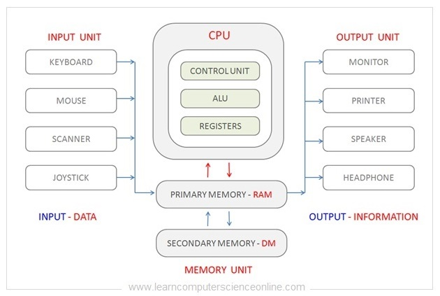
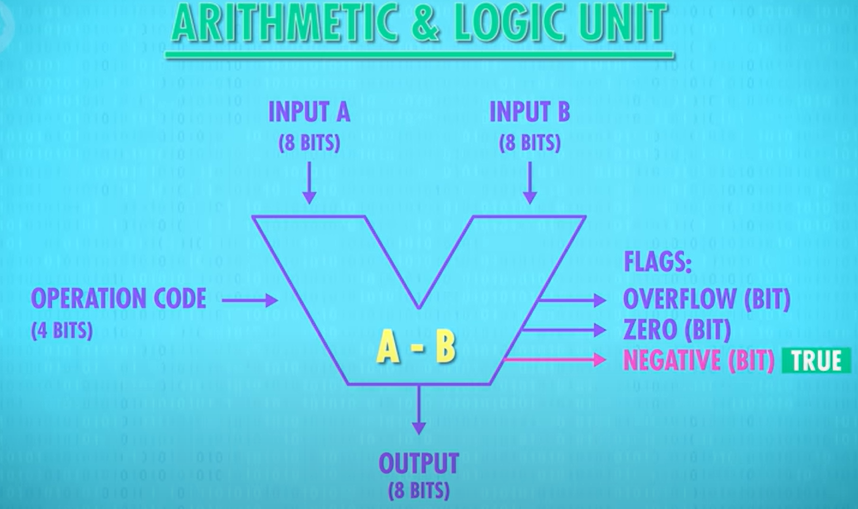
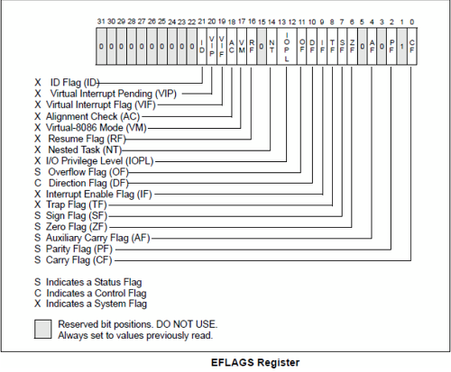
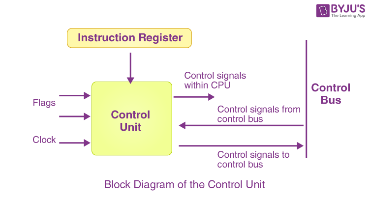
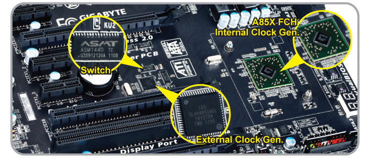
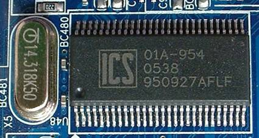
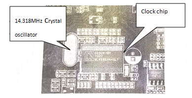
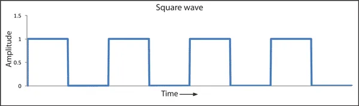

# 컴퓨터의 구조 기초

# 컴퓨터의 구성
> Q. 컴퓨터의 핵심적인 하드웨어가 무엇이 있는지 간단히 설명해주세요   
> A. 컴퓨터의 종류는 다양하지만 가장 핵심적인 하드웨어는 크게 CPU라고 불리는 중앙처리장치, 메인 메모리라고 불리는 주기억장치, 보조기억장치, 마우스, 키보드 등의 입출력장치 등이 있습니다.

> Q. 그럼 하드웨어와 소프트웨어의 차이는 무엇인가요?   
> A. 하드웨어는 컴퓨터를 구성하는 기계적 장치, 소프트웨어는 하드웨어의 동작을 지시하고 제어하는 명령어의 집합입니다.

> Q. 시스템 버스에 대해서 설명해 주세요.   
> A. 시스템 버스는 CPU, 메모리 및 I/O장치 사이의 정보 전송을 위한 통로입니다. 용도에 따라서 데이터 버스, 주소 버스, 제어 버스로 구성됩니다. 먼저 <b>데이터 버스</b>는 데이터를 전달하는 통로로, 메모리와 입출력장치의 명령어와 데이터를 CPU로 보내거나 CPU의 연산 결과를 메모리와 입출력장치로 전달하는 양방향 버스입니다. 두번째로 <b>주소 버스</b>는 데이터를 정확히 전달하기 위한 주소를 전달하는 통로로 CPU에서 메모리와 입출력 장치로 전달하는 단방향 버스입니다. 마지막으로 <b>제어 버스</b>는 CPU가 메모리나 입출력장치에 제어 신호를 전달하는 통로입니다. 앞선 데이터 버스와 주소 버스는 모든 장치에 공유되기 때문에 이를 제어할 수단으로 사용되며, 제어 신호의 종류로는 기억장치 읽기와 쓰기, 버스 요청 및 승인, 인터럽트 요청 및 승인, 클락, 리셋 등이 있습니다. 읽기와 쓰기 동작을 수행하기 위한 통로이므로 양방향 버스입니다.

# 중앙처리장치(CPU) 작동 원리
> Q. CPU에 대해서 간단히 설명하고 내부 구성 요소가 어떤 게 있는지 설명해주세요.   
> A. CPU는 컴퓨터의 두뇌이며 메인 메모리에 저장된 명령어를 읽어 들이고, 읽어 들인 명령어를 해석하고 실행하는 부품입니다. 그리고 CPU의 내부 구성 요소 중 가장 중요한 세 가지는 ALU, 레지스터, 제어장치입니다.

> Q. ALU는 어떤 역할을 하고, 그 과정에 대해서 설명해 주세요.   
> A. Arithmetic Logic Unit, 즉 산술 논리 장치는 CPU에서 산술 연산과 논리 연산을 수행하는 기능을 가진 장치입니다. ALU는 레지스터로부터 두 개의 피연산자를 받아들이고 제어장치로부터 제어신호를 받아들여서 연산을 수행하고 그 결과를 다시 누산기에 일시적으로 저장합니다. 그리고 결과에 대한 추가적인 상태 정보인 플래그도 플래그 레지스터에 저장합니다.

> Q. 플래그의 종류에는 뭐가 있죠?  
> A. 플래그의 종류에는 대표적으로 연산한 결과의 부호를 나타내는 부호 플래그, 연산 결과가 0인지 여부를 나타내는 제로 플래그, 연산한 결과 올림수나 빌림수가 발생했는지 여부를 나타내는 캐리 플래그, 오버플로우가 발생했는지 여부를 나타내는 오버플로우 플래그, 인터럽트가 가능한지 나타내는 인터럽트 플래그, 커널 모드로 실행 중인지 사용자 모드로 실행 중인지 나타내는 슈퍼바이저 플래그가 있습니다.

> Q. 그럼 오버플로우 플래그가 존재하는 이유는 뭐예요?  
> A. ALU에서는 Input의 크기와 같은 연산 결과를 Output으로 내보내기 때문에 연산자가 무엇인지에 따라 오버플로우가 발생할 수 있기 때문입니다. 예를 들어, 8bit의 Input이 들어왔다면 Output 또한 8bit로 나옵니다.

## ALU (Arithmethic Logic Unit)
- ALU는 산술논리장치이다. 즉, 산술 연산과 논리 연산을 수행하는 기능을 가진 장치이다.   
- 주로 정수 연산을 수행하지만, 최근에는 실수 연산과 부동소수 연산까지 처리한다.

### ALU의 구성
ALU는 일반적으로 다음과 같이 구성된다.

- 가산기
    - 2개 이상의 입력된 수의 합을 계산하는 논리 회로
- 보수기
    - 보수를 처리하는 논리 회로
- 누산기
    - 산술 및 논리 연산의 결과를 일시적으로 계산하는 레지스터
    - 계산과정에서 발생하는 중간 값을 보관하는 레지스터
- 플리플롭
    - 한 개의 비트를 저장하는 기억 회로
- 데이터 레지스터
    - 명령어를 수행할 때 필요한 데이터를 저장하는 레지스터
    - 데이터 레지스터는 워드(word)의 크기와 동일
    - 워드(word) : 한 번에 가져올 수 있는 명령어의 크기
- 시프트 레지스터
    - 비트들을 왼쪽/오른쪽으로 이동시키는 레지스터
- 상태 레지스터
    - 연산 결과의 상태를 나타내는 플래그를 저장

### ALU의 작동 방식

ALU는 레지스터를 통해서 피연산자(Input A, Input B, 위쪽)를 받아들이고 제어장치로부터 수행할 연산을 알려주는 제어 신호(Operation Code, 왼쪽)를 받아들인다. ALU는 받아들인 피연산자와 제어 신호로 산술 연산, 논리 연산 등 다양한 연산을 수행한다.

수행한 결과로 Input의 크기와 동일한 Output를 내며, 추가적으로 결과를 해석하는데 도움을 주는 1bit짜리 Flag를 내보내기도 하는데, 이는 상태 레지스터(플래그 레지스터)에 저장된다.

#### 플래그의 종류

- 부호 플래그
    - 연산한 결과의 부호를 나타냄
    - ex) 부호 플래그(1) = 음수, 부호 플래그(0) = 양수
- 제로 플래그
    - 연산 결과가 0인지 여부를 나타냄
    - ex) 제로 플래그(1) = 0, 제로 플래그(0) = 0이 아님
- 캐리 플래그
    - 연산 결과 올림수나 빌림수가 발생했는지를 나타냄
    - ex) 캐리 플래그(1) = 올림수 or 빌림수 발생, 캐리 플래그(0) = 발생하지 않음
- 오버플로우 플래그
    - 오버플로우가 발생했는지를 나타냄
    - ex) 오버플로우 플래그(1) = 발생, 오버플로우 플래그(0) = 발생하지 않음
- 인터럽트 플래그
    - 인터럽트가 가능한지 나타냄
    - ex) 인터럽트 플래그(1) = 가능, 인터럽트 플래그(0) = 불가능
- 슈퍼바이저 플래그
    - 커널 모드로 실행 중인지, 사용자 모드로 실행 중인지를 나타냄
    - ex)  슈퍼바이저 플래그(1) = 커널 모드, 슈퍼바이저 플래그(0) = 사용자 모드

## 제어장치 (Control Unit, CU)
- 제어장치는 제어 신호를 내보내고, 명령어를 해석하는 부품
- 제어 신호는 컴퓨터 부품들을 관리하고 작동시키기 위한 일종의 전기 신호
- 제어장치는 CPU의 구성 요소 중 가장 정교하게 설계된 부품

### 제어장치의 작동 방식

#### 클럭(Clock)

- 클럭은 컴퓨터의 모든 부품을 일사불란하게 움직일 수 있게 하는 컴퓨터의 시간 단위
- 전자 회로에서 신호를 생성해 컴퓨터의 부품들의 동작을 동기화
- 클럭은 초당 발생하는 신호의 수를 나타내며 이를 클럭 주파수라고 함
- 일반적으로 헤르츠(Hz) 단위로 측정

##### 1. 클럭의 기본 원리
- 컴퓨터는 디지털 회로로 구성되어 있으며 모든 연산은 이진수(0 또는 1)의 형태로 이루어짐
- 클럭 신호는 이러한 이진 상태를 전환하는 데 사용되며, 이를 통해 컴퓨터 내부의 구성 요소들이 일정한 시간 간격으로 동작하도록 함
- 클럭 신호는 Crystal Oscillator와 같은 부품의 사인파와 같은 진동에서 생성되며, 주로 사각파로 변환되어 사용   

#### 2. 클럭의 발생 위치
- 메인보드의 칩셋 또는 클럭칩
- 메인보드에는 클럭칩이 내장되어 있음
- 클럭칩은 Crystal Oscillator와 함께 기본 클럭 신호를 생성하고 이를 버스를 통해 CPU, RAM, GPU, I/O 장치 등 여러 구성 요소로 분배함
- 각 구성 요소들은 메인보드에서 제공받은 베이스 클럭(Base Clock, BCLK)을 기반으로 자체적인 클럭 속도를 결정함
- 예를 들어 CPU는 베이스 클럭(100MHz) * 40 = CPU 4GHz 클럭 이런 식

#### 제어장치의 작동
1. 제어장치는 클럭 신호를 받아들인다.
2. 제어장치는 명령어 레지스터로부터 해석할 명령어를 받아들이고 해석한 뒤 제어 신호를 발생시켜 컴퓨터 부품들에 수행해야 할 내용을 알려준다.
3. 제어장치는 플래그 레지스터 속 플래그 값을 받아들인다. 제어 신호를 발생시킬 때 해당 플래그 정보를 감안해서 발생시킨다.
4. 제어장치는 시스템 버스 중 제어 버스로 전달된 제어 신호를 받아들인다.

## 레지스터(Register)
- CPU 내에 위치한 기억장치
- 크기의 한계가 있기 때문에 특수 목적용 레지스터와 몇 개의 일반 목적용 레지스터만 존재

### 대표적인 레지스터의 종류
- PC (Program Counter, Instruction Pointer라고 부르는 CPU도 있음) : 메모리로부터 다음 인출(fetch)될 명령어의 주소를 가지고 있는 레지스터
- AC (Accumulator) : 연산 결과 데이터를 일시적으로 저장하는 레지스터
- IR (Instruction Register) : 가장 최근에 인출된 명령어(현재 실행 중인 명령어)가 저장되어 있는 레지스터
- SR (Status Register) : 현재 CPU의 상태를 가지고 있는 레지스터
- MAR (Memory Address Register) : PC에 저장된 명령어 주소가 사용되기 전에 일시적으로 저장되는 주소 레지스터
- MBR (Memory Buffer Register) : 기억장치에 저장될 데이터 혹은 읽혀진 데이터가 일시적으로 저장되는 버퍼 레지스터

### 과정
1. MAR ← PC
    - 실행할 명령어 주소 값을 PC에서 읽어 MAR에 넣는다
2. MBR ← M[MAR], PC ← PC + 1
    - MAR를 기반으로 Memory에서 명령어를 읽어 MBR에 넣고, Counter값을 1 증가시킨다
3. IR ← MBR
    - 인출한 명령어를 MBR에 넣는다
4. 제어장치가 IR에 저장된 명령어를 해석하고 제어 신호를 발생

