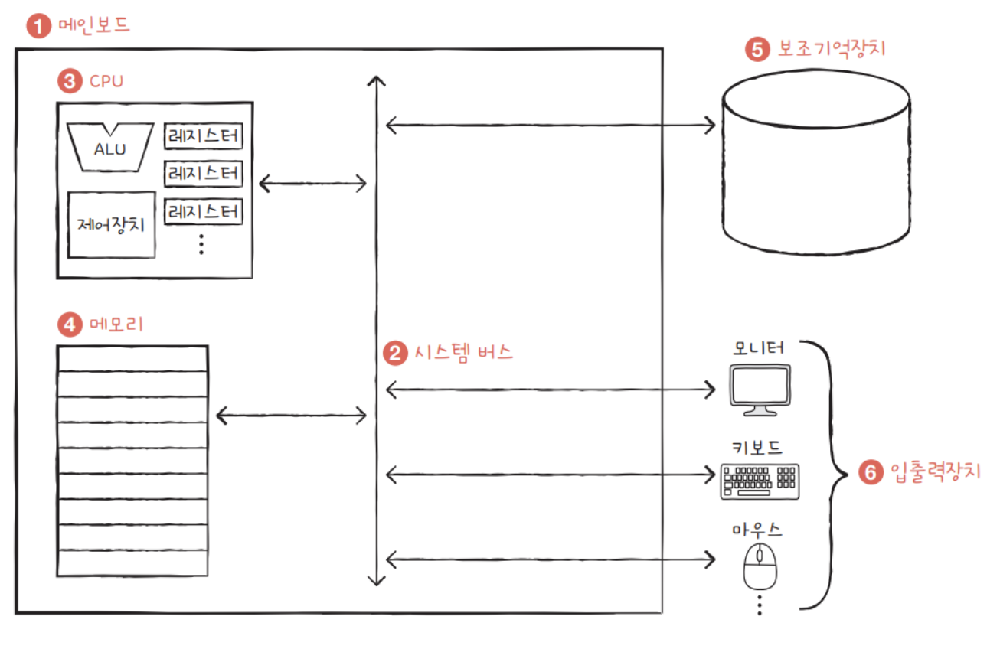
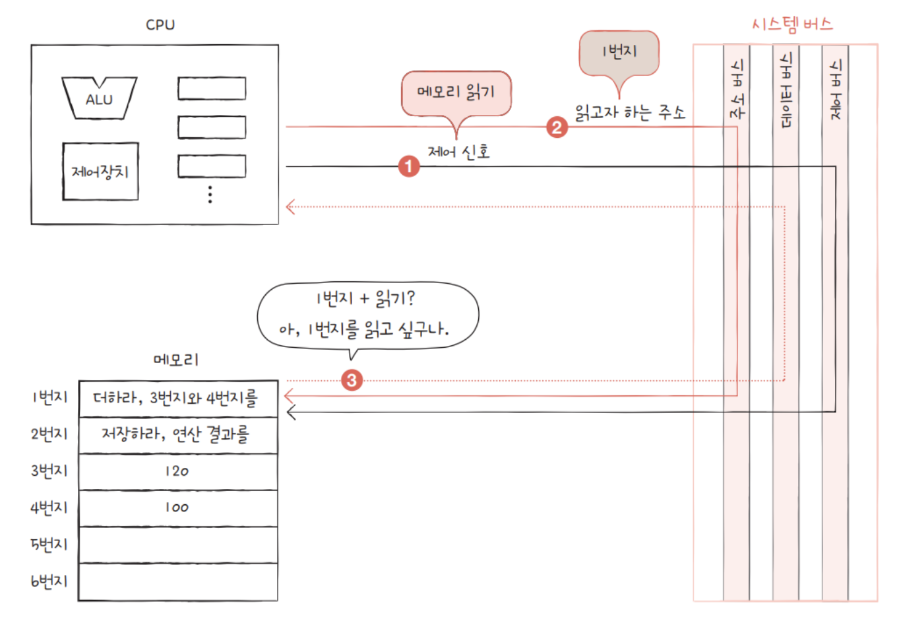
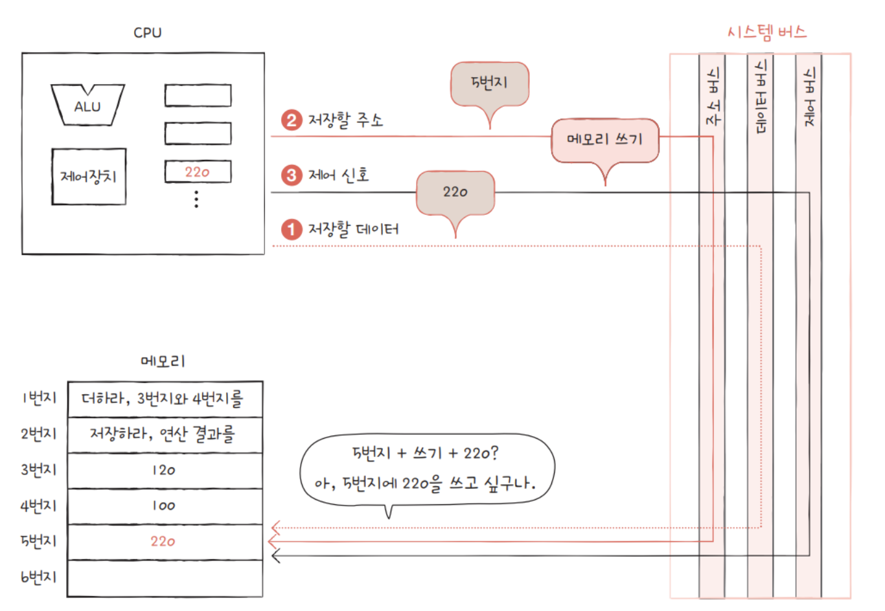
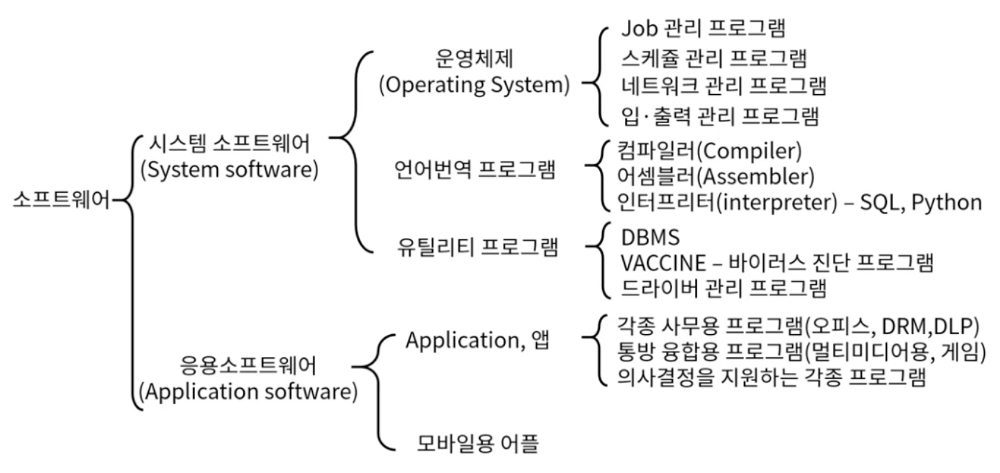

# 01. 컴퓨터 구성

[HW 참고](https://hongong.hanbit.co.kr/%EC%BB%B4%ED%93%A8%ED%84%B0%EC%9D%98-4%EA%B0%80%EC%A7%80-%ED%95%B5%EC%8B%AC-%EB%B6%80%ED%92%88cpu-%EB%A9%94%EB%AA%A8%EB%A6%AC-%EB%B3%B4%EC%A1%B0%EA%B8%B0%EC%96%B5%EC%9E%A5/)

[SW 참고](https://velog.io/@rabyeoljji/%ED%94%84%EB%A1%9C%EA%B7%B8%EB%9E%A8%EA%B3%BC-%EC%86%8C%ED%94%84%ED%8A%B8%EC%9B%A8%EC%96%B4)

## 1) HW

### 💡 컴퓨터의 핵심 부품

1. 중앙처리장치 (CPU; Central Processing Unit)
2. 주기억장치 (Main Memory)

- RAM (Random Access Memory)
  - OS가 64비트라면, CPU는 RAM으로부터 데이터를 한 번에 64비트 씩 읽어온다.
- ROM (Read Only Memory)

3. 보조기억장치 (Secondary Storage)
4. 입출력장치 (I/O Device)

### 💡 중앙처리장치

- 컴퓨터의 두뇌
- 메모리에 저장된 명령어를 읽어 들이고, 해석하고, 실행하는 장치
- 내부 구성 요소  
   1. **산술논리연산장치 (ALU; Arithmetic Logic Unit)**  
   : 비교와 연산 담당하는 계산을 위해 존재하는 부품
     2. **레지스터 (Register)**  
   : 속도가 빠른 데이터 기억장소로, 프로그램을 실행하는 데 필요한 값들을 임시로 저장
     3. **제어장치 (CU; Control Unit)**  
   : 명령어의 해석과 실행 담당하는 부품

### 💡 주기억장치 = 메모리

- 현재 실행되는 프로그램의 명령어와 데이터를 저장하는 부품
- 프로그램이 실행되기 위해서는 반드시 메모리에 저장되어 있어야 한다.
- 메모리에 저장된 값의 위치는 주소로 알 수 있다.

### 💡 보조기억장치

- 메모리보다 크기가 크고 전원이 꺼져도 저장된 내용을 읽지 않는 메모리를 보조할 저장 장치
- 하드 디스크, SSD, USB 메모리, DVD, CD-ROM 등

### 💡 입출력장치

- 컴퓨터 외부에 연결되어 컴퓨터 내부와 정보를 교환하는 장치
- 마이크, 스피커, 프린터, 마우스, 키보드 등

### 💡 시스템 버스

- 컴퓨터의 4가지 핵심 부품이 서로 정보를 주고받는 통로

1. 주소 버스

- 주소를 주고받는 통로
- 단방향
  - CPU가 메모리나 입출력장치로 기억장치 주소를 전달하는 통로

2. 데이터 버스

- 명령어와 데이터를 주고받는 통로
- 양방향
  - 메모리&입출력장치 —(명령어와 데이터)—> CPU
  - CPU —(연산결과)—> 메모리&입출력장치

3. 제어 버스

- 제어 신호를 주고받는 통로
- 주소 버스와 데이터 버스는 모든 장치에 공유되기 때문에 이를 제어할 수단으로 사용된다.
- 양방향
- 종류

  - 메모리 읽기 및 쓰기
  - 버스 요청 및 승인
  - 인터럽트 요청 및 승인
  - 클락, 리셋 등

- 시스템 버스의 활용 예시
  
  

## 2) SW

### 💡 시스템 소프트웨어

- 컴퓨터 HW를 동작하고 데이터에 접근할 수 있도록 해주는 도구
- 시스템 구동에 필수로 요구된다.
- 응용 SW를 실행할 수 있도록 플랫폼 제공
- 사용자가 컴퓨터를 이용할 수 있도록 연결해주는 역할
- 사용자 명령에 따라 시스템 리소스를 제어하고 관리

### 💡 응용 소프트웨어

- OS 위에서 실행되는 모든 소프트웨어
- 워드, 한글, 포토샵 등
