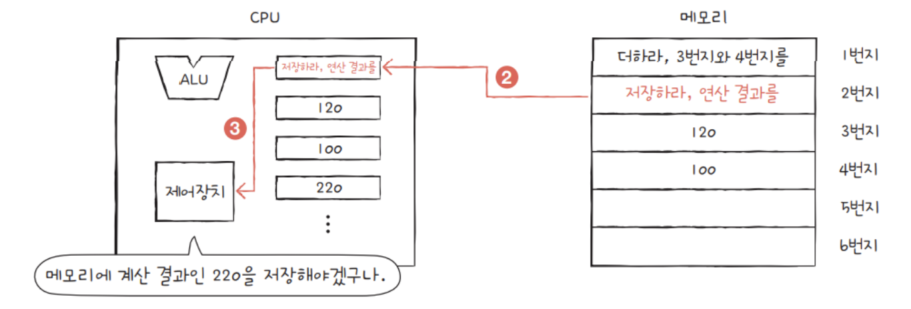

# 02. CPU 작동 원리

[참고](https://choihjhj.tistory.com/entry/%EC%BB%B4%ED%93%A8%ED%84%B0%EA%B5%AC%EC%A1%B0-%ED%95%98%EB%93%9C%EC%9B%A8%EC%96%B4-%EC%86%8C%ED%94%84%ED%8A%B8%EC%9B%A8%EC%96%B4)

## CPU 구성 요소


### 💡 산술논리 연산 장치 (ALU; Arithmetic Logic Unit)

- 수학적 연산(+-/\*)과 논리적 연산(AND,OR,NOT,XOR)을 담당
- 연산에 필요한 데이터를 레지스터에서 가져오고, 연산 결과를 다시 레지스터로 보낸다.

### 💡 제어 장치

- 명령어를 순서대로 실행할 수 있도록 제어하는 장치
- CPU에서 프로그램 명령어를 꺼내 해독하고, 그 결과에 따라 명령어 실행에 필요한 제어 신호를 다른 장치들로 보낸다.
- 다른 장치들이 보낸 신호를 받아 다음에 수행할 동작을 결정한다.

### 💡 레지스터

- CPU 내부의 작은 저장 공간
- 명령어 실행 중 임시 데이터 저장, 연산 결과 보관, 명령어 포인터 등의 역할 수행
- CPU의 처리 속도와 직접적인 관련이 있는 고속 기억 장치
- CPU 종류에 따라 사용 가능한 레지스터 개수와 크기가 다르다.
- 용도에 따른 구분
  - 범용 레지스터 : 연산에 필요한 데이터나 연산 결과를 임시로 저장
  - 특수 목적 레지스터 : 특별한 용도로 사용하는 레지스터

### 💡 특수 목적 레지스터 종류

1. **PC(Program Counter)**

- 다음에 실행될 명령어의 메모리 주소를 가지고 있다.
- CPU가 명령을 실행한 후, PC는 자동으로 업데이트되어 다음 명령어 위치를 가리킨다.
- ⇒ CPU가 프로그램의 명령어를 순서대로 실행 가능하다.
  <br><br>

2. **MAR(Memory Address Register)**

- CPU가 접근하려는 메모리의 주소를 저장한다.
- CPU가 데이터를 읽거나 쓰기 위해 메모리에 접근할 때, 그 위치를 MAR를 통해 지정한다.
  <br><br>

3. **MBR(Memory Buffer Register)**

- CPU가 메모리로부터 읽은 데이터나 메모리에 쓸 데이터를 일시적으로 저장한다.
- 데이터 전송 시 해당 데이터를 임시로 보관한다.
  <br><br>

4. **IR(Instruction Register)**

- CPU에 의해 현재 실행되고 있는 명령어를 저장한다.
- 명령어가 CPU로 가져와짐 → 그 명령어가 IR에 저장됨 → CPU는 이 명령어를 해석하여 실행함
- ⇒ CPU가 어떤 작업을 수행해야 하는지를 결정하는 기준
  <br><br>

5. **AC(Accumulator)**

- 중간 계산 결과를 저장하는 데 사용된다.
- 사칙연산과 같은 연산 수행 시, 연산의 결과를 일시적으로 저장한다.
- CPU가 복잡한 계산을 효율적으로 처리할 수 있도록 한다.
  <br><br>

6. **Status Register**

- CPU의 현재 상태를 나타내는 플래그들을 포함한다.
- 산술 연산 결과의 오버플로우, 제로, 음수, 캐리 아웃 같은 다양한 상태 정보가 포함된다.
- 상태 레지스터의 플래그를 통해 프로그램은 조건부 분기와 같은 결정을 내릴 수 있다.

## CPU 동작 과정

1. 주기억장치는 입력장치에서 입력받은 데이터 또는 보조기억장치에 저장된 프로그램을 읽어온다.
2. CPU는 프로그램을 실행하기 위해 주기억장치에 저장된 프로그램 명령어와 데이터를 읽어와 처리한다.
3. 처리 결과를 다시 주기억 장치에 저장한다.
4. 주기억장치는 처리 결과를 보조기억장치에 저장하거나 출력장치로 보낸다.
5. 제어장치는 1~4 과정에서 명령어가 순서대로 실행되도록 각 장치를 제어한다.





## 명령어 실행 사이클

### 💡 명령어 세트

- CPU가 실행할 명령어의 집합
- ‘Operation Code + Operand’로 이루어진다.
- Operation Code (연산 코드)
  - 실행할 연산
  - 연산, 제어, 데이터 전달, 입출력 등
- Operand (피연산자)
  - 필요한 데이터나 저장 위치
  - 주소, 숫자 및 문자, 논리 데이터 등

### 💡 명령어 사이클

- CPU가 주기억장치에서 한 번에 하나의 명령어를 인출하여 실행하는데 필요한 일련의 활동
- CPU는 프로그램을 실행하기 위해 주기억장치에서 명령어를 순차적으로 인출 → 해독 → 실행하는 과정 반복
- 인출/실행/간접/인터럽트 사이클로 나누어진다.

### 💡 Fetch Cycle (인출 사이클)

- CPU가 다음에 실행할 명령어를 메모리에서 가져오는 과정

```
T0 : MAR ← PC
T1 : MBR ← M[MAR], PC ← PC+1
T2 : IR ← MBR
```

1. PC에 저장된 주소를 MAR로 전달
2. 저장된 내용을 토대로 주기억장치의 해당 주소에서 명령어 인출
3. 인출한 명령어를 MBR에 저장
4. 다음 명령어 인출을 위해 PC 값 증가
5. MBR에 저장된 내용을 IR에 전달

### 💡 Execution Cycle (실행 사이클)

- Fetch Cycle에 의해 인출되어 IR에 저장된 명령어를 CPU가 실제로 해석하고 실행하는 과정

1. **ADD** : AC에 데이터를 더하는 명령어
   ```
   T0 : MAR ← IR(Addr)
   T1 : MBR ← M[MAR]
   T2 : AC ← AC + MBR
   ```
2. **LOAD** : 기억장치에 있는 데이터를 AC로 이동하는 명령어
   ```
   T0 : MAR ← IR(Addr)
   T1 : MBR ← M[MAR]
   T2 : AC ← MBR
   ```
3. **STA** : AC에 있는 데이터를 기억장치로 저장하는 명령어
   ```
   T0 : MAR ← IR(Addr)
   T1 : MBR ← AC
   T2 : M[MAR] ← MBR
   ```
4. **JUMP** : PC값을 IR의 주소값으로 변경하는 분기 명령어
   ```
   T0 : PC ← IR(Addr)
   ```
