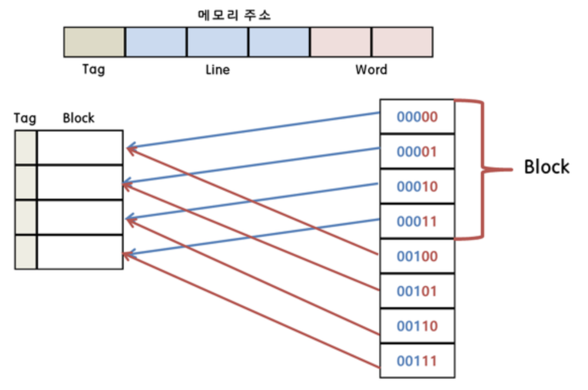

# 03. 캐시 메모리

[참고](https://raidho.tistory.com/272)  
[종류 참고](https://velog.io/@leesfact/%EC%BA%90%EC%8B%9C%ED%9E%88%ED%8A%B8%EC%99%80-%EC%BA%90%EC%8B%9C%EB%AF%B8%EC%8A%A4)  
[매핑 참고](https://velog.io/@leesfact/%EC%BA%90%EC%8B%9C-%EB%A7%A4%ED%95%91)

## 캐시 메모리

- 장치 간 속도 차이에 따른 병목 현상을 줄이기 위한 메모리
- 장점 : 빠른 속도
  - CPU가 주기억장치에서 저장된 데이터를 읽어올 때, 자주 사용하는 데이터를 캐시 메모리에 저장
  - 다음에 이용할 때 주기억장치가 아닌 캐시 메모리에서 먼저 가져오면서 속도 향상
  - RAM보다 10~100배 빠르게 작동한다.
- 단점 : 적은 용량 & 비싼 비용
- **Cache Hit**
  - CPU가 필요한 데이터가 캐시에 이미 존재하는 경우
- **Cache Miss**
  - CPU가 필요한 데이터가 캐시에 존재하지 않는 경우
  - 데이터는 메인 메모리에서 가져와야 하며, 이 과정에서 캐시에도 해당 데이터가 저장됨
- 듀얼 코어 프로세서의 캐시 메모리
  - 각 코어마다 독립된 L1 캐시 메모리를 가지고, 두 코어가 공유하는 L2 캐시 메모리가 내장된다.
  - 만약 L1 캐시가 128kb라면,
    - 64kb에 명령어를 처리하기 직전의 명령어를 임시 저장
  - 나머지 64kb에는 실행 후 명령어를 임시저장

## 지역성의 원리

- CPU는 데이터를 처리할 때 캐시 메모리를 먼저 살펴보고 캐시 메모리에서 데이터를 찾으면 시간이 많이 걸리는 데이터 읽기 수행 불필요
- **시간 지역성**
  - 한번 참조된 데이터는 잠시 후 다시 참조될 가능성이 높음
- **공간 지역성**
  - A[0], A[1]과 같은 연속 접근 시, 참조된 데이터 근처에 있는 데이터가 잠시 후 다시 사용될 가능성 높음

## 캐시 메모리 종류

- L1: Lightning-Fast Access
  - 자주 사용되는 명령어와 데이터를 저장하여 CPU가 빠르게 액세스할 수 있도록 하는 것
  - 상대적으로 작으며 CPU 내부에 존재
- L2: Bridging the Gap
  - 자주 요청되는 데이터와 명령어를 위한 더 많은 공간을 제공
  - CPU가 메인 메모리에 액세스해야 하는 필요성을 최소화
  - CPU와 RAM 사이에 존재
- L3: The Shared Resource
  - L1 및 L2의 성능을 향상시키기 위해 개발된 특수 메모리
  - 멀티 코어 프로세서에서 L3 캐시는 모든 CPU 코어의 공유 리소스
  - 일반적으로 사용되는 데이터와 명령어를 위한 공유 캐시 공간을 생성하여 코어 간에 데이터를 효율적으로 공유할 수 있도록 한다.
  - 보통 메인보드에 존재

## **Cache Miss**

- Cold Miss
  - 처음으로 접근하는 데이터 때문에 발생하는 미스
  - 어떤 데이터가 처음 캐시에 로드될 때 발생
- Conflict Miss
  - 특정 캐시 라인에 여러 데이터가 매핑되어 충돌이 발생할 때 생기는 미스
  - 캐시 메모리에 저장해야 하는 2개의 데이터가 있을 때, 그 데이터들이 같은 캐시 메모리 주소에 할당되어 있어서 나는 미스
  - 주로 캐시의 매핑 정책과 관련
  - Direct Mapped Mapping에서 많이 발생
- Capacity Miss
  - 캐시의 크기가 작아서 발생하는 미스
  - 캐시에 데이터가 너무 많이 들어가면 오래된 데이터가 제거되고, 나중에 다시 그 데이터가 필요하면 미스 발생

## **Cache Mapping**

- 메인 메모리의 데이터를 캐시에 저장하고, 나중에 필요할 때 이를 다시 찾기 위한 방법

### 직접 매핑 (Direct Mapped Mapping)

- 가장 기본적인 구조
- DRAM의 여러 주소가 캐시 메모리의 한 주소에 대응되는 다대일 방식
- 예시
  1. 데이터 저장
     - 메모리 주소 00000과 00100의 데이터를 예를 들면, 이 두 주소는 캐시에서 동일한 라인(라인 0)에 매핑
     - 빨간색 숫자 = 블록 번호
     - 파란색 숫자 = 오프셋
  2. 데이터 검색 과정
     - CPU가 메모리 주소 00000의 데이터를 요청하면 캐시는 해당 주소의 태그와 캐시 라인의 태그를 비교하여 일치하는지 확인
     - 만약 태그가 일치하면 해당 데이터는 캐시에서 가져옴
     - 일치하지 않으면 캐시 미스가 발생하고 메모리에서 데이터를 가져와야 함
  3. 충돌 문제
     - 메모리의 블록 00000과 00100이 동일한 캐시 라인에 매핑됨
     - → 반복적인 데이터 접근 시 출돌이 발생 할 수 있음
     - 이는 캐시 미스를 유발
- 장점
  - 간단하고 빠름
- 단점
  - Conflict Miss 발생

### 연관 매핑 (Fully Associative Mapping)

- 비어있는 캐시 메모리가 있으면 마음대로 주소를 저장하는 방식
- 조건이나 규칙이 없어서 특정 캐시 Set 안에 있는 모든 블럭을 한번에 찾아 원하는 데이터가 있는지 검색해야 한다.
- 장점
  - 유연성
    - 모든 블록이 어느 라인에나 저장될 수 있어 캐시 미스 확률이 낮아짐
  - 적중률 향상
    - 반복적인 데이터 접근 시 추돌이 줄어듦
- 단점
  - 구현의 복잡성
    - 모든 태그를 검사해야 하므로 검색 시간이 오래 걸림
  - 비용
    - 하드웨어 구현이 복잡하고 비용이 많이 듦

### 집합-연관 매핑 (Set Associative Mapping)

- 직접 매핑과 연관 매핑의 절충 방식
- 특정 행을 지정하고, 그 행 안의 어떤 열이든 비어있을 때 저장하는 방식
- 직접 매핑에 비해 검색 속도는 느리지만 저장이 빠르고, 연관 매핑에 비해 저장이 느리지만 검색이 빠르다.
- 장점
  - 충돌 감소
    - 직접 매핑보다 충돌이 적음
  - 유연성 향상
    - 집합 내에서는 연관 매핑이 적용되어 유연성이 높아짐
- 단점
  - 구현의 복잡성
    - 집합 내의 모든 태그를 검사해야 하므로 검색 시간이 직접 매핑보다는 길어질 수 있음
  - 비용
    - 연관 매핑보다는 저렴하지만 직접 매핑보다는 비용이 많이 듦
