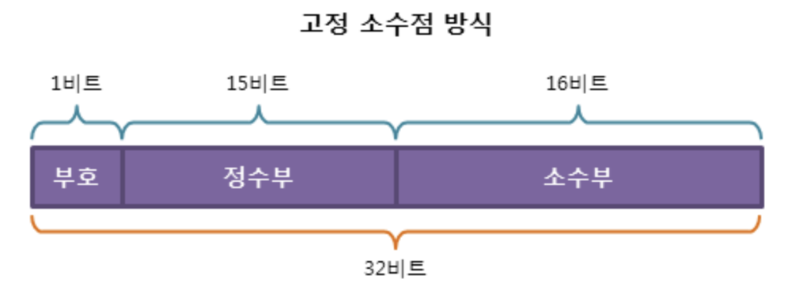
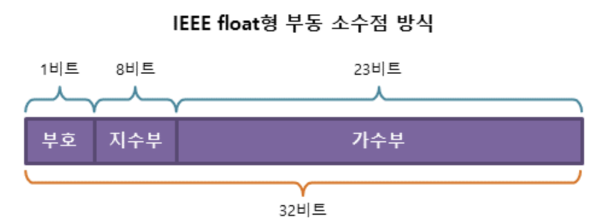

# 04. 고정 소수점 & 부동 소수점

[고정 소수점 & 부동 소수점](https://tkxxls.tistory.com/106)

- 컴퓨터에서 실수를 표현하는 방법

1. 고정 소수점
2. 부동 소수점

## 고정 소수점 (Fixed Point)

- 소수점이 찍힐 위치를 미리 정해놓고 소수를 표현하는 방식
- 정수 + 소수
- 주로 리소스가 제한적이고 높은 정밀도가 필요하지 않은 환경에서 사용됨
- 예) -3.141592
  - 부호(-)
  - 정수부(3)
  - 소수부(0.141592)
- 장점
  - 빠른 연산 속도
    - 단순한 정수 연산으로 처리
  - 간단한 하드웨어 구현
    - 정수 연산과 같으므로 저전력 임베디드 시스템이나 복잡한 연산을 할 수 없는 간단한 장치에서 많이 사용됨
  - 일정한 정밀도
    - 소수점 이하 자릿수의 정밀도가 일정하게 유지됨
    - 금융 계산처럼 일정한 자릿수의 정밀도가 필요한 경우 유리
  - 예측 가능한 계산 결과
    - 모든 연산이 정수 연산으로 수행되기 때문에 결과가 예측 가능
    - 특정 값에서 반올림 오류가 발생하지 않도록 하는 데 도움
  - 메모리 효율성
    - 부동 소수점 숫자보다 적은 메모리를 사용
- 단점
  - 제한된 표현 범위
    - 표현할 수 있는 수의 범위가 제한적
    - 큰 수나 매우 작은 수를 표현하는 데 부적합
  - 유연성 부족
    - 특정 scaling factor에 고정되기 때문에 다양한 크기의 숫자를 처리하는 데 유연성이 부족
  - 오버플로 및 언더플로 위험
- 사용 상황
  - 임베디드 시스템과 마이크로컨트롤러
    - 메모리와 처리 능력이 제한된 환경
  - 실시간 시스템
    - 예측 가능한 실행 시간이 중요
    - 부동 소수점 연산이 가변적인 실행 시간을 가질 수 있기 때문
  - 비용 민감형 하드웨어
    - 부동 소수점 연산자를 지원하는 비용이 더 들 수 있어, 가격을 낮추기 위해 고정 소수점 연산을 사용
  - 디지털 신호 처리(DSP)
    - 정확하게 정의된 범위 내의 값을 사용하기 때문에 고정 소수점 연산으로 충분한 경우가 많음

## 부동 소수점 (Floating Point)

- 가수부 + 지수부
  - 가수 : 실수의 실제값 표현
  - 지수 : 가수의 어디에 소수점이 있는지 표현
- 지수 값에 따라 소수점이 움직이는 방식을 활용한 실수 표현 방식
- 소수점의 위치가 고정되어 있지 않음
- 더 넓은 범위와 높은 정밀도를 필요로하는 복잡한 계산에 적합
- 장점
  - 넓은 표현 범위
    - 부동 소수점 표현은 매우 큰 수와 매우 작은 수를 모두 표현 가능
  - 정밀도 조절 가능
    - 가수부의 자릿수를 조정하여 계산의 정밀도를 조절 가능
  - 표준화
    - IEEE 754 표준에 의해 정의되어 있어, 다양한 시스템과 프로그래밍 언어에서 일관된 방식으로 부동 소수점 을 표현 가능
- 단점
  - 반올림 오류
  - 부정확
  - 느린 연산 속도
  - 일관성 부족
    - 서로 다른 시스템이나 컴파일러에서 부동 소수점 연산 결과가 약간 다를 수 있음
  - 메모리 사용
    - 부동 소수점 숫자는 정수에 비해 더 많은 메모리를 필요로 한다.
    - 예) 단일 정밀도 부동 소수점 숫자는 32비트를 사용하고, 배정밀도 부동 소수점 숫자는 64비트를 사용
- 사용 상황
  - 과학적 계산
    - 넓은 범위의 값과 높은 정밀도가 요구
  - 3D 그래픽스
    - 높은 정밀도와 다양한 크기의 값을 처리
  - 금융 분석
    - 복잡한 금융 모델링과 위험 평가에서는 높은 수준의 정밀도가 필요할 수 있으며, 부동 소수점 연산이 적합
  - 컴퓨터 시뮬레이션
    - 넓은 범위의 값과 높은 정밀도를 요구하기 때문에 부동 소수점 연산이 필수적
