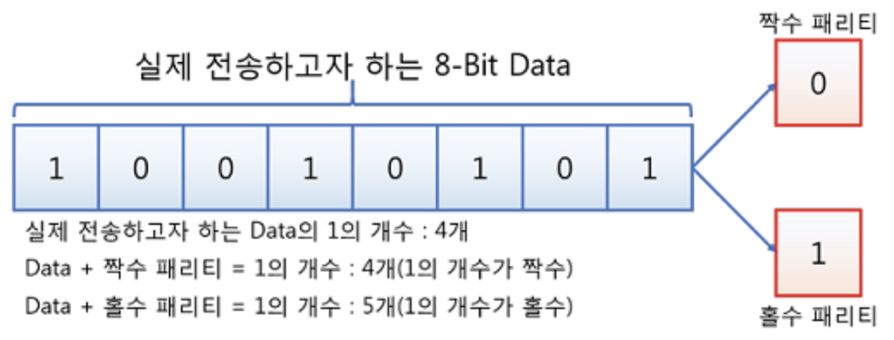

# 05. 패리티 비트 & 해밍 코드

[참고](https://hanseongbugi2study.tistory.com/139)

## 패리티 비트

- 정보 전달 과정에서 오류가 생겼는지 검사하기 위해 추가하는 비트
- 전송하고자 하는 데이터의 각 문자에 1비트를 더하여 전송한다.
- 패리티 비트를 포함한 데이터에서 1의 개수가 짝수인지 홀수인지에 따라 짝수 패리티, 홀수 패리티로 나뉜다.
  
  - 예) 8bit의 데이터를 전송할 때맨 끝에 패리티 비트를 추가하여 전송한다
  - 짝수 패리티의 경우 100101010
  - 홀수 패리티의 경우 100101011
  - 패리티 비트를 추가하는 위치는 맨 앞이 될 수도 있고, 맨 끝이 될 수 있다.
- 패리티 비트를 정하여 데이터를 전송
  - → 데이터를 받는 쪽에서는 수신된 데이터의 전체 비트를 계산하여 패리티 비트를 다시 계산하는 것으로 오류가 발생하였는지 확인
- 문제점
  - 패리티비트로 어느 비트에서 오류가 발생했는지 알 수 없다.
    - 데이터 재전송 요청
  - 2개의 비트에서 오류가 발생하면 오류를 검출할 수 없다.

## 해밍 코드

- 데이터 전송 시 1비트의 에러를 정정할 수 있는 자기 오류 정정 코드
- 패리티 비트를 보고 1bit에 대한 오류를 정정할 곳을 찾아 수정 가능
- 패리티 비트를 데이터의 비트 수에 따라 필요한 만큼 사용하여 데이터 추가하고, 패리티 비트를 조합하여 에러 검출 및 교정을 수행
- 해밍 코드에서 패리티 비트는 2의 거듭제곱에 해당하는 순서에 삽입됨
- 데이터 비트 수에 따라 필요한 패리티 비트의 개수
  - p : 패리티 비트 수
  - d : 데이터 비트 수
    ```
    2^p >= d + p + 1
    ```

### 해밍코드 생성 방법

- 예시) 4bit 데이터 1001에 대해 짝수 패리티로 해밍 코드 생성 과정
- 4bit 데이터를 전송하기 위해서는 패리티 비트가 적어도 3개 필요
  - 해밍 코드는 총 7bit
  - 패리티 비트는 비트1, 비트2, 비트4의 위치에 삽입
    

### 해밍코드 검사 및 수정


- 예시) 짝수 패리티의 해밍 코드가 0011011일때 오류가 수정된 코드
- 1, 3, 5, 7번째 비트 확인 : 0101로 짝수 ⇒ 0
- 2, 3, 6, 7번째 비트 확인 : 0111로 홀수 ⇒ 1
- 4, 5, 6, 7번째 비트 확인 : 1011로 홀수 ⇒ 1
- 역순으로 패리티비트 ‘110’ 도출
- 10진법으로 변환 시 6으로 6번째 비트 수정
- ⇒ 00110’0’1
