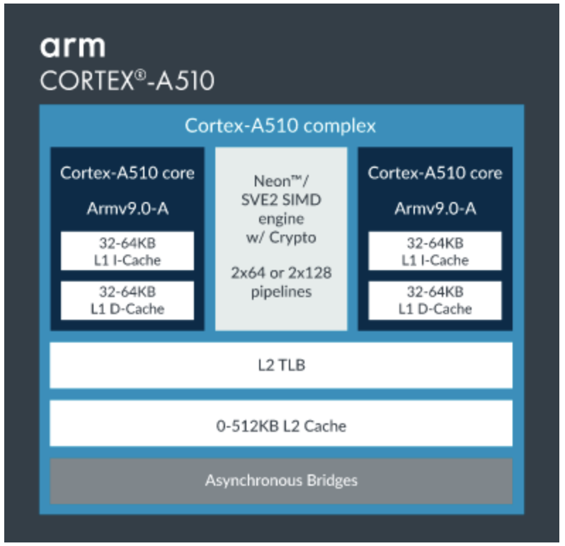
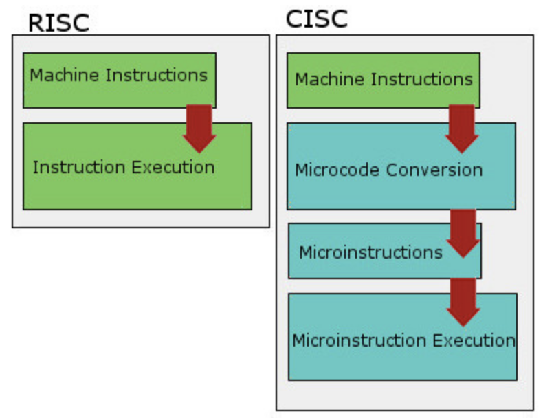

# 06. ARM 프로세서

[참고](https://velog.io/@jayy_19/%EC%BB%B4%ED%93%A8%ED%84%B0-%EA%B5%AC%EC%A1%B0-ARM-%ED%94%84%EB%A1%9C%EC%84%B8%EC%84%9C)

### ARM 프로세서

- RISC 아키텍처를 기반으로 설계된 CPU
- 적은 수의 명령어로 효율적인 성능을 내기 위해 설계
- 저전력과 저발열이라는 특성 덕분에 모바일 기기에서 널리 사용됨

### ARM 구조

- 칩의 기본 설계 구조만 제공
  - 실제 기능 추가 및 최적화는 각 반도체 제조사가 맡는다.
  - 물리적 설계는 동일하지만, 명령 집합은 제조사마다 다를 수 있다.
- 단순한 명령 집합 덕분에 적은 수의 트랜지스터만 필요하므로 크기를 줄이고 효율성을 높이는 데 유리
- 상대적으로 속도는 느리다.

### ARM 장점

- 저전력 & 고성능
- ⇒ 이로 인해 모바일 기기에서 널리 사용되며, ARM 기반 기기에서 동작하는 OS는 다른 ARM 기기에서도 잘 작동한다.
- 최근 기술 발전으로 RISC와 CISC 간의 속도 차이는 줄어들었으며, *클럭 속도*는 더 이상 성능의 유일한 지표가 아니게 되었다.
  - CPU가 초당 수행할 수 있는 클럭 사이클의 수를 말하며, GHz 단위로 측정된다.
- 특히 ARM 프로세서는 *명령어 병렬 처리*와 같은 기술적 이점을 활용해 Intel과 AMD와 같은 CISC 기반 프로세서를 따라잡고 있다.
  - Out-of-Order Execution
  - CPU가 프로그램의 명령어들을 원래 작성된 순서대로 실행하는 대신, 실행 가능한 명령어를 미리 실행하여 CPU 자원을 최대한 활용하는 기술
  - CPU가 명령어를 순차적으로 실행할 때 발생할 수 있는 데이터의 의존성이나 메모리 접근 지연 등의 문제를 완화
- 이를 대표적으로 보여준 사례 ⇒ 애플의 M1칩

### (+) RISC와 CISC

- RISC (Reduced Instruction Set Computer)
  - 명령어가 4 byte의 고정 길이를 가지고 있어 단순하고 처리 속도가 빠르다.
  - 명령어의 종류가 적기 때문에 다소 복잡한 기능을 수행하기 위해서는 여러 개의 명령어를 사용해야 한다.
  - 단순한 명령어를 빠르게 실행할 수 있지만, 복잡한 작업을 처리하려면 여러 명령어를 조합해야 하기 때문에 그 과정에서 상대적으로 성능이 떨어질 수 있다.
- CISC(Complex Instruction Set Computer)
  - 명령어의 길이가 가변적이므로 복잡하고 처리 속도가 느리다.
  - 명령어의 종류가 많으므로 명령어 하나로 원하는 기능을 수행할 수 있을 확률이 높다.
  - 복잡한 작업을 한꺼번에 처리할 수 있으나, 그 복잡성 때문에 명령어가 해석되고 실행되기까지 시간이 더 걸릴 수 있다.
  - 개별 명령어의 처리 속도는 RISC보다 느릴 수 있다는 의미

|             | RISC             | CISC      |
| ----------- | ---------------- | --------- |
| 설계        | 단순             | 복잡      |
| 명령어 종류 | 적음             | 많음      |
| 명령어 길이 | 고정             | 가변      |
| 레지스터 수 | 많음             | 적음      |
| 처리 속도   | 빠름             | 느림      |
| 프로그래밍  | 복잡             | 단순      |
| 사용 예시   | SPARC, ARM, MIPS | Intel x86 |
