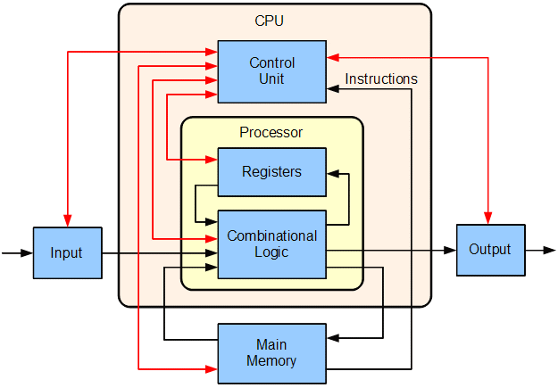

# 02-중앙처리장치(CPU) 작동 원리

## 중앙처리장치(CPU)

컴퓨터에서 가장 핵심적인 역할을 수행하는 부분
### 산술논리연산장치(ALU: Arithmetic and Logical Unit)
- 산술 연산과 논리 연산 수행
- 연산에 필요한 데이터를 레지스터에서 가져옴
- 연산 결과를 레지스터로 보냄
### 제어 장치(Control Unit)
- 명령어를 순서대로 실행할 수 있도록 제어하는 장치
- 주기억장치에서 프로그램 명령어를 꺼내 해독, 그 결과에 따라 명령어 실행에 필요한 제어 신호를 기억 장치, 연산장치, 입출력장치로 보냄
- 기타 장치들이 보낸 신호를 받아 다음에 수행할 동작을 결정함
### 레지스터(Register)
- 고속 기억장치
- 명령어 주소, 코드, 연산에 필요한 데이터, 연산 결과 등을 임시로 저장
- 중앙처리장치 종류에 따라 사용할 수 있는 레지스터 개수와 크기가 다름
- 현대 프로세서는 메인 메모리에서 레지스터로 데이터를 옮겨와 데이터를 처리한 후 그 내용을 다시 레지스터에서 메인 메모리로 저장하는 로드-스토어(LOAD & STORE) 설계 사용
- 범용 레지스터
  - 연산에 필요한 데이터나 연산 결과를 임시로 저장
- 특수 목적 레지스터
  - 특별한 용도로 사용하는 레지스터
  - MAR(Memory Address Register, 기억 장치 주소 레지스터)
    - 주기억장치 주소 레지스터, 주소 레지스터라고 부르기도 함
    - 메모리로부터 읽어오거나 메모리에 쓰기 위한 주소를 가지고 있음
  - PC(Program Counter, 프로그램 카운터)
    - ~실행될 명령어의 주소~를 가지고 있어 실행할 기계어 코드의 위치를 지정
  - IR(Instruction Register, 명령 레지스터)
    - 현재 수행 중인 명령어를 가지고 있음
  - MBR(Memory Buffer Register, 메모리 버퍼 레지스터)
    - 주기억장치에서 읽어온 데이터, 저장할 데이터 임시 저장
  - AC(Accumulator, 누산기)
    - 중간 산술 논리 장치 결과가 저장되는 레지스터
## CPU의 동작 과정
1. 주기억장치는 입력장치에서 입력받은 데이터 또는 보조기억장치에 저장된 프로그램을 읽어옴
2. CPU는 프로그램을 실행하기 위해 주기억장치에서 명령어와 데이터를 읽음 -> 결과를 주기억장치에 다시 저장
3. 주기억장치는 처리 결과를 보조기억장치에 저장 or 출력장치로 보냄
4. 제어장치는 1~3 과정에서 명령어가 순서대로 실행되도록 각 장치를 제어
### 명령어 세트
CPU가 실행할 명령어의 집합
연산 코드 (Operation Code) + 피연산자 (Operand)로 이루어짐
- 연산 코드
  - 연산, 제어, 데이터 전달, 입출력 기능
- 피연산자
  - 주소, 숫자/문자, 논리 데이터 등을 저장
- 명령어 사이클: CPU가 주기억장치에서 한번에 하나의 명령어를 인출하여 실행하는데 필요한 일련의 활동
  - 인출, 실행, 간접, 인터럽트 사이클로 나누어짐
  - 주기억장치의 지정된 주소에서 하나의 명령어 인출 -> 실행 사이클에서 명령어 실행 -> 명령어 실행 완료되면 그 다음 명령어에 대한 인출 사이클
### 인출 사이클과 실행 사이클에 의한 명령어 처리 과정
인출 사이클
> T0 : MAR <- PC
>
> T1 : MBR <- M[MAR], PC <- PC+1
> 
> T2: IR <- MBR

- 프로그램 카운터에 저장된 주소를 메모리 주소 레지스터에 저장. 
- 메모리 주소 레지스터를 토대로 주기억장치에서 명령어 인출, 인출된 명령어 메모리 버퍼 레지스터에 저장. 다음 명령어 인출하기 위해 프로그램 카운터 증가
- 메모리 버퍼 레지스터에 저장된 내용을 명령어 레지스터에 전달

살행 사이클
> T0 : MAR <- IR(Addr)
> 
> T1 : MBR <- M[MAR]
> 
> T2 : AC <- AC + MBR

accumulator에 메모리 버퍼 레지스터의 데이터 �