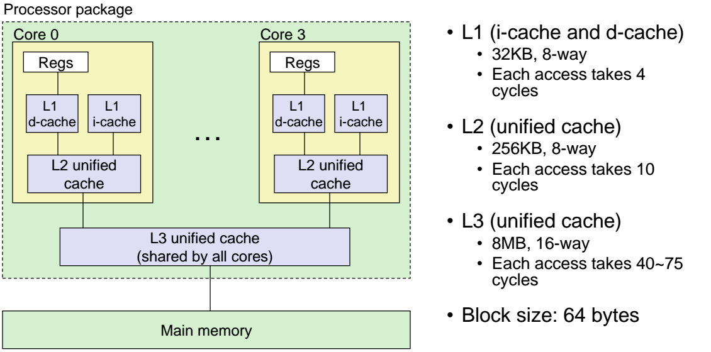
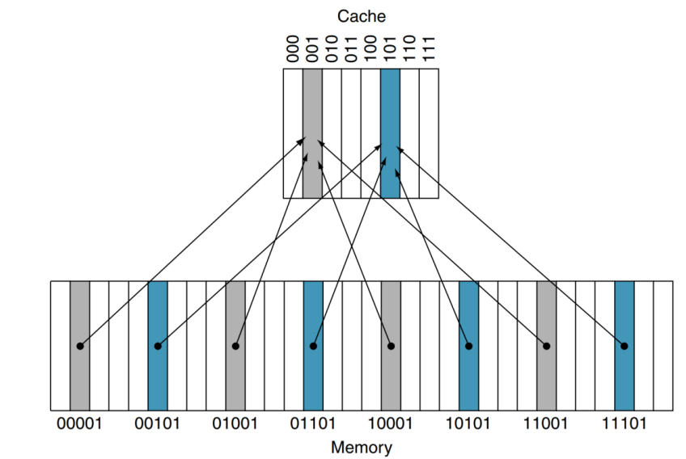
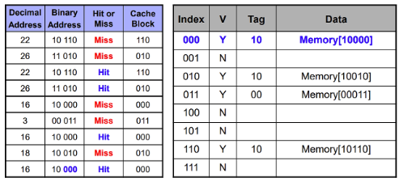
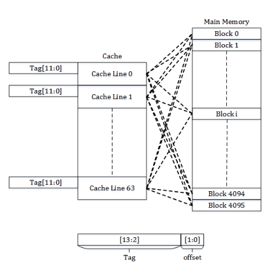
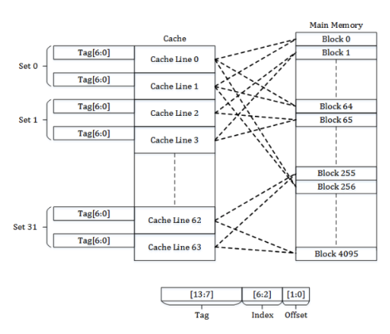

# 03-캐시 메모리

## 캐시 메모리 (Cache Memory)
속도가 빠른 장치와 느린 장치에서 속도 차이에 따른 병목 현상을 줄이기 위한 메모리
- CPU 코어와 메모리 사이의 병목 현상 완화
- 웹 브라우저 캐시 파일 : 하드디스크와 웹페이지 사이의 병목 현상을 완화

> **병목 현상?**
> 
> 전체 시스템의 성능이나 용량이 하나의 구성 요소로 인해 제한을 받는 현상

- CPU가 주기억장치에서 메모리를 읽어옴
- 자주 사용하는 데이터를 캐시 메모리에 저장
- 다음에 사용 시, 주기억장치가 아닌 캐시 메모리에서 데이터를 가져옴
- 속도가 향상되는 것이 장점이지만, 용량이 적고, 비용이 비쌈

> **비용이 비싼 이유**
> - 정적 램(SRAM, Static RAM)을 사용함. 
> - 기억 장치에 전원이 공급되는 한 그 내용이 계속 보존됨. 
> - DRAM보다 고속이므로, CPU 캐시, 프로세서 레지스터 등 속도를 중요시하는 부분에서 사용.

CPU에는 캐시 메모리가 2~3개 정도 사용됨

L1, L2, L3 캐시 메모리라고도 함

속도와 크기에 따른 분류. 일반적으로 L1 캐시부터 사용됨

L1 -> L2 -> L3 순으로 탐색

### 듀얼 코어 프로세서의 캐시 메모리

각 코어마다 독립된 L1 Cache Memory를 가지고 있음

~~두 코어가 L2 Cache Memory를 공유함(프로세서 설계에 따라 달라짐)~~

현대 프로세서의 경우, 공유 L3 캐시를 사용

L1 Cache가 128kb일 경우

- 64kb: 명령어 처리 전의 명령어 임시 저장
- 나머지 64kb: 실행 후 명령어를 임시 저장

> **i-cache vs d-cache**
> 
> i-cache: instrunction을 저장하는 캐시
> d-cache: 데이터를 보관하는 캐시

### 디스크 캐시
주기억장치(RAM: Random access memory)와 보조기억장치(하드디스크) 사이에 존재하는 캐시

메모리에서 읽는 속도가 디스크에서 읽는 속도가 빠르기 때문에 사용

디스크 캐시에 의하여 디스크 접근 속도 향상

## 캐시 메모리 작동 원리
**시간 지역성**

for나 white 같은 반복문에 사용하는 조건 변수처럼 한번 참조된 데이터는 잠시 후 또 참조될 가능성이 높음

**공간 지역성**

A[0], A[1]과 같은 연속으로 접근 시, 참조된 데이터 근처에 있는 데이터가 잠시 후 또 사용될 가능성이 높음

캐시에 데이터를 저장할 때는, 이러한 참조 지역성을 최대한 활용하기 위해 해당 데이터뿐만 아니라, 옆 주소의 데이터도 함께 가져와 쓰일 것을 대비함

**Cache Hit**

CPU가 요청한 데이터가 캐시에 있을 경우

**Cache Miss**

캐시 메모리에 찾는 데이터가 존재하지 않을 경우

Cache Miss 발생 시, DRAM으로부터 필요한 데이터를 찾아 캐시 메모리에 로드
## 캐시 미스 경우 3가지
1. Cold miss
   
   해당 메모리 주소를 처음 불러서 나는 미스
2. Conflict miss
   
   캐시 메모리에 A와 B를 저장해야 하는데, 같은 캐시 메모리 주소에 할당되어 있어서 나는 미스

   direct mapped cache에서 많이 발생
3. Capacity miss
   
   캐시 메모리의 공간이 부족해서 나는 미스

## 구조 및 작동 방식
- Direct Mapped Cache
  

  가장 기본적인 구조로, DRAM의 여러 주소가 캐시 메모리의 한 주소에 대응되는 다대일 방식

  캐시 메모리 = 인덱스 필드 + 태그 필드 + 데이터 필드로 구성

  

  간단하고 빠른 장점이 있으나 conflict miss가 발생하는 단점 존재

- Fully Associative Cache
  
  

  비어있는 캐시 메모리가 있으면, 마음대로 주소를 저장하는 방식

  저장할 때는 간단하나, 찾을 때 어려움

  조건이나 규칙이 없어서 특정 캐시 Set 안에 있는 모든 블럭을 한번에 찾아 원하는 데이터가 있는 검색해야 함

  CAM이라는 특수한 메모리 구조를 사용해야 함. 비쌈

- Set Associative Cache
  
  

  Direct + Fully 방식

  특정 행을 지정하고, 그 행 안의 어떤 열이든 비어있을 때 저장

  Direct Mapped Cache에 비해 검색 속도 느림, 저장 빠름

  Fully Associative Cache에 비해 저장이 느리지만 검색이 빠름

