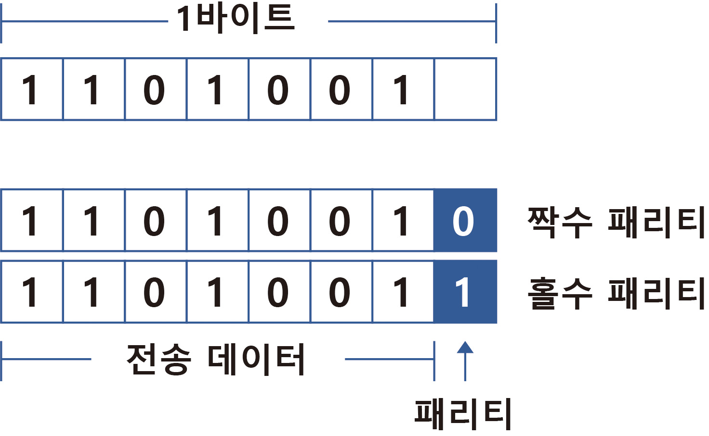
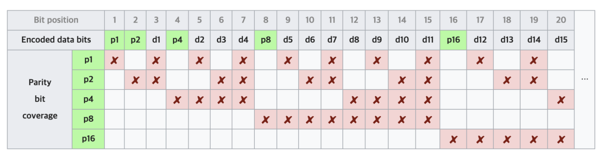

# 05-패리티 비트 & 해밍 코드

## 패리티 비트(Parity bit)
정보 전달 과정에서 오류가 생겼는지 검사하기 위해 추가하는 비트

전송하고자 하는 데이터의 각 문자에 1비트를 더하여 전송함

짝수 패리티, 홀수 패리티가 존재

1byte(8bit)구조에서 parity bit는 7bit 크기의 ASCII 코드를 제외한 나머지 1bit.

송신 호스트와 수신 호스트는 짝수 패리티나 홀수 패리티 중 동일한 한 가지 방식을 사용해야 함

수신 호스트는 패리티 검사를 하여 1의 개수가 짝수인지 홀수인지 확인함

짝수 패리티일 경우, 1의 개수가 홀수로 변경된 사실을 알게 되면 데이터 전송 과정에서 1비트 오류가 있음을 알게됨 

## 해밍 코드(Hamming Code)
데이터 전송 시 1비트의 에러를 정정할 수 있는 자기 오류정정 코드(ECC, Error Correction Code)

패리티비트를 보고 1비트에 대한 오류를 정정할 곳을 찾아서 수정할 수 있음 

2^p >= d + p + 1 (p: 패리티 비트 수, d: 데이터 비트 수)

해밍 코드에서 패리티 비트는 2의 거듭제곱에 해당하는 순서에 삽입됨

p1: 1, 3, 5, 7bit의 패리티비트 확인

p2: 2, 3, 6, 7bit의 패리티비트 확인

p3: 4, 5, 6, 7bit의 패리티비트 확인