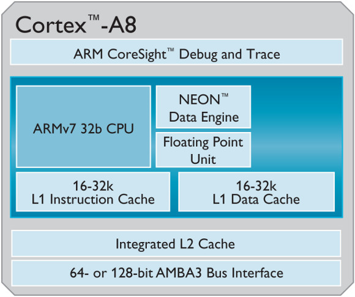
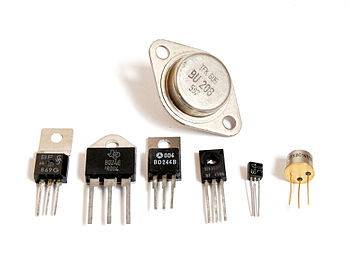
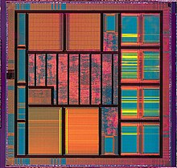

# 06-ARM 프로세서

## 프로세서 (Processor)
외부 데이터 소스에서 작업을 수행하는 전기 부품(디지털 회로)

주로 중앙 처리 장치(CPU)를 지칭하는 데에 사용
## ARM (Advanced RISC Machine)
진보된 RISC 기기의 약자로 ARM의 핵심 RISC 프로세서

> **RISC (Reduced Instruction Set Computer, 감소된 명령어 집합 컴퓨터)**
> 
> CPU 명령어를 짧게 구성하여 속도 개선을 향상시키는 프로세서 설계 방식
> 
> 간단한 명령어의 집합으로 구성되며, 명령어의 동작이 단순함
> 
> 명령어 하나 당 하나의 연산만을 수행
> 
> RISC-V, SPARC, MIPS 등의 아키텍처에서 사용됨

> **CISC (Complex Instruction Set Computer, 복합 명령어 집합 컴퓨터)**
> 
> 복잡한 명령어 집합을 갖는 CPU 아키텍처
> 
> 명령어가 복잡하므로 명령어 해석 시간이 오래 걸리며, 회로가 복잡함

## ARM 구조

RISC는 적은 수의 트랜지스터만 필요하므로 간결한 설계와 더 작은 크기를 가능케 함

반도체 기본 부품인 트랜지스터는 전원을 소비해 다이의 크기를 증가시키므로 가능한 적은 트랜지스터를 가지는 것이 이상적임

-> 명령 집합의 수가 적기 때문에 트랜지스터 수가 적고 이를 통해 전원 소모가 낮은 스마트폰, 태블릿PC와 같은 모바일 기기에 많이 사용됨

> **트랜지스터 (Transistor)**
> 
> 
> 
> 진공관을 대체하여, 반도체를 이용하여 전자 신호 및 전력을 증폭하거나 스위칭하는 데 사용되는 반도체 소자

> **다이 (die, 집적 회로)**
> 
> 
> 
> 반도체 물질의 자그마한 사각형 조각, 위에 회로가 제작되어 있음
> 
> 일반적으로 하나의 웨이퍼에 여러 개의 집적 회로가 생산됨
> 
> 웨이퍼는 절단을 통해 여러 개의 조각으로 나뉘는데 각 조각에는 한 개의 집적 회로가 담겨있음
> 
> 각 조각들을 다이라고 부름 

## ARM 장점
ARM을 위해 개발된 프로세서는 오직 ARM 프로세서가 탑재된 기기에서만 실행할 수 있음

하나의 ARM 기기에 동작하는 OS는 다른 ARM 기반 기기에서도 잘 동작함