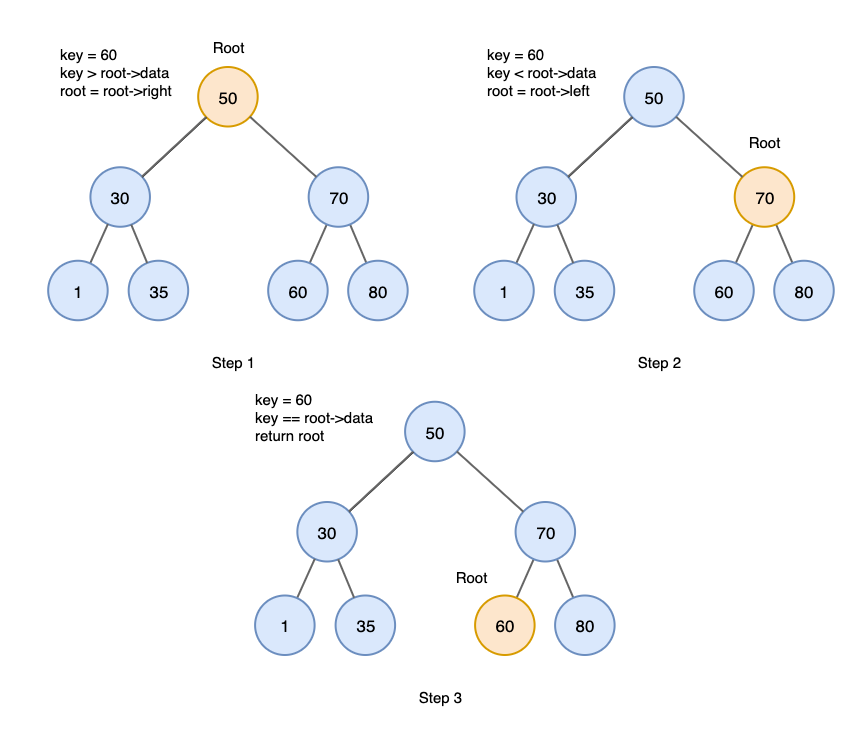
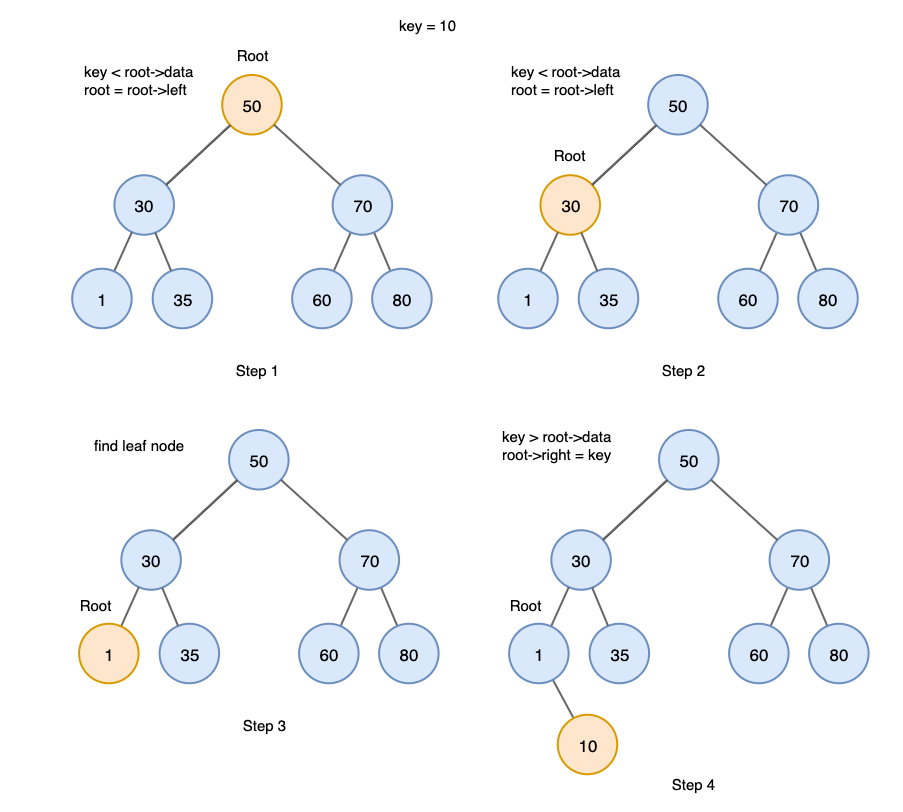
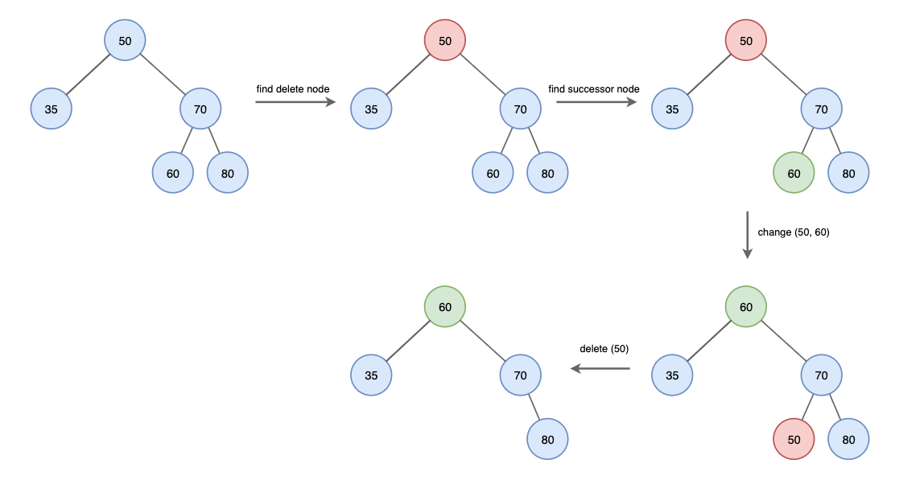

# BST(Binary Search Tree)

- 순서화된 이진 트리
- 노드의 왼쪽 하위 트리에는 **노드의 키보다 작은 키의 노드만** 포함된다.
- 노드의 오른쪽 하위 트리에는 **노드의 키보다 큰 키의 노드만** 포함된다.
- 중복된 키를 허용하지 않는다.
- => 효율적인 검색이 가능

 

## 특징

#### 1. BST의 **Inorder Traversal**을 수행하여 **모든 키를 정렬된 순서**로 가져올 수 있다.

#### 2. BST의 검색에 대한 시간 복잡도

- 균형 상태인 경우 => O(logN)
- 불균형 상태인 경우 => O(N)

 

## BST의 연산

### 검색(Search)

1. Root Node에서 시작한다.
2. 검색 값과 root를 비교한다. root보다 작으면 왼쪽으로, 크다면 오른쪽으로 재귀한다.
3. 일치하는 값을 찾을 때까지 2번 절차를 반복한다.
4. 검색 값이 없다면 null을 반환한다.

   

 

### 삽입(Insert)

1. Root Node에서 시작한다.
2. 삽입 값을 root와 비교한다. root보다 작으면 왼쪽으로 크다면 오른쪽으로 재귀한다.
3. leaf node에 도달한 후, 노드보다 작다면 왼쪽에, 크다면 오른쪽에 삽입한다.

   

 

### 삭제(Delete)

#### 1) 삭제할 노드가 leaf node인 경우

- => 단순 노드 삭제

#### 2) 삭제할 노드에 자식이 하나만 있는 경우

- => 노드 삭제 후 자식 노드를 삭제한 노드의 부모에 직접 연결

#### 3) 삭제할 노드에 자식이 둘 있는 경우

1. 삭제할 노드를 찾는다.
2. 삭제할 노드의 successor 노드를 찾는다.
3. 삭제할 노드와 successor 노드의 값을 바꾼다.
4. successor 노드를 삭제한다.

   

#### successor 노드

    right subtree의 최소값
