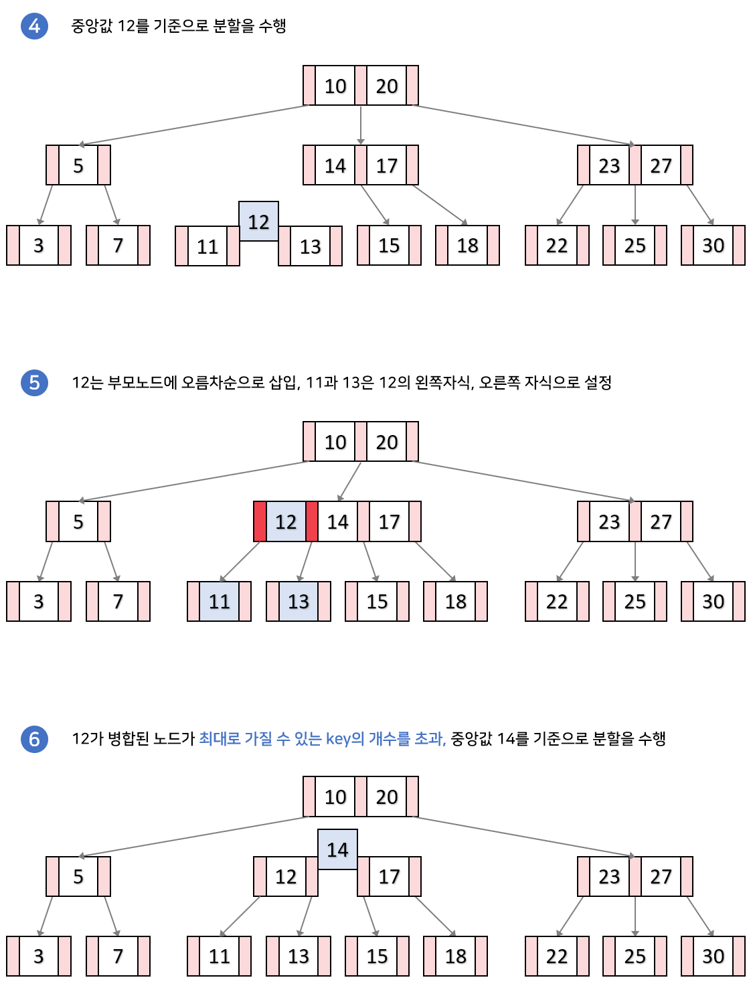

# B-Tree

- 이진트리를 확장해 모든 리프 노드들이 같은 레벨을 가질 수 있도록 자동으로 밸런스를 맞추는 트리
- Self-balanced Tree 중 가장 유명한 자료구조
- 정렬된 순서를 보장하고, 멀티레벨 인덱싱을 통해 빠른 검색이 가능
- 데이터베이스와 파일 시스템에서 널리 사용되는 트리 자료구조의 일종

    

#### M차 B-Tree

    최대 M개의 자식을 가질 수 있는 B-Tree

 

## 특징

#### 1. key들은 노드 안에서 항상 정렬된 값을 가진다.

#### 2. key들은 중복되지 않는다.

#### 3. 모든 leaf node는 같은 레벨에 존재한다.

#### 4. 이진 검색 트리처럼 각 key들의 왼쪽 자식들은 항상 key보다 작은 값을, 오른쪽은 큰 값을 갖는다.

#### 5. root node가 leaf node가 아닌 이상, 항상 2개 이상의 자식을 갖는다.

#### 6. 노드는 최대 M개부터 M/2개까지의 자식을 가질 수 있다.(root와 leaf 제외)

#### 7. 노드에는 최대 M-1개부터 ⌈(M/2)⌉-1개의 키가 포함될 수 있다.

#### 8. 노드의 키가 x개라면 자식의 수는 x+1개이다.

#### 9. 자식 수의 하한값이 t라면 `M = 2t - 1`을 만족한다.

 

## key 검색 과정(하향식)

1. root node에서 시작하여 key들을 순회하면서 검사한다.  
   1-1. k와 같은 key를 찾은 경우, 검색 종료  
   1-2. k와 key들의 **대소관계를 비교**한다. 어떤 key들 사이에 k가 들어간다면 해당 key들 사이의 자식 노드로 내려간다.
2. 1번 과정을 leaf node에 도달할 때까지 반복한다. 만약 leaf node에 k와 같은 key가 없다면 검색을 실패한다.

 

### Case. key 18을 검색하는 과정

 

## key 삽입 과정(상향식)

1. 트리가 비어있으면 root node를 할당하고 k를 삽입
2. leaf node가 가득 찼다면, 노드를 분할하고 leaf node가 생성된다.
3. 삽입하기에 적절한 leaf node를 찾아 k를 삽입한다. 삽임 위치는 노드의 key값과 k값을 검색 연산과 동일한 방법으로 비교하면서 찾는다.

### Case 1. 분할이 일어나지 않는 경우

### Case 2. 분할이 일어나는 경우

 

## key 삭제 과정

1. 삭제할 키가 있는 노드 검색
2. 키 삭제
3. 필요한 경우, 트리 균형 조정

#### inorder predecessor

    노드의 왼쪽 자손에서 가장 큰 key

#### inorder successor

    노드의 오른쪽 자손에서 가장 작은 key

#### parent key

    부모 노드의 key들 중 왼쪽 자식으로 본인 노드를 가지고 있는 Key 값
    마지막 자식노드의 경우에는 부모의 마지막 key이다.

 

### Case 1. 삭제할 k가 leaf node에 있는 경우

#### Case 1.1) 현재 노드의 key 개수가 최소 key 개수보다 큰 경우

#### Case 1.2) 왼쪽 또는 오른쪽 형제 노드의 key가 최소 key 개수 이상인 경우

#### Case 1.3) 왼쪽, 오른쪽 형제 노드의 key가 최소 key 개수이고, 부모 노드의 key가 최소개수 이상인 경우

 

### Case 2. 삭제할 k가 내부 노드에 있고, 노드나 자식의 key가 최소 key 보다 많을 경우

 

### Case 3. 삭제할 k가 내부 노드에 있고, 노드의 key와 자식노드의 key 개수가 모두 최소 key 개수인 경우

 
 

# B+Tree

- leaf node가 연결리스트 형태를 띄어 선형 검색이 가능하다.
- 작은 시간복잡드에 검색 수행 가능
- 대표적인 예) DB 인덱싱

    

#### 인덱싱

    어떠한 자료를 찾는데 key 값을 이용해 효과적으로 찾을 수 있는 기능

 

## 특징

#### 1. 모든 key, data가 leaf node에 모여있다.

#### 2. 모든 leaf node가 연결리스트의 형태를 띄고 있다.

#### 3. leaf node의 부모 key는 leaf node의 첫 번째 key보다 작거나 같다.

#### 4. 노드는 최대 M개부터 M/2개까지의 자식을 가질 수 있다.

#### 5. 노드에는 최대 M-1개부터 ⌈(M/2)⌉-1개의 키가 포함될 수 있다.

#### 6. 노드의 키가 x개라면 자식의 수는 x+1개이다.

#### 7. 자식 수의 하한값이 t라면, `M = 2t - 1`을 만족한다.

 

## B-Tree vs B+Tree

- B-tree는 leaf node가 아닌 각자 key마다 data를 가진다면, B+tree는 leaf node에 모든 data를 가진다.
- B-tree는 옆에 있는 leaf node를 검사할 때 다시 root node부터 검사해야 한다.  
  B+tree는 leaf node에서 선형검사를 수행할 수 있어 시간복잡도가 굉장히 줄어든다.
- B+tree는 leaf node를 제외하면 데이터를 담지 않기 때문에 메모리를 더 확보할 수 있다.
- B+tree는 B-tree에 비해 트리의 높이가 낮아지게 되며, 탐색 시 leaf node의 데이터만 살피므로 탐색에 매우 유리하다.

 

## key 삽입 과정

### Case 1. 분할이 일어나지 않고, 삽입 위치가 leaf node의 가장 앞 key 자리가 아닌 경우

- => B-tree와 같은 삽입 과정 수행

### Case 2. 분할이 일어나지 않고, 삽입 위치가 leaf node의 가장 앞 key 자리인 경우

### Case 3. 분할이 일어나는 삽입 과정

 

## key 삭제 과정

### Case 1. 삭제할 k가 인덱스에 없고, leaf node의 가장 처음 key가 k가 아닌 경우

### Case 2. 삭제할 k가 leaf node의 가장 처음 key인 경우

 
 

# B\*tree

- 균형을 유지하기 위한 연산에서 노드의 생성과 부가적인 연산을 최소화하기 위해 등장
- 기존 B-tree에서 자식 노드가 최소 M/2개의 데이터를 가져야 했던 점이 M\*2/3개로 변경
- 노드가 가득 찼을 때 분열하지 않고 형제 노드로 재배치하게 된다는 차이점

 

## 특징

#### 1. 각 노드의 key는 정렬되어 있다.

#### 2. key는 중복되지 않는다.

#### 3. 모든 leaf node는 같은 레벨에 존재한다.

#### 4. root node는 자신이 leaf node가 되지 않는 이상 적어도 2개 이상의 자식 노드를 가진다.

#### 5. root node가 아닌 노드들은 최대 M개부터 2 \* ⌈(M-2)/3⌉ + 1개의 자식 노드를 가지고 있는다.
