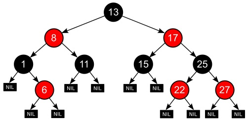
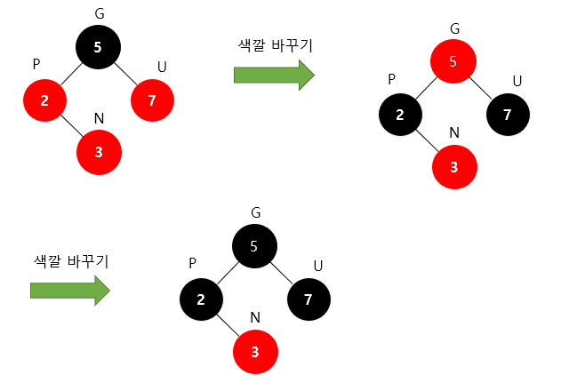

# Red-Black Tree

- 자가 균형 이진 탐색 트리
- 이진 탐색 트리는 균형이 안맞을 경우, 최악 시간 복잡도는 O(N)이다.
- RB Tree는 삽입/삭제 동안 트리의 모양이 균형 잡히도록 각 노드들은 Red 혹은 Black의 색상을 가지고 모든 경우에서 O(logN)의 시간복잡도를 보장받는다.

    

### 사용 사례

- 기하학 계산
- 함수형 프로그래밍에서의 연관 배열, 집합
- C++의 Map 자료구조
- Java의 TreeMap 자료구조

 

## 조건

#### 1. 모든 노드는 빨간색 혹은 검은색이어야 한다.

#### 2. 루트 노드는 검은색이다.

#### 3. 모든 리프 노드(NIL)들은 검은색이다.

- Null Leaf. 자료를 갖지 않고 트리의 끝을 나타내는 노드

#### 4. 빨간색 노드의 자식은 반드시 검은색이다.

- No Double Red. 빨간색 노드가 연속으로 나올 수 없다.

#### 5. 모든 리프 노드에서 루트 노드까지 가는 경로에서 만나는 검은색 노드의 개수가 같다.

- 모든 리프 노드에서 Black Depth는 같다.

 

## 삽입 과정

- RB Tree는 새로운 노드를 삽입할 때 항상 빨간색으로 삽입한다.
- 이때, Double Red가 발생했다면 2가지 전략을 사용할 수 있다.
- 부모의 형제 노드가 검은색이라면 Restructuring, 빨간색이라면 Recoloring

### 1) Restructuring

1.  새로운 노드(N), 부모 노드(P), 조상 노드(G)를 오름차순으로 정렬한다.
2.  셋 중 중간값을 부모로 만들고 나머지 둘을 자식으로 만든다.
3.  새로운 부모가 된 노드를 검은색으로 만들고 나머지 자식들을 빨간색으로 만든다.

    

 

### 2) Recoloring

1.  새로운 노드(N)의 부모(P)와 부모의 형제(U)를 검은색으로 바꾸고 조상(G)를 빨간색으로 바꾼다.
2.  조상(G)가 루트노드라면 검은색으로 바꾼다.
3.  조상(G)를 빨간색으로 바꿨을 때 또다시 Double Red가 발생한 경우, Restructuring 혹은 Recoloring을 통해 Double Red 문제가 발생하지 않을 때까지 반복한다.

    
