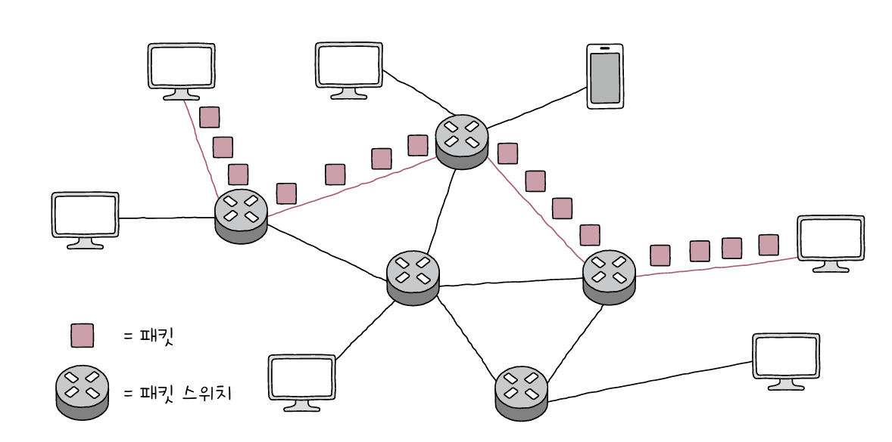

# 컴퓨터 네트워크 시작하기

slug: start-of-computer-network
tags: Network
version: 1

# 컴퓨터 네트워크를 알아야 하는 이유

컴퓨터 네트워크는 우리 일상을 지탱하는 주요 기반 기술입니다. 컴퓨터 네트워크 줄여서 **네트워크**란 여러 개의 장치가 마치 그물처럼 서로 연결되어 정보를 주고 받을 수 있는 통신망입니다.

## 인터넷(Internet)

네트워크를 통해 주변의 장치와 정보를 주고받는 것을 넘어서 네트워크와 연결된 지구 반대편의 다른 장치와도 정보를 주고 받을 수 있도록 하는 기술을 **인터넷**이라고 합니다. 즉 여러 네트워크를 연결한 ‘네트워크의 네트워크’를 인터넷이라고 합니다.

# 네트워크 거시적으로 살펴보기

네트워크는 거시적으로 그래프의 형태를 띠고 있습니다. 그래프(Graph)란 노드(Node)와 노드를 연결하는 간선(Edge)로 이루어진 자료구조입니다.

## 네트워크의 기본 구조

모든 네트워크는 ‘노드’, 노드를 연결하는 ‘간선’, 노드 간 주고받는 ‘메시지’로 구성됩니다. 각 개념에 대해서 세부적으로 살펴보겠습니다.

### 호스트(Host)

네트워크의 가장자리에 위치한 노드는 네트워크를 통해 흐르는 정보를 최초로 생성, 송신, 그리고 최종적으로 수신합니다. 이러한 가장자리 노드를 **호스트**라고 부릅니다. 때때로 호스트가 네트워크상에서 특정한 역할을 수행하는데, 대표적인 역할로는 **서버**와 **클라이언트**가 있습니다.

**서버(Server)**는 어떤 서비스를 제공하는 호스트입니다. 이때 서비스는 파일(파일 서버)이 될 수도 있고, 웹 페이지(웹 서버)가 될 수도 있고, 메일(메일 서버)이 될 수도 있습니다.

반면 **클라이언트(Client)**는 서버에게 어떤 서비스를 요청하고 서버의 응답을 제공받는 호스트입니다. 클라이언트는 서버에게 **요청(Request)**를 보내고 그에 대한 **응답(Response)**을 제공받습니다.

### 네트워크 장비

네트워크 노드가 호스트만 있는 것이 아니고, 가장자리에 위치해있지 않은 **중간 노드**가 있습니다. 대표적으로 이더넷 허브, 스위치, 라우터, 공유기 등이 있습니다. 이러한 **네트워크 장비**들은 호스트 간에 주고받는 정보가 원하는 수신지까지 안정적이고 안전하게 전송될 수 있도록 합니다.

### 통신매체

각 노드를 연결하는 간선을 통신 매체라고 합니다. 이 통신 매체에는 노드들을 유선으로 연결하는 **유선 매체**, 무선으로 연결하는 **무선 매체**가 있습니다.

### 메시지(Message)

통신 매체로 연결된 노드가 주고받는 정보를 **메시지**라고 합니다.

## 범위에 따른 네트워크 분류

호스트가 메시지를 주고 받는 범위는 일반 가정이 될 수도 있고, 기업이 될 수도 있고, 도시나 국가가 될 수도 있습니다. 즉 네트워크의 구성 범위는 다양하므로 범위에 따라 분류하는 기준이 존재합니다. 네트워크는 범위에 따라 크게 LAN과 WAN으로 구분합니다.

### LAN

LAN은 Local Area Network의 약자로 가까운 지역을 연결하는 근거리 통신망을 의미합니다. 

### WAN

WAN은 Wide Area Network의 약자로 먼 지역을 연결하는 광역 통신망을 의미합니다. 인터넷이 WAN으로 분류됩니다. 같은 LAN에 속한 호스트들끼리는 인터넷 연결과 같은 WAN이 필요없지만, 다른 LAN에 속한 호스트들과 메시지를 주고받아야 할 때는 WAN이 필요합니다.

인터넷을 사용하기 위해서 접속하는 WAN은 **ISP(Internet Service Provider)**라는 인터넷 서비스 업체가 구축하고 관리합니다. ISP는 사용자에게 인터넷과 같은 WAN에 연결 가능한 회선을 임대하는 등 WAN과 관련된 다양한 서비스를 제공합니다.

## 메시지 교환 방식에 따른 네트워크 분류

호스트들이 네트워크를 통해 메시지를 주고받는 방식은 대표적으로 **회선 교환 방식**과 **패킷 교환 방식**이 있습니다. 각 방식을 사용하는 네트워크를 각각 회선 교환 네트워크, 패킷 교환 네트워크라고 합니다.

### 회선 교환 방식 (Circuit Switching)

**회선 교환** 방식은 먼저 메시지 전송로인 회선(Circuit)을 설정하고 이를 통해 메시지를 주고 받는 방식입니다. 따라서 호스트들이 메시지를 주고받기 전에 두 호스트를 연결하는 경로를 먼저 만들어둔 뒤 연결된 경로로 메시지를 주고받습니다.

회선 교환 네트워크가 올바르게 동작하기 위해서는 호스트 간의 회선을 적절하게 설정하는 회선 교환 네트워크 장비인 회선 스위치가 있어야 합니다. **회선 스위치**는 호스트 사이에 일대일 전송로를 확보하는 네트워크 장비입니다.

회선 교환 방식은 우선 두 호스트 사이에 연결을 확보한 후에 메시지를 주고받는 특성 덕분에 주어진 시간 동안 전송되는 정보의 양이 비교적 일정하다는 장점이 있습니다. 하지만 연결되어 있는 동안 회선의 이용 효율이 낮아질 수 있다는 단점이 있습니다. 가능한 모든 회선에서 모든 모든 경로에서 끊임없이 메시지가 흐르고 있어야지 이용 효율이 높을텐데, 메시지를 주고받지 않으면서 회선만 점유하고 있다면 효율이 떨어질 수 밖에 없습니다.

### 패킷 교환 방식 (Packet Switching)

**패킷 교환** 방식은 회선 교환 방식의 문제점을 해결한 것으로, 메시지를 패킷이라는 작은 단위로 쪼개어 전송합니다. 여기서 **패킷(Packet)**은 패킷 교환 네트워크상에서 송수신되는 메시지의 단위입니다. 그리고 현대 인터넷은 대부분 패킷 교환 방식을 사용합니다.

패킷 교환 네트워크는 회선 교환 네트워크와는 달리 메시지를 송수신하는 두 호스트가 하나의 전송 경로를 점유하지 않기 때문에 네트워크 이용 효율이 상대적으로 높습니다.

패킷 교환 방식은 정해진 경로만으로 메시지를 송수신하지 않고 다양한 중간 노드를 통해 호스트로 보낼 수 있는데, 이때 중간 노드인 **패킷 스위치**는 패킷이 수신지까지 올바르게 도달할 수 있도록 최적의 경로를 설정하거나 패킷의 송수신지를 식별합니다. 대표적인 패킷 스위치 네트워크 장비로는 **라우터(Router)**와 **스위치(Switch)**가 있습니다.

패킷은 소포, 꾸러미라는 뜻입니다. 패킷은 택배와 비슷한 개념으로, 택배에는 보낼 물품과 송신지 주소, 수신지 주소, 송신자, 수신자 등의 부가 정보가 필요한 것과 비슷합니다. 패킷에는 패킷을 통해 전송하고자 하는 데이터를 **페이로드(Payload)**라고 하며, 이와 더불어 **헤더(Header)**라는 정보와 때로는 **트레일러(Trailer)**라는 정보가 포함되기도 합니다.

### 주소와 송수신지 유형에 따른 전송 방식

패킷의 헤더에 담기는 대표적인 정보로는 주소가 있습니다. 주소(Address)는 송수신지를 특정하는 정보입니다. 이러한 주소가 있다면 송수신지 유형에 따라 다양한 방식으로 메시지를 보낼 수 있습니다. 예를 들어 수신지를 특정 호스트로 설정할 수도 있고, 네트워크 내 모든 호스트로 설정할 수도 있습니다. 송수신지 유형에 따른 전송 방식은 다양한 종류가 있지만 네트워크의 기본 동작을 파악하기 위해 알아야 할 가장 중요한 전송 방식은 유니캐스트와 브로드캐스트입니다.

### 유니캐스트 (Unicast)

가장 일반적인 형태의 송수신 방식으로 하나의 수신지에 메시지를 전송하는 방식입니다. 즉, 송신지와 수신지가 일대일로 메시지를 주고받는 경우입니다.

### 브로드캐스트 (Broadcast)

자신을 제외한 네트워크상의 모든 호스트에게 전송하는 방식입니다. 브로드캐스트가 전송하는 범위를 **브로드캐스트 도메인(Broadcast Domain)**이라고 합니다. 즉, 브로드캐스트의 수신지는 브로드캐스트 도메인이며 이는 자신을 제외한 네트워크상의 모든 호스트입니다.

이외에도 네트워크 내 동일 그룹에 속한 호스트에게만 전송하는 방식인 **멀티캐스트(Multicast)**, 네트워크 내의 동일 그룹에 속한 호스트 중 가장 가까운 호스트에게 전송하는 방식인 **애니캐스트(Anycast)**등의 방식도 있습니다.

# 네트워크 미시적으로 살펴보기

## 프로토콜 (Protocol)

언어가 올바르게 정보를 주고받기 위해 합의된 의사소통 방식인 것처럼 **프로토콜**은 통신 과정에서 정보를 올바르게 주고받기 위해 합의된 규칙이나 방법입니다.

## 네트워크 참조 모델 (Network Reference Model)

통신이 일어나는 각 과정을 계층으로 나눈 구조를 네트워크 참조 모델이라고 합니다. 계층으로 표현한다는 점에서 **네트워크 계층 모델**이라고도 합니다.

통신 과정을 계층으로 나눈 이유는 크게 두 가지입니다.

1. 네트워크 구성과 설계가 용이
    1. 각 계층이 수행해야 할 역할이 정해져 있으므로 계층의 목적에 맞게 프로토콜과 네트워크 장비를 계층별로 구성할 수 있습니다.
    2. 예컨데 2계층에서는 2계층의 목적에 부합하는 프로토콜과 네트워크 장비를 사용하고, 3계층에서는 3계층의 목적에 부합하는 프로토콜과 네트워크 장비를 사용할 수 있습니다.
2. 네트워크 문제 진단과 해결이 용이
    1. 통신 과정에서 문제가 발생하더라도 문제의 원인을 계층별로 진단하기 수월합니다.

이제 대표적인 네트워크 참조 모델인 **OSI모델**과 **TCP/IP모델**을 알아보겠습니다.

### OSI모델

OSI모델은 국제 표준화 기구(ISO; International Organization for Standardization)에서 만든 네트워크 참조 모델입니다. 통신 단계를 7개의 계층으로 나눕니다. 최하위 계층부터 최상위 계층까지 각각 물리 계층, 데이터 링크 계층, 네트워크 계층, 전송 계층, 세션 계층, 표현 계층, 응용 계층입니다.

1. 물리 계층 (Physical Layer)
    1. OSI모델의 최하단에 있는 계층
    2. 1, 0으로 표현되는 **비트 신호**를 주고 받음
2. 데이터 링크 계층 (Data Link Layer)
    1. **네트워크 내 주변 장치** 간의 정보를 올바르게 주고받기 위한 계층
    2. 이더넷을 비롯한 많은 LAN기술이 녹아있음
    3. 물리 계층을 통해 주고받는 정보에 오류가 없는지 확인하고 **MAC주소**를 통해 네트워크 내 송수신지를 특정할 수 있음
    4. 전송 과정에서 발생할 수 있는 충돌을 해결하는 계층이기도 함
3. 네트워크 계층 (Network Layer)
    1. 메시지를 **다른 네트워크**에 속한 수신지까지 전달하는 계층
    2. 데이터 링크 계층에서 네트워크 내 주변 장치 간의 통신이 이루어진다면, 네트워크 계층에서는 **네트워크 간의 통신**이 이루어짐
    3. **IP주소**를 통해 통신하고자 하는 수신지 호스트와 네트워크를 식별하고 원하는 수신지에 도달하기 위한 최적의 경로를 설정
4. 전송 계층 (Transport Layer)
    1. 신뢰성 있고 안정적인 전송을 해야할 때 필요한 계층
    2. 패킷이 정상적으로 보내졌는지, 중간에 유실된 정보는 없는지, 패킷의 순서가 뒤바뀐 것은 없는지 등을 확인하며 **패킷의 흐름을 제어하거나 전송 오류를 점검**해 전송의 신뢰를 확보함
    3. 추가적으로 **포트(Port)** 정보를 통해 실행 중인 응용 프로그램의 식별이 이루어지기도 함
5. 세션 계층 (Session Layer)
    1. **세션(Session)**을 관리하기 위해 사용하는 계층
    2. 세션은 일반적으로 통신을 주고받는 호스트의 응용 프로그램 간 연결 상태를 의미
    3. 세션 계층은 이러한 연결 상태를 생성, 유지, 종료하는 역할을 담당
6. 표현 계층 (Presentation Layer)
    1. 사람이 이해할 수 있는 언어를 컴퓨터가 이해할 수 있는 코드로 변환하거나 압축, 암호화와 같은 작업이 이루어지는 계층
7. 응용 계층 (Application Layer)
    1. OSI 참조 모델의 최상단에 있는 계층으로 사용자가 이용하는 응용 프로그램과 가장 밀접히 닿아있는 계층
    2. 응용 프로그램에 다양한 네트워크 서비스를 제공
    3. 웹 브라우저 프로그램에 웹 페이지를 제공하거나 이메일 클라이언트 프로그램에 송수신된 이메일을 제공하는 등의 실질적인 네트워크 서비스가 제공
    4. 다양한 서비스가 제공될 수 있는 만큼 타 계층에 비해 응용 계층에 속한 프로토콜이 많음

### TCP/IP모델

OSI 모델은 주로 네트워크를 이론적으로 표현할 때 사용하는 반면에 TCP/IP모델은 구현에 중점을 둔 네트워크 참조 모델입니다. TCP/IP 4계층, 인터넷 프로토콜 스위트(Internet Protocol Suite), TCP/IP 프로토콜 스택(Protocol Stack)이라고도 부릅니다.

1. 네트워크 액세스 계층 (Network Access Layer)
    1. 링크 계층(Link Layer), 네트워크 인터페이스 계층(Network Interface Layer)이라고도 부름
    2. OSI의 데이터 링크 계층과 유사
2. 인터넷 계층 (Internet Layer)
    1. OSI의 네트워크 계층과 유사
3. 전송 계층 (Transport Layer)
    1. OSI의 전송 계층과 유사
4. 응용 계층 (Application Layer)
    1. OSI의 세션 계층, 표현 계층, 응용 계층을 합친 것과 유사

## 캡슐화와 역캡슐화

패킷은 송신 과정에서 캡슐화, 수신 과정에서 역캡슐화가 이루어집니다. 

## PDU (Protocol Data Unit)

각 계층에서 송수신되는 메시지의 단위를 PDU라고 합니다. 상위 계층에서 전달받은 데이터에 현재 계층의 프로토콜 헤더 혹은 트레일러를 추가하면 현재 계층의 PDU가 됩니다. OSI모델에서 각 계층의 PDU를 정리하면 다음과 같습니다.

전송 계층의 PDU는 TCP프로토콜이 사용되었을 때는 **세그먼트**, UDP프로토콜이 사용되었을 때는 **데이터그램**이 됩니다.