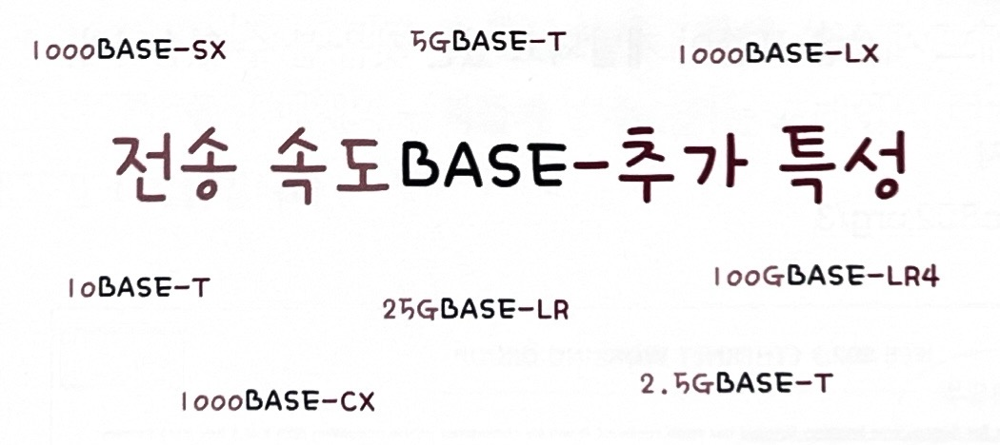
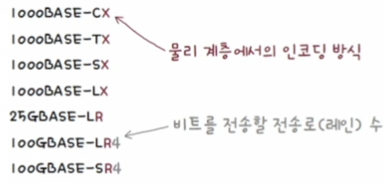
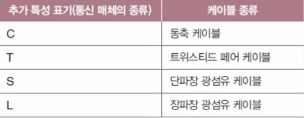
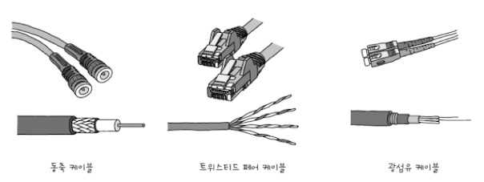
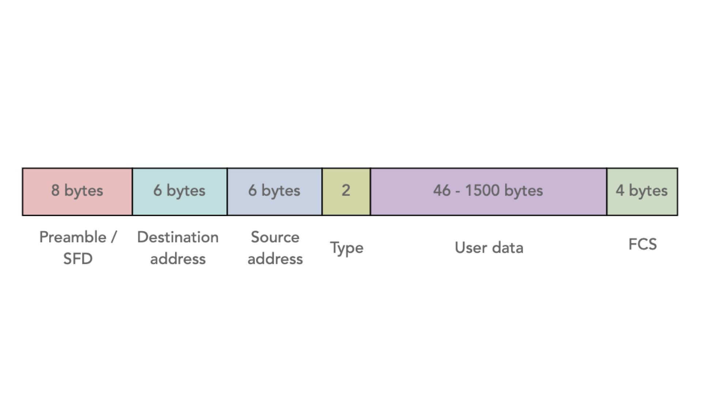
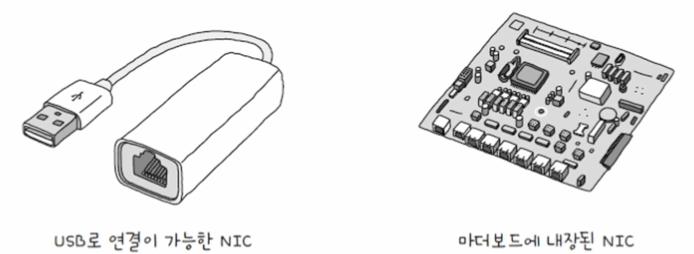
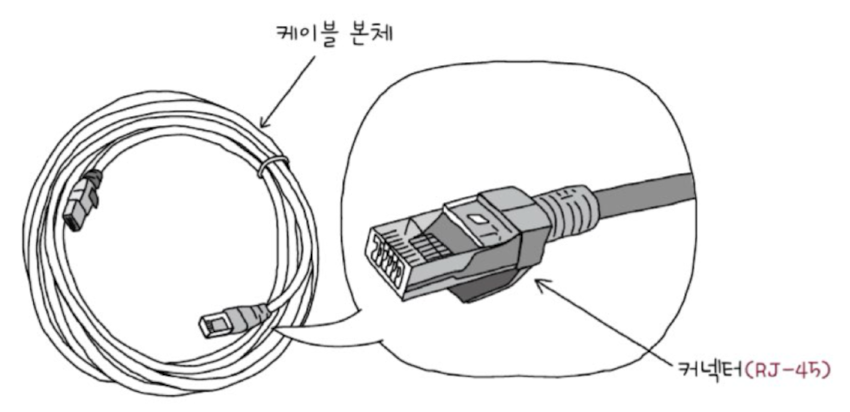
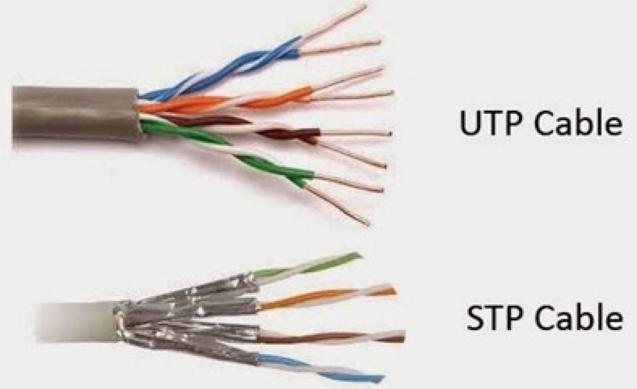

# 물리 계층과 데이터 링크 계층

slug: physical-layer-and-data-link-layer
tags: Network
version: 1

# 이더넷 (Ethernet)

이더넷은 유선 LAN환경에서 가장 대중적으로 사용되는 기술입니다. 케이블과 같은 통신 매체를 통해 정보를 송수신할 때 서로 방법이 정해져 있어야 하는데, 그것이 바로 이더넷입니다. 이더넷은 다양한 통신 매체의 규격과 송수신되는 프레임의 형태, 프레임을 주고받는 방법 등이 정의된 네트워크 기술입니다.

## 이더넷 표준

오늘날의 유선 LAN환경은 대부분 이더넷을 기반으로 구성됩니다. IEEE(Institute of Electrical and Electronics Engineers)에서 이더넷 관련 기술을 [IEEE 802.3](https://www.ieee802.org/3/)이라는 이름으로 표준화했습니다. 따라서 서로 다른 컴퓨터가 각기 다른 제조사의 네트워크 장비를 사용하더라도 동일한 형식의 프레임을 주고받고 통일된 형태로 작동할 수 있습니다.

## 통신 매체 표기 형태

### 전송속도 (Data Rate)

숫자만 표기되어 있으면 Mbps속도, 숫자 뒤에 G가 붙어 있으면  Gbps의 속도를 의미합니다. 100BASE-T케이블은 100Mbps, 10GBASE-T는 10Gbps입니다.

### BASE

BASE는 **베이스밴드(BASEband)**의 약자로, **변조 타입(Modulation Type)**을 의미합니다. 변조 타입은 비트 신호로 변환된 데이터를 통신 매체로 전송하는 방법을 의미합니다. LAN환경에서는 대부분 디지털 신호를 송수신하는 베이스밴드 방식을 사용합니다.

### 추가 특성 (Additional Distinction)

추가 특성에는 통신 매체의 특성을 명시합니다. **전송 가능한 최대 거리**나 **물리 계층에서 인코딩 방식**, 비트 신호를 옮길 수 있는 전송로 수를 의미하는 **레인 수**가 명시되기도 합니다.

## 통신 매체 종류

## 이더넷 프레임(Ethernet Frame)

이더넷 네트워크에서 주고 받는 프레임인 이더넷 프레임의 형식은 정해져 있습니다.

이더넷 프레임 헤더는 기본적으로 **프리앰블**, **수신지 MAC주소**, **송신지 MAC주소**, **타입/길이**로 구성되고, 페이로드는 **데이터**, 트레일러는 **FCS**로 구성됩니다.

### 프리앰블(Preamble)

프리앰블은 이더넷 프레임의 시작을 알리는 8바이트(64비트)크기의 정보입니다. 프리앰블의 첫 7바이트는 10101010, 마지막 바이트는 10101011값을 가집니다. 수신지는 이 프리앰블을 통해 이더넷 프레임이 오고 있음을 알아차립니다. 즉, 프리앰블은 송수신지 간의 동기화를 위해 사용되는 정보입니다.

### 수신지 MAC주소, 송신지 MAC주소

‘물리적 주소’라고도 불리는 MAC주소는 데이터 링크 계층의 핵심입니다. MAC 주소는 네트워크 인터페이스마다 부여되는 6바이트(48비트) 길이의 주소로 LAN 내의 수신지와 송신지를 특정할 수 있습니다. MAC 주소는 일반적으로 고유하고, 일반적으로 변경되지 않는 주소로써 네트워크 인터페이스마다 부여됩니다. 보통 NIC(Network Interface Controller)라는 장치가 네트워크 인터페이스 역할을 담당합니다.

### 타입/길이

타입/길이 필드에는 **타입(Type)** 혹은 **길이(Length)**가 올 수 있습니다. 필드에 명시된 크기가 1500(16진수 05DC) 이하일 경우에는 이 필드는 프레임의 크기를 나타내는 데 사용되고, 1536(16진수 0600) 이상일 경우에는 타입을 나타내는 데 사용됩니다. 타입이란 이더넷 프레임이 어떤 정보를 캡슐화했는지 나타내는 정보로 이더타입(Ethertype)이라고도 부릅니다. 대표적으로 상위 계층에서 사용된 프로토콜의 이름이 명시됩니다.

### 데이터

데이터는 상위 계층에서 전달받거나 상위 계층으로 전달해야 할 내용으로 네트워크 계층의 데이터와 헤더를 합친 PDU가 이곳에 포함됩니다. 최대 크기는 1500바이트이며 유의할 점은 반드시 일정 크기(46 바이트) 이상이어야 한다는 점입니다. 그 이하의 데이터라면 크기를 맞추기 위해 패딩(Padding)이라는 정보가 내부에 채워집니다. 보통 46바이트 이상이 될 때까지 0으로 채워집니다.

### FCS(Frame Check Sequence)

FCS는 수신한 이더넷 프레임에 오류가 있는지 확인하기 위한 필드입니다. 데이터 링크 계층에서 오류 검출은 바로 이 FCS를 통해 이루어집니다. 이 필드에는 CRC(Cyclic Redundancy Check), 즉 순환 중복 검사라고 불리는 오류 검출용 값이 들어가는데 프리앰블을 제외한 나머지 필드값을 바탕으로 CRC값을 계산해서 FCS 필드에 명시합니다.

# NIC과 케이블

## NIC (Network Interface Controller)

호스트와 유무선 통신 매체를 연결하고 통신 매체를 통해 전달되는 신호와 컴퓨터가 이해할 수 있는 정보 간의 변환을 담당하는 네트워크 장비를 NIC라고 합니다. 즉, 호스트를 네트워크(LAN)에 연결하기 위한 하드웨어라고 표현합니다.

### NIC의 생김새

### NIC의 역할

NIC는 통신 매체에 흐르는 신호를 호스트가 이해하는 프레임으로 변환하거나 반대로 호스트가 이해하는 프레임을 통신 매체에 흐르는 신호로 변환합니다. 따라서 호스트가 송수신하는 정보는 NIC를 거칩니다. 이처럼 NIC는 네트워크와의 연결점을 담당한다는 점에서 네트워크 인터페이스 역할을 수행한다고도 합니다.

## 트위스티드 페어 케이블(Twisted Pair Cable)

트위스티드 페어 케이블은 구리선으로 전기 신호를 주고 받는 통신 매체입니다.

### 실드에 따른 트위스티드 페어 케이블의 분류

**STP(Shielded Twisted Pair)** 케이블은 브레이드 실드로 구리 선을 감싸 노이즈를 감소시킨 트위스티드 페어 케이블, **FTP(Foil Twisted Pair)** 케이블은 포일 실드로 노이즈를 감소시킨 트위스티드 페어 케이블입니다. 반면 아무것도 감싸지 않은 구리 선만 있는 케이블은 **UTP(Unsheielded Twisted Pair)**케이블이라고 합니다.