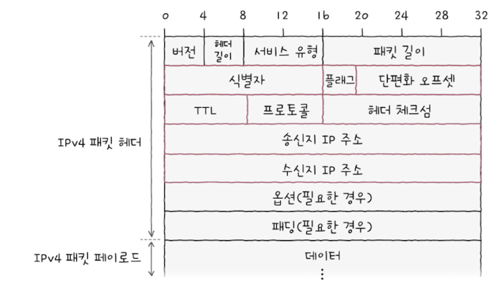

# 네트워크 계층

slug: network-layer
tags: Network
version: 1

## 네트워크 계층

통신을 빠르게 주고받기 위해 패킷이 이동할 최적의 경로를 결정하는 라우팅이 이루어진다.

네트워크 계층의 IP 주소를 이용해 네트워크 상의 호스트 식별 가능

- 물리 계층과 데이터링크 계층은 LAN에 국한된 통신
- LAN 을 넘어서기 위한 계층으로 네트워크 간 통신이 가능한 계층
- 단편화가 이루어지는 계층

### 기본적으로 MAC 주소 이전에 IP주소를 사용

| 구분 | 특징 | 비유 | 주소 |
| --- | --- | --- | --- |
| MAC주소 | 물리주소 | 수취인 개인 정보(주민등록번호) | A1:B2:C3:D4:E5:F6 |
| IP주소 | 논리주소 | 수취인 주소(서울특별시 노원구..) | 192.168.1.1 |
- 직접 할당
- 자동할당 (DHCP)

## 인터넷 프로토콜 (IP)

네트워크 계층의 핵심 프로토콜

### IP 주소 형태

- 4바이트(32비트) 주소로 표현 가능
- 0~255 범위 안에 있는 네 개의 10진수로 표기
- 각 10 진수는 점(옥텟)으로 구분 된다.

### IP 의 기능

1. **IP 주소 지정**
    1. IP 주소를 바탕으로 송수신 대상을 지정하는 것
2. **단편화**
    1. 패킷의 크기를 최대 전송 단위 MTU(Maximum Transmission Unit) 이하로 유지, 최대 전송 단위 보다 클 경우에는 크기 이하의 복수의 패킷으로 나눔
    2. MTU 크기 이하로 단편화된 패킷들은 목적지에서 재조합

### IP 버전

버전 4(IPv4)와 6(IPv6 )가 있고, 각각 주소의 길이와 헤더의 구성이 다르다.

**IPv4**

- **IP 주소 지정 기능에 관여** : 송신지 IP 주소, 목적지 IP 주소
- **IP 단편화 기능에 관여** : 식별자, 플래그 단편화 오프셋
    - **식별자:** 패킷에 할당된 번호 (재조합시 사용)
    - **플래그** : 부가 정보

        
        - **첫 번째 비트** : 항상 0,미사용
        - **DF**(Don’t Fragment) - IP 단편화 금지 : 나머지 두개의 비트중 하나
            - 1 : IP 단편화 미수행 / 0 : IP 단편화 수행 가능
        - **MF** (More Fragment 비트) : 단편화된 패킷이 더있는 지 나타냄
            - 1: 쪼개진 패킷이 아직 존재 / 0 : 마지막 패킷
    - **단편화 오프셋** : 단편화되기 전 패킷의 초기 데이터에서 얼마나 떨어져 있는 패킷인가 (재조합시 필요)
- **TTL :** 패킷의 수명, 라우터를 거칠때마다(홉마다) 1씩 감소 하며 0이 되면 폐기
    - **홉** : 패킷이 호스트 또는 라우터에 한 번 절달되는 것
- **프로토콜** : 상위 계층의 프로토콜이 무엇인지(TCP인지, UDP 인지)

**IPv6**

- 할당 가능한 IPv4 주소 갯수는 약 43억개로 주소 총량이 고갈 되는 것을 해소하고자 IPv6 등장
- 16바이트(128비트)로 주소 표현, 콜론(:)으로 구분된 8개 그룹의 16진수
- 2의 128제곱으로 무한에 가까운 갯수 할당 가능
- 간소화된 IPv6 패킷의 기본헤더
    - 다음헤더, 홉 제한, 송신지 IP 주소, 수신지 IP wnth

## ARP

기본적으로 MAC 주소 이전에 IP 주소를 사용

**동일 네트워크 내**의 호스트의 IP주소를 통해 MAC 주소를 알아내기 위한 프로토콜

### **동작 과정**

1. ARP 요청
2. ARP 응답
3. ARP 테이블(ARP 캐시) 갱신

**1. ARP 요청 (브로드캐스트 메시지)**

- 특정 IP 주소를 가진 호스트의 MAC 주소를 알아내기 위해 보내는 브로드캐스트 메시지
- 해당 호스트의 MAC 주소를 모르기 때문에 브로드캐스트 메시지로 전송

**2. ARP 응답**

- ARP 요청 메시지에 대한 응답
- 자신의 MAC 주소 포함

**3. ARP 테이블 갱신**

- ARP 테이블 (ARP 캐시) : MAC 주소와 IP 주소가 매핑된 표 형태의 데이터
- 일정 시간이 지나면 삭제
- ARP 테이블에 추가된 호스트는 브로드캐스트로 ARP 브로드캐스트로 ARP 요청 보낼 필요 없음

 다른 네트워크에 속한 호스트의 MAC 주소 일경우
 
 
 다른 네트워크에 속한 호스트에게 패킷을 보내야 할 경우 네트워크 외부로 나가기 위한 장비(라우터)의 MAC 주소를 알아내어 패킷 전송
 
 - ARP 요청 - ARP 응답 (MAC 주소를 모를 경우)
     1. 호스트 A와 라우터 A
     2. 라우터 A와 라우터 B
     3. 라우터 B와 호스트 B

## **IP 주소의 구성**

: 네트워크 주소, 호스트 주소 (유동적)

| 네트워크 주소 | 호스트주소 |
| --- | --- |
| 네트워크를 표현하는 부분 | 호스트를 표현하는 부분 |
| 네트워크 ID, 네트워크 식별자 등 | 호스트 ID, 호스트 식별자등 |
- IP 주소에서 네트워크 주소와 호스트 주소를 구분하는 범위는 유동적 일 수 있다.

### 클래스풀 주소 체계

- 클래스를 이용해 네트워크 주소와 호스트 주소를 나누는 방식
- 네트워크 주소와 호스트 주소의 공간분배 고민을 해결하기 위해 생긴 개념
- 네트워크 크기에 따라 IP 주소를 분류하는 기준

- 호스트의 주소공간을 모두 사용할 수는 없다.
    - 전부 0 : 해당 네트워크 자체를 의미하는 네트워크 주소
    - 전부 1 : 브로드캐스트를 위한 주소

        

### 클래스리스 주소체계

- 클래스를 이용하지 않고 서브넷 마스크로 네트워크 주소와 호스트 주소를 구분 짓는 방법
- 클래스풀 주소 체계는 클래스 별 네트워크 크기가 고정되어 있기 때문에 다수의 IP 주소가 낭비될 수 있음
- 오늘날 주로 사용하는 방식

### 서브넷 마스크

- **IP 주소 상에서 네트워크 주소는 1, 호스트 주소는 0으로 이루어진 비트열**
- 네트워크 내의 부분적인 네트워크(서브네트워크)를 구분 짓는(마스크) 비트열
- **서브네팅** : 서브넷 마스크를 이용해 클래스를 원하는 크기로 더 잘게 쪼개어 사용하는 것
- 클래스 A : 255.0.0.0
- 클래스 B : 255.255.0.0
- 클래스 C : 255.255.255.0

### 서브네팅 : 비트 AND 연산

- 서브넷 마스크를 이용해 네트워크 주소와 호스트 주소를 구분 짓는 방법
- 서브넷 마스크와 IP 주소의 비트 AND 연산 ⇒ 네트워크 주소

### 서브넷 마스크 표기 : CIDR 표기법

- 서브넷 마스크 상의 1의 개수를 IP주소/숫자로 표기
- 192.168.100.103/30

> MAC 주소의 구성
> 
> 
> : 제조사 번호, 일련 번호 (비트 수 24/24비트 고정)

## 공인 IP 주소와 사설 IP 주소

IP 주소는 전세계 고유한 주소이기도 하면서 아니기도 하다.

### 공인 IP 주소

- 인터넷 사용할 때 사용하는 고유한 주소
- ISP나 공인 IP 주소 할당 기관을 통해 할당 받을 수 있다.

### 사설 IP 주소

- 사설 네트워크 내에서 사용하는 고유하지 않은 주소
    - 사설 네트워크 : 이넡넷, 외부 네트워크에 공개되지 않은 네트워크
    - 해당 호스트가 속한 사설 네트워크상에서만 유효한 주소이기 떄문에 다른 네트워크 상의 사설 IP주소와 중복 될 수 있다.
- 사설 IP 주소 대역
    - 10.0.0/8
    - 172.16.0.0/12
    - 192.168.0.0/16

### NAT(Network Address Translation) : 공인 IP 주소와 사설 IP 주소 간의 변환 기능

- 하나의 공인 IP 주소를 여러 사설 IP 주소가 공유 가능
- IP 주소 부족 문제 해결
- 대부분의 라우터와 (가정용)공유기는 NAT 기능을 내장하고 있다.
    1. 사설 IP 주소는 공유기를 거쳐 공인 IP 로 변경되어 외부 네트워크로 전송
    2. 외부 네트워크로 받은 패킷 속 공인 IP주소는 공유기를 거쳐 사설 IP주소로 변경되어 사설 네트워크 속 호스트에 이름

## 정적 IP 주소와 동적 IP 주소

- IP 주소의 할당 방법 : 정적 할당과 동적 할당

### 정적 할당

- 호스트에 직접 수작업으로 IP 주소를 부여하는 방법
    - IP 주소, 서브넷 마스크, 게이트웨이(라우터)주소, DNS 주소 입력 가능
- 정적 IP 주소 : 정적 할당된 IP 주소 (고정)

> 기본 게이트 웨이
> 
> - 호스트가 속한 네트워크 외부로 나가기 위한 기본적인 첫 경로(첫 번쨰 홉)
> - **게이트웨이** : 서로 다른 네트워크를 연결하는 하드웨어적/소프트웨어적 수단

### 동적 할당

- 호스트에 IP 주소가 동적으로 할당되는 방식: 사용되지 않을 경우 회소, 할당받을 때마다 다른 주소 할당 가능
- 동적 IP 주소 : 동적 할당된 IP 주소 (유동적)
- **DHCP (Dynamic Host Configuration Protocol)**
    - 동적 IP 주소를 할당하기 위한 프로토콜
    - DHCP 서버에 의해 동적으로 IP 주소 할당 (== IP 주소 임대)
    - 정해진 임대 시간이 끝날 경우 임대 갱신 (자동 수행, 수동 수행)
    1. DHCP Discover (클라이언트 → DHCP 서버)
    2. DHCP Offer (DHCP 서버 → 클라이언트)
    3. DHCP Request (클라이언트 → DHCP 서버)
    4. DHCP ACK (DHCP 서버 → 클라이언트)

## 네트워크 계층 장비, 라우터

### 라우팅

패킷이 이동할 최적 경로 설정, 해당 경로로 패킷을 이동시키는 것

- 라우팅 프로토콜 : 라우팅을 수행하는 방법

### 홉

라우팅 도중 패킷이 호스트와 라우터 간에, 라우터와 라우터 간의 패킷 이동 과정

- 홉 바이 홉 라우팅

### 라우팅 테이블 (routing table)

- 특정 목적지까지 도달하기 위한 정보를 명시하는 표와 같은 정보
- 대표적인 정보 : 목적지 주소, 서브넷 마스크, 게이트웨이(다음 홉), 인터페이스, 메트릭
- 롱기스트 프리픽스 매치 (logest prefix match)
    - 여러 라우팅 테이블 항목과 일치할 경우 가장 길게 일치하는 항목 선택 후 패킷 전송
        
- 디폴트 라우트 (default route)
    - 합치되는 경로가 없을 경우(라우팅 테이블에 없는 경로로 패킷을 전송해야할 경우) 기본으로 내보낼 경로 (0.0.0.0/0)

## 정적 라우팅과 동적 라우팅

- **정적 라우팅**: 수동으로 라우팅 테이블 항목 채워넣기
- **동적 라우팅** : 자동으로 라우팅 테이블 항목 채워넣기 (라우팅 프로토콜)
    - 대규모 네트워크 관리에 유리
    - 네트워크 경로상 문제 발생시 우회 가능
- AS (Autonomous System)
    - 동일한 라우팅 정책으로 운영되는 라우터들의 집단 네트워크
    - 예) 한 회사나 단체에서 관리하는 라우터 집단
    - 한 AS 내에는 다수의 라우터 존재
    - AS 외부와 통실할 경우, AS 경계 라우터 사용하여 통신

### 라우팅 프로토콜

라우터 끼리 자신들의 정보를 교환하여 패킷이 이동할 최적의 경로를 찾기위한 프로토콜

- **AS 내부 라우팅 프로토콜 (IGP)** : RIP, OSPF
    - 최적의 경로를 선정하는 과정에서 거리 벡트, 링크 상태가 사용되는냐에 따라 분류
    - **RIP** : 거리벡터 라우팅 프로토콜, 거리 기반으로 최적의 경로를 찾음, 패킷이 경유한 라우터의수(홉의 수), 라우터 간에 경로 정보를 주기적으로 교호나하며 라우팅 테이블 갱신
    - **OSPF** : 링크 상태 라우팅 프로토콜, 최적의 경로를 위한 대역폭 기반으로 메트릭 계산(대역폭이 높은링크 : 메트릭이 낮은 경로) , 네트워크 구성이 변경될대 라우팅 테이블 갱신
- **AS 외부 라우팅 프로토콜 (EGP)** : BGP
    - AS 간의 통신에 사용되는 프로토콜, AS 내 라우터 간 통신도 가능