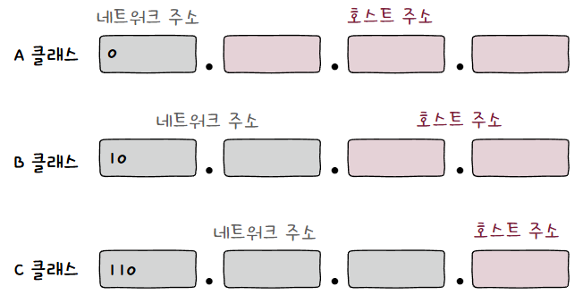
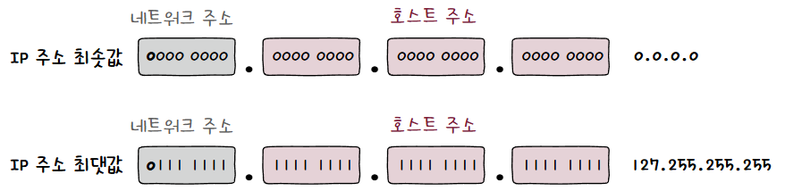
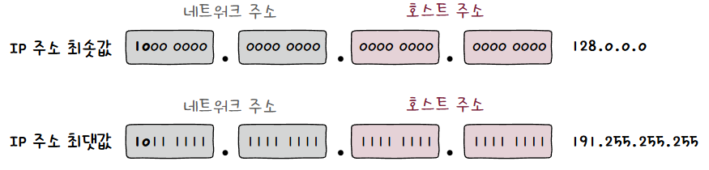
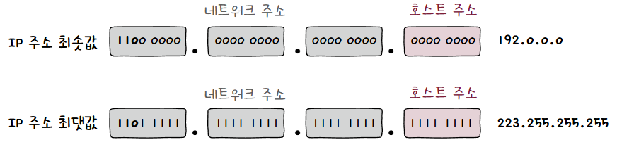
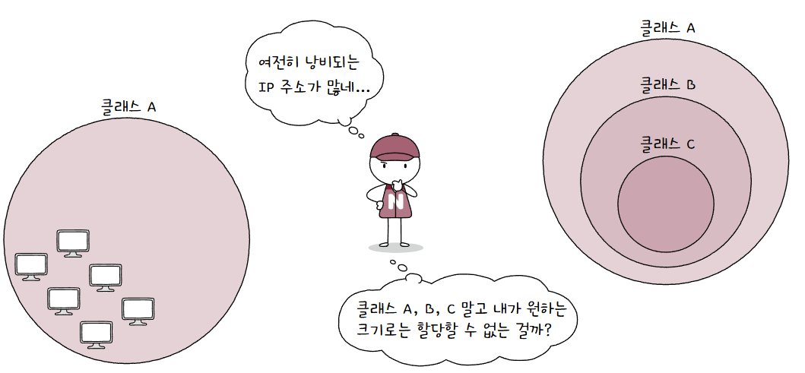
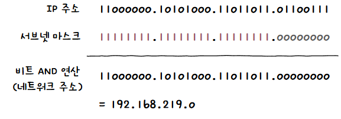
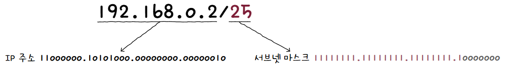
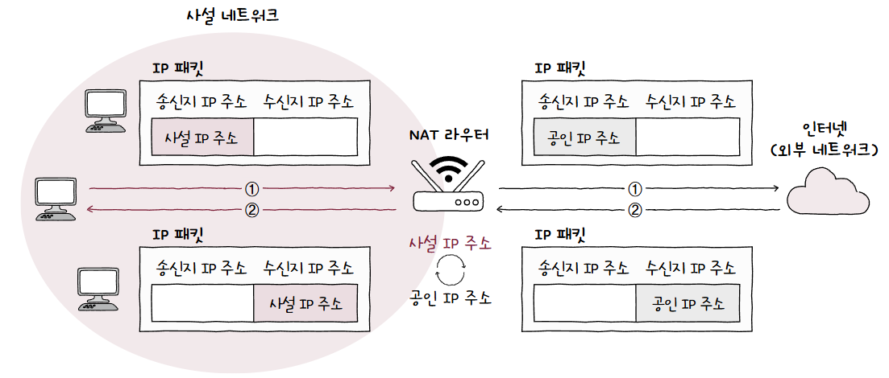
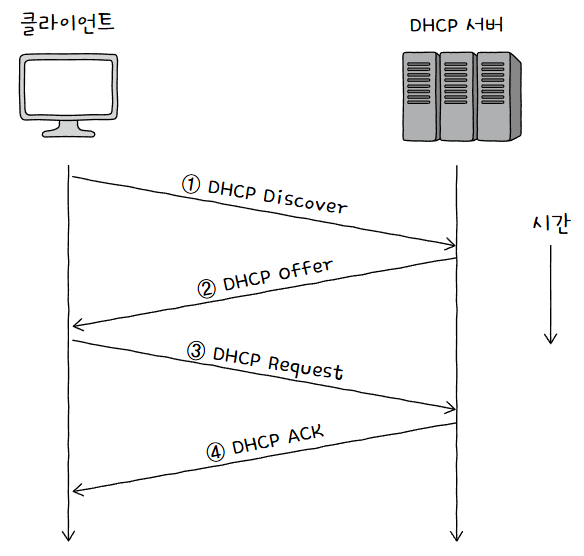

네트워크 계층에서 **수신지를 특정**하기 위해 사용하는 주소  
## 구성
하나의 IP 주소는 크게 **네트워크 주소**와 **호스트 주소**로 이루어짐  

1. **네트워크 주소**  
   네트워크를 표현하는 부분  
   호스트가 속한 **네트워크를 식별**함  
   네트워크 ID, 네트워크 식별자(Network Identifier) 등으로도 불림  
2. **호스트 주소**  
   호스트를 표현하는 부분  
   네트워크 내에서 **호스트를 식별**함  
   호스트 ID, 호스트 식별자(Host Identifier) 등으로도 불림  

네트워크 주소가 16비트, 호스트 주소가 16비트인 예시를 보자  
  
만약 네트워크 주소가 하나의 [옥텟](인터넷%20프로토콜.md#형태)으로 이루어져 있다면, 자연스레 호스트 주소 할당에 24비트를 사용할 수 있게 되고 많은 호스트에 IP 주소를 할당할 수 있을 것  

즉, 네트워크 주소와 호스트 주소를 **구분하는 범위는 유동적**임  
그렇다면 이 크기는 어떻게 설정하는게 적당할까?  
호스트 주소 공간을 키우면 호스트가 **할당되지 않은 IP 주소가 낭비**될 수 있고, 반대로 줄이면 호스트가 사용할 **IP 주소가 부족**할 수도 있음  
이를 위해 나온 개념이 IP 주소의 **클래스**  
## 클래스
**클래스(Class)** 란 **네트워크 크기에 따라 IP 주소를 분류**하는 기준  
필요한 호스트 IP 수에 따라 **네트워크 크기를 가변적으로 조정**할 수 있음  
### 클래스풀 주소 체계
클래스 기반으로 IP 주소를 관리하는 주소 체계를 **클래스풀 주소 체계(Classful Addressing)** 이라 함  

예시로 실제 클래스를 몇개 보자  
**A, B, C, D, E 총 5개의 클래스**가 존재함  
여기서 D, E는 **특수한 목적**을 위해 예약된 클래스이기 때문에, **실질적으로 사용하는 클래스는 A, B, C 클래스**임  
  

- **A 클래스**  
  네트워크 주소가 **비트 `0`으로 시작하고 1옥텟으로 구성**되며, 호스트 주소는 **3옥텟으로 구성**됨  
  이 특징으로 인해 B, C에 비해 **할당 가능한 호스트가 많음**  
    
  이론상 2^7개의 네트워크가 존재할 수 있고, 2^24개의 호스트 주소를 가질 수 있음  
  이를 10진수로 나타내면 **`0.0.0.0`부터 `127.255.255.255`의 범위**를 가짐  
  만약 **첫 옥텟의 주소가 0~127이라면 A 클래스**임을 짐작할 수 있음  
- **B 클래스**  
  네트워크 주소가 **비트 `10`으로 시작하고 2옥텟으로 구성**되며, 호스트 주소도 **2옥텟으로 구성**됨  
    
  이론상 2^14개의 네트워크가 존재할 수 있고, 2^16개의 호스트 주소를 가질 수 있음  
  이를 10진수로 나타내면 **`128.0.0.0`부터 `191.255.255.255`의 범위**를 가짐  
  만약 첫 옥텟의 주소가 **128~191이라면 B 클래스임을 짐작**할 수 있음  
- **C 클래스**  
  네트워크 주소가 **비트 `110`으로 시작하고 3옥텟으로 구성**되며, 호스트 주소는 **1옥텟으로 구성**됨  
    
  이론상 2^21개의 네트워크가 존재할 수 있고, 2^8개의 호스트 주소를 가질 수 있음  
  이를 10진수로 나타내면 **`192.0.0.0`부터 `223.255.255.255`의 범위**를 가짐  
  만약 첫 옥텟의 주소가 **192~223이라면 C 클래스임을 짐작**할 수 있음  

하지만 여기서 호스트 주소를 모두 사용할 수 있는 것은 아님  
IPSpecialAddress  
**호스트 주소가 전부 0인 경우 해당 네트워크 자체**를 의미하는 네트워크 주소로 사용됨  
또, **호스트 주소가 전부 1인 경우 브로드캐스트**를 위한 주소로 사용됨  

### 클래스리스 주소 체계
클래스풀 주소 체계를 사용해도 여전히 낭비되는 IP 주소가 존재하긴 함  
  
만약 300개의 IP주소가 필요하면 C 클래스의 경우 최대 254개이기 때문에 6만개가 할당 가능한 B 클래스를 써야 하는 상황이 올 것  

이 문제를 해결하기 위해 나온 것이 **클래스리스 주소 체계(Classless Addressing)**  
오늘날 주로 사용되는 방식임  

#### 서브넷 마스크
클래스풀과 다르게 **임의의 지점이 네트워크 주소와 호스트 주소를 구분 짓는 지점**이 될 수 있음  
그 수단으로 사용하는 것이 **서브넷 마스크(Subnet Mask)**  

네트워크 내 부분적인 네트워크(서브네트워크)를 구분짓는(마스크) 비트열이라 이름이 서브넷 마스크  
서브넷 마스크는 IP 주소상에서 **네트워크 주소는 1, 호스트 주소는 0으로 표기한 비트열**임  
서브넷 마스크를 이용해 클래스를 원하는 크기로 더 쪼개어 사용하는 것이 **서브네팅(Subnetting)**  

클래스와 비교하면 이해가 쉬움  
A 클래스의 경우 **네트워크 주소가 8비트**, B 클래스는 **16비트**, C 클래스는 **24비트** 였음  
이를 서브넷 마스크로 바꾸면 아래와 같음  
A 클래스: **`255.0.0.0(11111111.00000000.00000000.00000000)`**  
B 클래스: **`255.255.0.0(11111111.11111111.00000000.00000000)`**  
C 클래스: **`255.255.255.0(11111111.11111111.11111111.00000000)`**  
말 그대로 네트워크 주소인 부분은 1, 아닌 부분은 0으로 표기하는 것!  

그렇다면 이걸 이용해서 어떻게 네트워크 주소를 구할까?  
단순하게 **IP 주소와 서브넷 마스크에 AND 연산**을 수행하면 됨!  
  
알아서 네트워크 주소인 부분은 1과 AND 연산을 거치며 유효한 부분이 남을 것이고, 호스트 주소인 부분은 서브넷 마스크가 0이므로 제외될 것  

#### CIDR 표기법
서브넷 마스크 표기 방법은 크게 2가지가 있음  

1. `255.255.255.0`과 같이 10진수로 직접 표기하는 방법  
2. `IP 주소/1의 개수` 형식으로 표기하는 방법

두번째 방법을 **CIDR(Classless Inter-Domain Routing Notation) 표기법** 이라 부름  
단순하게 `255.255.255.0`으로 예를 들자  
이를 2진수로 바꾸면 `11111111.11111111.11111111.00000000`  
**1의 개수가 총 24개이므로 /24라고 뒤에 붙여주는 것**  

> **💡 총정리 해주세요!**  
> 
> `192.168.0.2/25`라는 표기가 있다고 가정하자  
>   
> 우선 서브넷 마스크는 1이 25개이므로 2진수로 `11111111.11111111.11111111.10000000`  
> 이는 10진수로 `255.255.255.128`과 같음  
> IP 주소는 2진수로 변환하면 `11000000.10101000.00000000.00000010`  
> 
> 두 비트를 AND 연산하면 `11000000.10101000.00000000.00000000`  
> 즉, 10진수로 `192.168.0.0`  
> 자연스럽게 남은 7비트는 호스트 주소가 될 것이고, 2가 부여됨  
> 
> 결론적으로 `192.168.0.2/25`는 126개의 호스트를 할당할 수 있는 `192.168.0.0`이라는 네트워크에 속하는 2라는 호스트를 의미함!  

## 공인/사설 IP 주소
지금까지 IP 주소는 고갈되고 낭비되는 유일한 주소처럼 이야기 함  
하지만 **고유한 IP 주소**도 있지만, **고유하지 않은 IP 주소**도 존재함  
고유한 IP 주소를 공인 IP 주소라 하고, 고유하지 않은 것은 사설 IP 주소라 함  
### 공인 IP 주소
**전 세계에서 고유한 IP 주소**가 **공인 IP 주소(Public IP Address)**  
이는 ISP나 공인 IP 주소 할당 기관을 통해 할당받을 수 있음  
ex) 한국인터넷정보센터(KRNIC)
### 사설 IP 주소
**사설 네트워크에서 사용**하기 위한 IP 주소가 **사설 IP 주소(Private IP Address)**  
모든 네트워크 기기의 IP 주소를 별도로 신청해 할당받지 않고, **LAN 내 많은 호스트는 사설 IP 주소를 사용**함  

사설 IP 주소로 사용하도록 [예약된 IP 주소 공간](#예약%20주소)이 있음  

1. `10.0.0.0/8(10.0.0.0 - 10.255.255.255)`
2. `172.16.0.0/12(172.16.0.0 - 172.31.255.255)`
3. `192.168.0.0(192.168.0.0 - 192.168.255.255)`

이 사설 IP 주소 할당 주체는 일반적으로 [라우터](라우팅.md#라우터)임  
해당 호스트가 속한 사설 네트워크상에서만 유효하므로 다른 네트워크의 사설 IP 주소와 중복될 수 있음  

그렇다면 외부 네트워크와 어떻게 통신할까?  
이때 사용되는 기술이 **NAT(Network Address Translation)**  
**내부에서 사용하는 사설 IP 주소를 외부에서 사용하는 공인 IP 주소로 변환**함  
NAT를 통해 사설 IP 주소를 사용하는 여러 호스트가 적은 수의 공인 IP 주소를 공유할 수 있음  

대부분의 라우터와 가정용 공유기는 NAT 기능을 내장하고 있음  
  
그렇기에 사설 네트워크에서 생성된 패킷 속 사설 IP 주소가 **공유기를 거쳐 공인 IP 주소로 변경**되며, 그 반대로 외부 네트워크에서 받은 패킷 속 공인 IP 주소가 **공유기를 거쳐 사설 IP 주소로 변경**됨  
## 정적/동적 IP 주소
그렇다면 호스트에 어떻게 IP 주소를 할당할까?  
크게 2가지 방법이 존재함
### 정적 할당
호스트에 직접 **수작업으로 IP 주소를 부여**하는 것  
이렇게 할당된 IP 주소를 **정적 IP 주소(Static IP Address)** 라 부름  

> **💡 네트워크 설정에 게이트웨이라는게 있는데 이건 뭐에요?**  
> 
> **게이트웨이(Gateway)** 는 서로 다른 네트워크를 연결하는 하드웨어/소프트웨어적 수단  
> 그 중 **기본 게이트웨이(Default Gateway)** 는 **호스트가 속한 네트워크 외부로 나가기 위한 첫 경로**(첫 번째 홉)을 의미함  
> 
> 그래서 **기본 게이트웨이는 네트워크 외부와 연결된 라우터(공유기)의 주소를 의미**하는 경우가 많음  
> IP 할당 설정에서 말하는 게이트웨이는 기본 게이트웨이를 의미하기 때문에, 기본 게이트웨이 역할을 하는 라우터(공유기)의 주소를 적으면 됨  

### 동적 할당
IP 주소를 정적으로만 할당하면 잘못되거나 중복된 IP 주소를 할당할 수도 있음  
  
이를 위해 나온 방식이 동적 할당  
직접 입력하지 않아도 **호스트에 IP 주소가 동적으로 할당**되는 방식  
이렇게 할당된 IP 주소를 **동적 IP 주소(Dynamic IP Address)** 라 부름  
알아서 사용되지 않을 경우 회수되고, 할당받을 때마다 다른 주소를 받을 수도 있음  

#### DHCP
[응용 계층](응용%20계층.md)에 속하며, 동적 할당에 사용되는 대표적인 프로토콜인 **DHCP(Dynamic Host Configuration Protocol)**  
IP 주소를 할당받고자 하는 **호스트**와 해당 호스트에게 IP 주소를 제공하는 **DHCP 서버(DCHP Server)** 간 메시지를 주고 받음으로써 이루어짐  
일반적으로 **라우터(공유기)가 수행**하지만, **특정 호스트에 DHCP 서버 기능을 추가**할 수도 있음  
DHCP 서버는 할당 가능한 IP 주소 목록을 관리하다가, 요청 시 IP 주소를 할당함  

중요한 점은 DHCP로 할당 받은 IP 주소는 임대 기간이 정해져있음  
임대 시간은 정하기 나름이지만 보통 수 시간 ~ 수 일로 설정됨  
임대 기간이 끝난 IP 주소는 다시 DHCP 서버로 반환됨  

클라이언트는 DHCP 서버와 메시지를 주고 받으며 IP 주소를 할당받음  
  
IP 주소 할당 과정에서 주고받는 메시지는 크게 네 종류가 있음  

1. **DHCP Discover**  
   **DHCP 서버를 찾는** 메시지  
   **브로드캐스트로 전송**되며, 전송 시점 클라이언트는 IP 주소를 할당받지 못했기에 **송신지 IP 주소는 `0.0.0.0`으로 설정**됨  
2. **DHCP Offer**  
   서버가 DHCP Discover 메시지를 받은 후, 클라이언트에게 **할당받을 IP 주소를 제안**하는 메시지  
   이 메시지에는 IP 주소 뿐 아니라 **서브넷 마스크, 임대 기간 등 정보도 포함**됨  
3. **DHCP Request**  
   DHCP Offer 메시지에 대한 응답으로, **해당 IP 주소를 써도 되는지** 묻는 메시지  
   역시 **브로드캐스트로 전송**됨  
4. **DHCP Acknowledgment(DHCP ACK)**  
   해당 IP 주소를 **사용해도 된다고 최종 승인**하는 메시지  
   이 메시지를 받은 클라이언트는 할당받은 IP 주소를 자신의 IP 주소로 설정한 후, 임대 기간동안 사용함  

임대 기간이 끝나면 다시 이 과정을 거쳐 IP 주소를 재할당받아야 함  
그런데 기간이 끝나기 전 **임대 기간을 연장**할 수 있음  
이를 **임대 갱신(Lease Renewal)** 이라 함  
임대 갱신은 임대 기간이 끝나기 전 **두 차례 자동으로 수행**됨  
이에 **모두 실패하면 IP 주소가 반환**됨  

## 예약 주소
위에서 언급된 것처럼 **특별한 목적을 위해 예약**된 IP 주소가 존재함  

| 예약 주소          | IP 범위                         | 사용 목적                                                |
| -------------- | ----------------------------- | ---------------------------------------------------- |
| 0.0.0.0/8      | 0.0.0.0 - 0.255.255.255       | 이 네트워크의 호스트                                          |
| 10.0.0.0/8     | 10.0.0.0 - 10.255.255.255     | 사설 네트워크                                              |
| 127.0.0.0/8    | 127.0.0.0 - 127.255.255.255   | 루프백(Loopback) 주소                                     |
| 169.254.0.0/16 | 169.254.0.0 - 169.254.255.255 | 링크 로컬(Link Local) 주소 (호스트가 연결된 링크로 통신 범위가 제한된 주소) |
| 172.16.0.0/12  | 172.16.0.0 - 172.31.255.255   | 사설 네트워크                                              |
| 192.0.2.0/24   | 192.0.2.0 - 192.0.2.255       | 테스트용                                                 |
| 192.168.0.0/16 | 192.168.0.0 - 192.168.255.255 | 사설 네트워크                                              |
| 192.18.0.0/15  | 192.18.0.0 - 192.19.255.255   | 테스트용                                                 |
| 224.0.0.0/4    | 224.0.0.0 - 224.255.255.255   | 멀티캐스트(D 클래스)                                         |
| 240.0.0.0/4    | 240.0.0.0 - 255.255.255.254   | 미래 사용 용도로 예약(E 클래스)                                  |

여기서 자주 접하게 될 **중요한 IP 주소는 `0.0.0.0`과 루프백 주소 `127.0.0.0`** 이 있음  

**`0.0.0.0/8`** 은 인터넷 표준 공식 문서(RFC 6890) 기준 **"이 네트워크의 이 호스트(This host on this network)"** 라 명시됨  
상단 DHCP Discover 메시지에서 송신자 IP 주소에 사용함  
이처럼 **호스트가 IP 주소를 할당받기 전 임시로 사용**하는 경우가 많음  
자신을 지칭할 IP 주소가 없기에 "이 네트워크의 이 호스트"로 지칭하는 것  

이와 유사한 주소로 **`0.0.0.0/0`** 도 존재함  
이는 **모든 임의의 IP 주소**를 의미함  
주로 패킷이 이동할 경로를 결정하는 라우팅에서, 디폴트 라우트를 나타내기 위해 사용됨  
여기서 **디폴트 라우트(Default Route)** 란 패킷을 **어떤 IP 주소로 전달할지 모르겠는 경우 기본적으로 패킷을 전달하는 경로**를 의미함  

**루프백 주소(Loopback Address)** 는 **자기 자신을 가리키는 특별한 주소**임  
일반적으로 **`127.0.0.1`이 사용**되며, **로컬호스트(localhost)** 라고도 불림  
자기 자신에게 되돌아오므로 주로 **테스트나 디버깅** 용도로 사용됨  