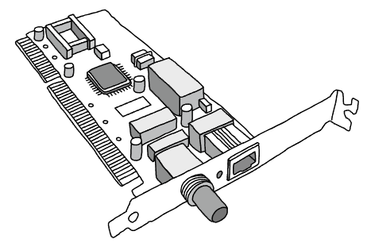
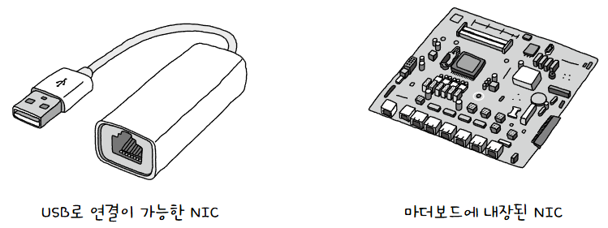

**호스트와 유무선 통신 매체를 연결**하고, 통신 매체에 흐르는 다양한 **신호를 호스트가 이해할 수 있도록 변환**해주는 네트워크 장비  
호스트는 **NIC(Network Interface Controller)** 가 있어야 네트워크에 참여할 수 있음  
이런 점에서 **호스트를 네트워크(LAN)에 연결하기 위한 하드웨어** 라고도 표현함  
## 생김새
`NIC`의 호칭은 네트워크 인터페이스 카드, 네트워크 어댑터, LAN 카드 등등 아주 다양함  
여기서 **카드**라고 불렸던 이유는 초기 `NIC`가 아래와 같이 확장 카드 형태였기 때문!  
  
이후 USB로 연결하거나 마더보드에 내장되는 등 형태가 다양해짐  
  
## 역할
**통신 매체에 흐르는 신호를 호스트가 이해하는 프레임으로 변환**하거나 그 **반대의 일**을 함  
즉, 호스트가 네트워크를 통해 송수신하는 정보는 `NIC`를 거치게 되며 이 점에서 **네트워크 인터페이스(Network Interface)** 역할을 수행한다고 함  

MAC 주소는 네트워크 인터페이스마다 할당되므로 `NIC`는 MAC 주소를 할당받게 됨  
자기 주소는 물론 수신되는 프레임의 수신지 주소를 인식함  
이후 자신과 **관련 없는 수신지 MAC 주소**가 명시되어 있거나 `FCS` 필드에서 **오류를 검출**할 시 프레임을 폐기할 수 있음  
> **💡 `NIC`는 대충 아무거나 써도 되나요?**  
> 
> `NIC`마다 **지원되는 속도가 다름**  
> `NIC`의 지원 속도는 곧 네트워크 속도에 영향을 끼치므로 통신 매체 신호가 고속으로 흐른다면 `NIC`도 그에 맞춰 성능이 좋아야할 것  
> 그래서 높은 대역폭에서 많은 트래픽을 감당해야 하는 경우 `NIC`를 추가로 설치하기도 함!  