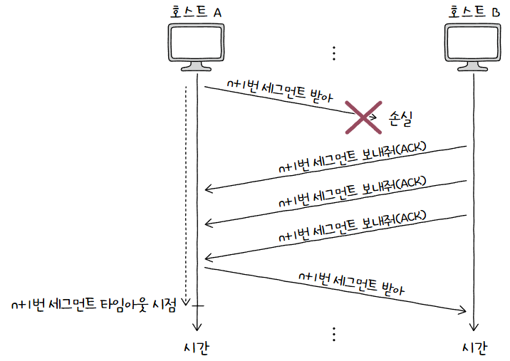

신뢰할 수 있는 통신을 위한 연결형 프로토콜인 **TCP(Transmission Control Protocol)**  

## 통신 단계
통신 과정은 크게 세 단계로 나눌 수 있음  
  
통신하기 전 **연결을 수립**하고, 통신이 끝나면 **연결을 종료**함  
또한, 데이터 송수신 과정에서 **재전송을 위한 오류 제어, 흐름 제어, 혼잡 제어 등의 기능을 제공**함  
TCP의 연결 수립과 종료를 이해하기 위해 **MSS** 라는 단위와 **TCP의 세그먼트 구조**를 이해해야 함  
### MSS
**MSS(Maximum Segment Size)** 는 **TCP로 전송할 수 있는 최대 페이로드 크기**를 의미함  
  
[MTU](인터넷%20프로토콜.md#기능)와 다르게 **헤더 크기는 제외**함  
### TCP 세그먼트
생각보다 헤더가 복잡함  
  

1. **송신지/수신지 포트(Source/Destination Port)**  
   이름 그대로 **송신지 또는 수신지 애플리케이션의 포트 번호**  
2. **순서 번호(Sequence Number)**  
   송수신되는 세그먼트의 **올바른 순서를 보장하기 위해 첫 바이트에 부여되는 번호**  
3. **확인 응답 번호(Acknowledgment Number)**  
   상대 호스트가 보낸 세그먼트에 대한 응답  
   **다음으로 수신하기를 기대하는 순서 번호**가 명시됨  
4. **제어 비트(Control Bits)**  
   플래그 비트(Flag Bits) 라고도 부름  
   **현재 세그먼트에 대한 부가 정보**를 나타냄  
5. **윈도우(Window)**  
   **수신 윈도우의 크기**가 명시됨  
   수신 윈도우란 **한 번에 수신하고자 하는 데이터의 양**  

여기서 순서 번호, 확인 응답 번호, 제어 비트에 대해 자세히 알아보자  
#### 제어 비트
기본적으로 **8비트로 구성**됨  
각 자리의 비트는 각기 다른 의미를 가짐  
이 중 가장 대표적인 3개는 다음과 같음  

1. **ACK**  
   **세그먼트의 승인**을 나타냄  
2. **SYN**  
   **연결을 수립**하기 위한 비트  
3. **FIN**  
   **연결을 종료**하기 위한 비트  

여기서 **ACK나 SYN이나 FIN이 1로 설정**된 세그먼트를 각각 **ACK 세그먼트, SYN 세그먼트, FIN 세그먼트** 라 줄여서 부르는 경우가 많음  
#### 순서 번호와 확인 응답 번호
**TCP의 신뢰성을 보장**하기 위해 사용되는 중요한 필드  
이 필드 2개를 한번에 묶어서 기억하자  

**순서 번호는 세그먼트 데이터의 첫 바이트에 부여**됨  
간단한 예시로 전송 계층이 응용 계층으로부터 전송해야 하는 1900바이트 크기의 데이터를 받았다고 가정하자  
  
이는 **MSS 단위로 전송**될 수 있음  
대충 MSS가 500바이트라고 가정하면, 1900바이트의 데이터 덩어리를 총 4개의 세그먼트로 쪼갤 수 있음  
  
대충 이런 식으로 500/500/500/400 으로 나누었다고 가정하자  
처음 통신을 위해 연결을 수립한 경우, 즉, **SYN 플래그가 1로 설정된 세그먼트**의 경우 순서 번호가 무작위 값이 되며, 이를 **초기 순서 번호(ISN, Initial Sequence Number)** 라고 함  
만약 초기 순서 번호가 100이라면 가장 먼저 보낼 세그먼트의 순서 번호가 100이 되는 것  
  
연결 수립 이후에는 **송신된 바이트를 더해 가는 형태로 누적 값**을 가짐  
즉, **"초기 순서 번호 + 송신한 바이트 수"** 가 되는 것  
  
이런 식으로 500바이트씩 떨어지게 되는 셈  

다음으로 **확인 응답 번호는 순서 번호에 대한 응답**임  
즉, **수신자가 다음으로 받기를 기대하는 순서 번호**  
일반적으로 **"수신한 순서 번호 + 1"** 로 설정함  
  
확인 응답 번호를 보내기 위해서는 **ACK 플래그를 1로 설정**해야 함  
## TCP 연결 수립과 종료
통신 이전에는 연결을 수립하고, 통신 이후에는 연결을 종료함  
### 연결 수립
연결 수립은 **쓰리 웨이 핸드셰이크(Three-Way Handshake)** 를 통해 이루어짐  
이름 그대로 세 개의 단계로 이루어진 TCP 연결 수립 과정을 의미함  
  

| 송수신 방향 | 세그먼트           | 세그먼트에 포함된 주요 정보                                                                         | 비유                     |
| ------ | -------------- | --------------------------------------------------------------------------------------- | ---------------------- |
| A -> B | SYN 세그먼트       | 호스트 A의 초기 순서 번호   1로 설정된 SYN 비트                                                      | "연결 시작합니다."            |
| B -> A | SYN + ACK 세그먼트 | 호스트 B의 초기 순서 번호   호스트 A가 전송한 세그먼트에 대한 확인 응답 번호   1로 설정된 SYN 비트   1로 설정된 ACK 비트 | "네, 확인 했습니다. 연결 시작해요!" |
| A -> B | ACK 세그먼트       | 호스트 A의 다음 순서 번호   호스트 B가 전송한 세그먼트에 대한 확인 응답 번호   1로 설정된 ACK 비트                    | "네, 확인했습니다."           |

대충 이런 식으로 구성됨  
이때, **처음 연결을 시작하는 호스트**의 연결 수립 과정을 **액티브 오픈(Active Open)** 이라 함  
액티브 오픈은 서버 - 클라이언트 관계에서 **주로 클라이언트에 의해 수행**됨  

반대로 **연결 요청을 받은 후 요청에 따라 연결을 수립**해주는 호스트도 있음  
이 호스트의 연결 수립 과정을 **패시브 오픈(Passive Open)** 이라 함  
**주로 서버에 의해 수행**됨  
  
### 연결 종료
데이터 송수신이 끝난 후 연결을 종료해야 함  
송수신 호스트가 각자 한 번씩 FIN과 ACK를 주고받으며 이루어짐  
  

| 송수신 방향 | 세그먼트     | 세그먼트에 포함된 주요 정보                                 | 비유           |
| ------ | -------- | ----------------------------------------------- | ------------ |
| A -> B | FIN 세그먼트 | 1로 설정된 FIN 비트                                   | "연결 끊을게요."   |
| B -> A | ACK 세그먼트 | 호스트 A가 전송한 세그먼트에 대한 확인 응답 번호   1로 설정된 ACK 비트 | "네, 확인했습니다." |
| B -> A | FIN 세그먼트 | 1로 설정된 FIN 비트                                   | "이제 연결 끊어요." |
| A -> B | ACK 세그먼트 | 호스트 B가 전송한 세그먼트에 대한 확인 응답 번호   1로 설정된 ACK 비트 | "네, 확인했습니다." |

대충 이런 식으로 구성됨  
역시나 여기도 **먼저 연결을 종료하려는 호스트의 요청**을 **액티브 클로즈(Active Close)** 라 함  
FIN 세그먼트를 먼저 보낸 호스트가 수행하는 것  
반대로 **연결 종료 요청을 받아들이는 호스트의 동작**을 **패시브 클로즈(Passive Close)** 라 함  
## TCP 상태
TCP는 연결형 통신과 신뢰할 수 있는 통신을 위해 다양한 상태를 유지함  
**상태(State)** 는 **현재 어떤 통신 과정에 있는지**를 나타내는 정보  
TCP는 상태를 유지하고 활용한다는 점에서 **스테이트풀(Stateful) 프로토콜** 이라고도 부름  

그게 세 가지 분류로 나눌 수 있음  

| 상태 분류     | 주요 상태                                                             |
| --------- | ----------------------------------------------------------------- |
| 연결 미수립 상태 | CLOSED, LISTEN                                                    |
| 연결 수립 상태  | SYN-SENT, SYN-RECEIVED, ESTABLISHED                               |
| 연결 종료 상태  | FIN-WAIT-1, CLOSE-WAIT-, FIN-WAIT-2, LAST-ACK, TIME-WAIT, CLOSING |

### 연결이 수립되지 않은 상태
연결 수립이 이루어지기 전의 호스트는 주로 CLOSED나 LISTEN 상태를 유지함  
  

1. **CLOSED**  
   **아무런 연결이 없는 상태**  
2. **LISTEN**  
   **연결 대기 상태**  
   일반적으로 서버로서 동작하는 패시브 오픈 호스트는 LISTEN 상태를 유지함  
   LISTEN 상태인 호스트에게 SYN 세그먼트를 보내면 쓰리 웨이 핸드셰이크가 시작되는 것  

### 연결 수립 상태
TCP 연결 수립 과정에서는 주로 SYN-SENT, SYN-RECEIVED, ESTABLISHED 상태를 볼 수 있음  
  

1. **SYN-SENT**  
   액티브 오픈 호스트가 **SYN 세그먼트를 보낸 후 그 응답인 SYN + ACK 세그먼트를 대기**하는 상태  
   즉, **연결 요청을 보낸 뒤 대기**하는 상태  
2. **SYN-RECEIVED**  
   패시브 오픈 호스트가 **SYN + ACK 세그먼트를 보낸 뒤 그에 대한 ACK를 대기**하는 상태  
3. **ESTABLISHED**  
   **연결이 확립되었음**을 나타내는 상태  
   마지막 ACK 세그먼트를 주고받으면 ESTABLISHED 상태에 접어듦

### 연결 종료 상태
연결 종료 과정에서는 주로 FIN-WAIT-1, CLOSE-WAIT, FIN-WAIT-2, LAST-ACK, TIME-WAIT, CLOSED 상태를 볼 수 있음  
  

1. **FIN-WAIT-1**  
   연결 종료의 첫 단계  
   **FIN 세그먼트로 종료 요청을 보낸 후** FIN-WAIT-1 상태에 들어감  
2. **CLOSE-WAIT**  
   FIN 세그먼트를 받은 **패시브 클로즈 호스트가 그 응답인 ACK 세그먼트를 보낸 후 대기**하는 상태  
3. **FIN-WAIT-2**  
   **FIN-WAIT-1 상태에서 ACK 세그먼트를 받은** 상태  
   상대 호스트의 FIN 세그먼트를 기다림  
4. **LAST-ACK**  
   **CLOSE-WAIT 상태에서 FIN 세그먼트를 전송한 뒤 ACK 세그먼트를 대기**하는 상태  
5. **TIME-WAIT**  
   **액티브 클로즈 호스트가 FIN 세그먼트를 수신한 뒤 ACK 세그먼트를 전송한 뒤 들어가는 상태**  
   패시브 클로즈 호스트는 **마지막 ACK 수신 후 바로 CLOSED 상태로 돌입**하지만, **액티브 클로즈 호스트는 일정 시간 대기** 후 CLOSED 상태로 돌입함  

> **💡 그러면 액티브 클로즈 호스트도 바로 CLOSED로 가면 되지 뭐하러 기다려요?**  
> 
> 상대 호스트가 받았어야 할 **마지막 ACK 세그먼트가 전송되지 않았을 수 있기 때문!**  
> TCP 송수신 과정에서는 세그먼트가 올바르게 전송되지 않으면 **일정 시간 후에 재전송**함  
> 만약 **바로 CLOSED 상태로 돌입하면, 나중에 다시 보내는 세그먼트를 받을 수 없음!**  

마지막으로 **CLOSING** 상태는 **동시에 연결을 종료**하려 할 때 전이되는 상황임  
  
서로 FIN 세그먼트를 보낸 후 상대 FIN 세그먼트에 대한 ACK 세그먼트를 보냈지만, **자신의 FIN 세그먼트에 대한 ACK 세그먼트를 받지 못했을때** 접어드는 상태  
**모두가 연결 종료를 요청하고, 서로 종료 응답을 기다리는 경우** 접어드는 셈  
이 경우 ACK 세그먼트를 수신하면, **각자 TIME-WAIT 상태로 접어든 뒤 종료**하게 됨  

지금까지의 내용을 총 정리하면 아래와 같음  
  
## 오류 제어
TCP는 **재전송을 기반으로 다양한 오류를 제어**함  
### 오류 검출과 재전송
TCP 세그먼트에 체크섬 필드가 존재하지만, 이것만으로 신뢰성을 보장하기는 어려움  
체크섬은 그저 세그먼트의 훼손 여부만 나타낼 뿐임  

신뢰성을 보장하기 위해서는 두 가지를 할 수 있어야 함  

1. 송신 호스트가 **송신한 세그먼트에 문제가 발생했음을 인지**할 수 있어야 함  
2. 오류를 감지하게 되면 **해당 세그먼트를 재전송**할 수 있어야 함  

우선 발생할 수 있는 문제에는 크게 두 가지가 존재함  

1. **중복된 ACK 세그먼트 수신**  
   TCP는 **중복된 ACK 세그먼트를 수신했을 때 문제가 생겼음을 감지**함  
   올바르게 세그먼트를 주고 받는다면 방금 보낸 세그먼트에 대한 ACK 세그먼트를 받고, 그 다음 순서 번호인 세그먼트를 보내는 과정이 반복될 것  
     
   하지만 **일부가 누락되면 중복된 ACK 세그먼트를 전송**하게 됨  
2. **타임아웃이 발생**  
   타임아웃이 발생하면 문제가 생겼음을 감지함  
   TCP 세그먼트를 송신하는 호스트는 모두 **재전송 타이머(Retransmission Timer)** 라는 값을 유지함  
   호스트가 **세그먼트를 전송할 때마다 재전송 타이머를 시작**함  
   이 타이머가 끝나는 상황이 **타임아웃(Timeout)**  
     
   **타임아웃이 발생할 때까지 ACK 세그먼트를 받지 못하면** 정상적으로 도착하지 않았다고 간주하고 재전송함  

> **💡 틈새 상식!**  
> 
> 메시지를 전송한 뒤 그에 대한 답변을 받는데 걸리는 시간을 RTT(Round Trip Time) 이라 함  
>   
> `ping` 명령어를 사용해보면 쉽게 조회할 수 있음  
#### ARQ
어느 상황에서 재전송 하는지 알았으니 재전송 기법을 보자  
문제가 생긴 **메시지를 재전송함으로써 신뢰성을 확보**하는 방식을 **ARQ(Automatic Repeat Request)** 라 함  
ARQ의 종류는 크게 세 가지가 있음  
  

1. **Stop-and-Wait ARQ**  
   **제대로 전달했음을 확인**하기 전까지는 새로운 메시지를 보내지 않음  
     
   **단순하지만, 높은 신뢰성을 보장**함  
   하지만 더 많은 데이터를 전송받을 수 있음에도 불구하고, 확인 응답을 받아야 전송을 시작하므로 **네트워크 이용 효율이 낮아짐**  
2. **Go-Back-N ARQ**  
   Stop-and-Wait의 문제를 해결하기 위해 **여러 세그먼트를 연속해서 전송**해야 함  
   이런 기술을 **파이프라이닝(Pipelining)** 이라고 부름  
   현재 사용되는 Go-Back-N과 Selective Repeat는 파이프라이닝을 사용해 동작함  
   
   여러 세그먼트를 전송하고, 도중 **잘못 전송된 세그먼트 발생 시 해당 세그먼트부터 전부** 다시 보냄  
     
   수신 호스트는 그 **이후 수신된 세그먼트를 올바르게 수신해도 그냥 폐기**함  
   즉, 수신 호스트에서 보내는 ACK 세그먼트는 n번의 확인 응답이 아닌 **n번 까지의 응답 확인**인 것  
   이런 점에서 Go-Back-N ARQ의 ACK 세그먼트를 **누적 확인 응답(CACK, Cumulative Acknowledgment)** 라고 함  
3. **Selective Repeat ARQ**  
   이름 그대로 **선택적으로 재전송**함  
   수신 호스트에서 **각 패킷에 대해 ACK 세그먼트**를 보내고, 송신 호스트는 **수신받지 못한 ACK 세그먼트를 확인하고 해당 세그먼트를 재전송**함  
     
   Go-Back-N의 누적 확인 응답이 아닌 **개별 확인 응답(Selective Acknowledgment)** 인 것  
   오늘날 대부분 Selective Repeat ARQ를 지원하며, 사용하지 않는다면 그때 Go-Back-N을 사용함  

> **💡 더 빠르게 재전송하는 법!**  
> 
> **빠른 재전송(Fast Retransmit)** 은 재전송 타이머가 만료되기 전이어도 **세 번의 동일한 ACK 세그먼트가 수신되면 바로 재전송**하는 기능  
>   
> 원래는 세그먼트의 일부가 유실되더라도 재전송 타이머가 만료되어야 비로소 재전송하지만, 빠른 재전송은 타이머가 만료되지 않아도 세 번의 동일한 ACK 세그먼트가 수신되면 곧바로 재전송을 수행함  
> 그로 인해 타이머가 종료되기 기다리는 시간을 줄일 수 있음  

## 흐름 제어
**흐름 제어(Flow Control)** 를 통해 **처리할 수 있을 만큼의 데이터만 주고받음**  
호스트가 한 번에 받아서 처리할 수 있는 세그먼트 양에 한계가 있기에 반드시 고려해야 함  

우선 **수신 버퍼**에 대해 알아야 함  
수신 버퍼는 수신된 세그먼트가 **애플리케이션 프로세스에 의해 읽히기 전 임시로 저장**되는 공간  
흐름 제어를 고려하지 않으면 **수신 버퍼 크기보다 많은 데이터**가 들어와 일부 세그먼트가 처리되지 못할 수 있음  
이런 문제를 **버퍼 오버플로(Buffer Overflow)** 라고 함  

사실 Stop-and-Wait ARQ를 사용하면 확인 응답이 오기 전까지 추가 세그먼트를 보내지 않아 괜찮음  
하지만 **Go-Back-N ARQ와 Selective Repeat ARQ를 사용하기 위해서는 필요**함  
파이프라이닝이 무작정 무한한 데이터를 보내게 놔두면 안되기 때문  

요즘은 **슬라이딩 윈도우(Sliding Window)** 기법을 사용함  
  
**송신 호스트가 파이프라이닝할 수 있는 최대량**을 **윈도우(Window)** 라고 함  
즉, 확인 응답을 받지 않고도 한 번에 전송 가능하다는 의미  
이 윈도우를 이동해가며 윈도우에 포함되는 데이터만 전송하는 방식으로 작동함  
  
이런 식으로 먼저 보낸 세그먼트에 대한 ACK 세그먼트를 받으면 윈도우를 한 칸 이동함  
그냥 알고리즘 슬라이딩 윈도우 생각하면 편할듯!  

송신 호스트뿐 아니라 **수신 호스트도 윈도우를 고려**함  
사실, 송신측은 보낼수만 있으면 알빠콩임
송신 윈도우는 **수신 호스트가 알려주는 수신 측 윈도우**를 토대로 알 수 있는 정보임  
[TCP 세그먼트 헤더](#TCP%20세그먼트)에 윈도우가 의미하는 수신 윈도우의 크기가 왜 있는지 알 수 있는 대목  
수신 호스트가 한 번에 수신하고자 하는 데이터의 양만큼만 전송하기 위해 **수신 호스트가 TCP 헤더를 통해 송신 호스트에게 알려준다**고 보면 될 듯!
## 혼잡 제어
네트워크가 **혼잡한 정도에 따라 전송량을 조절**함  
혼잡 제어를 수행하는 송신 호스트는 네트워크 혼잡도를 판단하고 혼잡한 정도에 맞춰 유동적으로 전송량을 조절함  