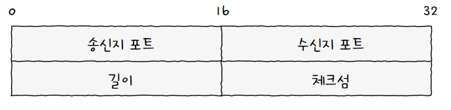
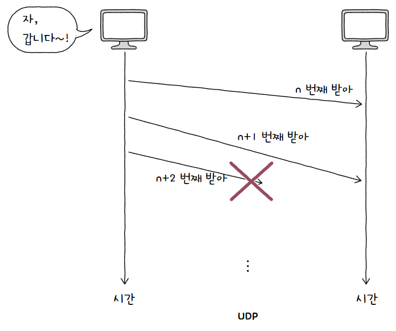

[TCP](TCP.md)와 달리 **비연결형 통신을 수행하는 신뢰할 수 없는** 프로토콜  
상태를 유지하지도, 활용하지도 않는다는 점에서 **스테이트리스(Stateless) 프로토콜** 이라고도 함  

데이터그램 구조도 아주 간단함  
  
크게 송신지 포트, 수신지 포트, 길이, 체크섬 필드로 구성됨  

1. **송신지/수신지 포트**  
   말 그대로 **송수신지의 포트**  
2. **길이**  
   **헤더를 포함한 UDP 데이터그램의 바이트**  
3. **체크섬**  
   데이터그램 전송 과정에서 **오류 발생 여부를 검사**하기 위한 필드  
   이 필드의 값을 토대로 정보가 훼손되었다고 판단하면 폐기함  
   이는 그저 훼손 여부를 확인하는 것으로 신뢰성과는 상관 없음  

TCP의 전송 방식이 수신지에 하나씩 확실하게 전달하는것과 같다면, UDP는 **그냥 빠르게 마구 던짐**  
  
그 과정에서 **패킷이 손실되거나 순서가 바뀔 수도 있음**  
