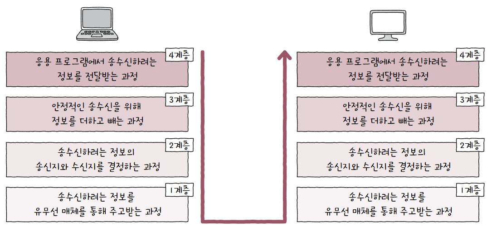
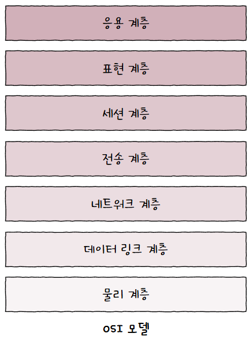
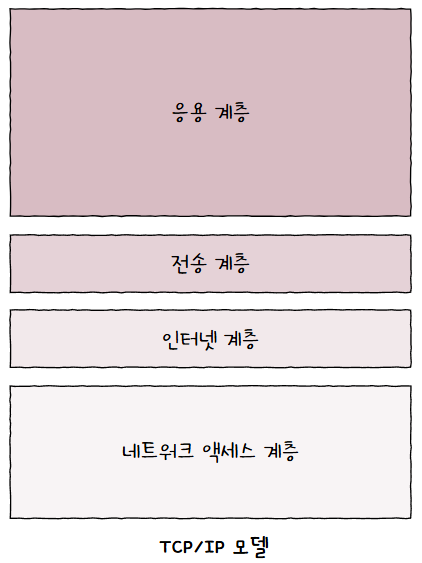
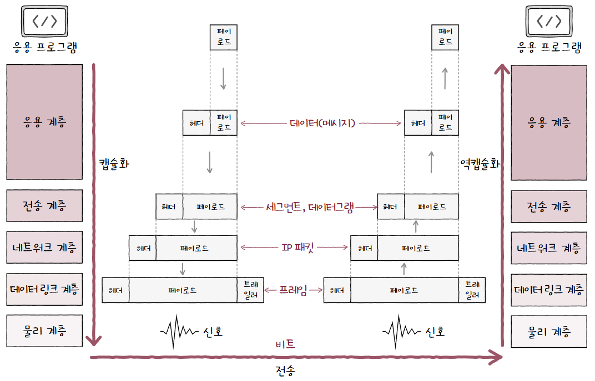

네트워크를 통해 정보를 주고받을 때는 정형화된 단계를 거침  
  
이를 **네트워크 참조 모델(Network Reference Model)** 혹은 **네트워크 계층 모델(Network Layer Model)** 이라 부름  

통신 과정을 계층으로 나눈 이유는 크게 2가지가 있음  
1. **네트워크 구성 및 설계 용이**  
   계층의 **목적에 맞게 프로토콜과 네트워크 장비를 구성**할 수 있음  
   모든 프로토콜이나 네트워크 장비가 참조 모델과 들어맞는 것은 아니지만 **가이드라인 역할을 수행**함  
2. **네트워크 문제 진단과 해결 용이**  
   문제의 원인을 계층별로 진단하기 수월함  
   최하위 계층부터 하나씩 올라오며 진단할 수 있음  

## OSI 모델
**국제 표준화 기구(ISO, Internation Organization for Standardization)** 에서 만든 네트워크 참조 모델  
  
어지간하면 통일해서 쓰라고 국룰을 하나 만들어줬음  

각 계층이 수행하는 역할은 아래와 같음  
### 물리 계층
OSI 모델 최하단에 있는 계층  
1과 0으로 표현되는 **비트 신호를 주고 받음**  

통신 매체에 맞는 신호로 운반되도록 **비트 데이터의 변환**이 이루어지고, **통신 매체를 통한 송수신**이 이루어짐  
주로 네트워크 장비, 통신 매체와 연관이 있음  
### 데이터 링크 계층
네트워크 내 **주변 장치 간 정보를** 올바르게 주고받기 위한 계층  
물리 계층과 밀접하게 연관되어 있고, [이더넷](이더넷.md)을 비롯한 LAN 기술이 이 계층에 녹아있음  
물리 계층을 통해 **정보 오류를 확인**하고, **MAC 주소 체계를 통해 네트워크 내 송수신지를 특정**함  
때로는 전송 과정에서 발생할 수 있는 **충돌 문제도 해결**할 수 있음  
### 네트워크 계층
메시지를 **다른 네트워크에 속한 수신지까지 전달**하는 계층  
쉽게 말해 인터넷을 가능하게 함  
**IP 주소 체계를 통해 수신지 호스트와 네트워크를 식별**하고, **최적의 경로를 결정**함  
### 전송 계층
**신뢰성 있고 안정성 있는 전송**을 위한 계층  
패킷이 정상적으로 보내졌는지, 유실된 정보는 없는지, 순서가 뒤바뀐 것은 없는지 등을 확인함  
**패킷의 흐름을 제어**하거나 **전송 오류를 점검**해 신뢰성을 높임  
이 외에 포트 정보를 통해 실행중인 응용 프로그램의 식별이 이루어지기도 함  
### 세션 계층
말 그대로 **세션을 관리**하기 위한 계층  
여기서 말하는 **세션(Session)** 은 통신을 주고받는 호스트의 **응용 프로그램 간 연결 상태**를 의미함  
이런 **연결 상태를 생성하거나 유지하고, 끊어주는 역할**을 함  
### 표현 계층
**번역가 역할**을 하는 계층  
사람이 사용하는 언어인 **문자를 코드로 변환**하거나, **압축, 암호화** 같은 작업이 이루어짐  
### 응용 계층
**최상단에 위치**해 사용자 및 사용자가 이용하는 응용 프로그램과 가장 맞닿아 있는 계층  
사용자가 이용할 **응용 프로그램에 다양한 네트워크 서비스를 제공**함  
응용 프로그램에 다양한 서비스가 있는 만큼 응용 계층에 속한 프로토콜이 많음  
## TCP/IP 모델
OSI 모델이 이론에 중점을 둔 모델이라면, TCP/IP는 **구현에 중점**을 둔 모델  

TCP/IP 모델은 TCP/IP 4계층, 인터넷 프로토콜 스위트(Internet Protocol Suite), TCP/IP 프로토콜 스택(TCP/IP Protocol Stack) 등 다양한 이름으로 불림  
결국 중요한건 TCP와 IP라는 두 프로토콜이 핵심이라는 것  

> 💡 **프로토콜 스위트와 프로토콜 스택은 뭔가요?**  
> 
> 다양한 계층의 프로토콜 집합을 프로토콜 스위트, 프로토콜 스택이라 부름  
> 위와 같이 불리는 이유는 TCP, IP를 포함해 UDP, ARP, HTTP 등 다양한 프로토콜을 함께 사용하기 때문!!

TCP/IP 모델은 크게 4개의 계층으로 나뉨  
  
### 네트워크 액세스 계층
### 인터넷 계층
OSI 모델의 네트워크 계층과 유사함  
자세한 내용은 [인터넷 계층](인터넷%20계층.md) 참조  
### 전송 계층
OSI 모델의 전송 계층과 유사함  
자세한 내용은 [전송 계층](전송%20계층.md) 참조  
### 응용 계층
OSI 모델의 세션 계층, 표현 계층, 응용 계층을 합친 것과 유사함  
자세한 내용은 [응용 계층](응용%20계층.md) 참조  

> **💡 그럼 이 계층을 안지키면 큰일 나겠네요!**  
> 
> 사실 상관 없음!  
> 네트워크 참조 모델은 엄격한 규칙이나 법규가 아닌 어디까지나 **가이드라인**임  
> 새로운 프로토콜과 네트워크 장비는 계속해서 만들어지고, 이 프로토콜들이 모델에 완벽히 대응되지 않음  
> 
> 즉, 통신이 일어나는 단계를 **역할별로 구획한 큰 그림일 뿐 규칙이나 작동 주체가 아님**을 상기하자!

## PDU
각 계층에서 송수신되는 메시지의 단위를 **PDU(Protocol Data Unit)** 이라 함  
즉, 상위 계층에서 전달받은 데이터에 현재 계층의 프로토콜 헤더를 추가하면 현재 계층의 PDU가 되는 것  

OSI 모델 기준으로 각 계층의 PDU는 아래와 같음  
  

| OSI 계층    | PDU                                      |
| --------- | ---------------------------------------- |
| 응용 계층     | 데이터(Data)                                |
| 표현 계층     | "                                        |
| 세션 계층     | "                                        |
| 전송 계층     | TCP: 세그먼트(Segment), UDP: 데이터그램(Datagram) |
| 네트워크 계층   | 패킷(Packet)                               |
| 데이터 링크 계층 | 프레임(Frame)                               |
| 물리 계층     | 비트(Bit)                                  |
PDU는 주로 전송 계층 이하의 메시지를 구분하기 위해 사용됨  
그 위는 걍 메시지  

여기서 네트워크 계층의 패킷이라는 용어는 자칫 혼동할 수 있음  
1. 패킷 교환 네트워크에서 쪼개져서 전송되는 단위인 패킷  
2. 네트워크 계층에서 송수신 단위를 지칭하기 위해 사용하는 용어인 패킷  

위 PDU에서의 패킷은 2번!  

