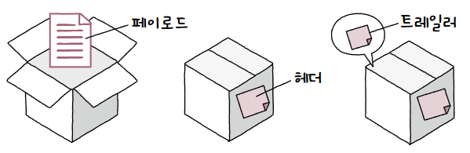

## 컴퓨터 네트워크
여러 개의 장치가 그물(net)처럼 연결되어 **정보를 주고받을 수 있는 통신망**  

마치 **그래프의 형태**를 띄고 있음  
  
장치는 노드, 유•무선 연결은 간선같은 형태  
## 인터넷
**여러 네트워크를 연결**한 네트워크의 네트워크  
각 장치들은 네트워크 내에서도 서로 정보를 교류할 수 있고, 인터넷을 통해 네트워크 간 서로 정보를 교류할 수도 있음  

구조는 크게 4개로 나눌 수 있음  
1. **가장자리**에 위치한 노드(호스트)  
2. **중간**에 위치한 노드(네트워크 장비)  
3. **노드 간 연결**하는 링크(통신 매체)  
4. 노드 간 주고받는 **정보**(메시지)  
### 호스트
네트워크의 가장자리 노드  
  
네트워크를 통해 주고받는 **메시지를 최초로 생성해 송신**하거나, **최종적으로 수신**하는 대상  

여기서 호스트 역할에 따라 구분이 됨  
1. **클라이언트(client)**  
   **요청**을 보내는 호스트  
2. **서버(server)**  
   **응답**을 하는 호스트  
  
서빙할때 그 serve와 같은 단어  

### 네트워크 장비
네트워크의 중간 노드  
  
호스트 간 주고받을 정보를 수신지까지 안정적이고 안전하게 전송하도록 도와주는 노드  
ex) 이더넷 허브, 스위치, 라우터, 공유기 등

> **💡 그렇다면 호스트는 네트워크 장비가 될 수 없나요?**  
> 
> 아님!!!  이는 역할 / 네트워크 구에 따라 구분한 개념일 뿐 배타적인 개념이 아님!!  
> 즉, 호스트도 네트워크 장비가 될 수 있고, 서버도 클라이언트가 될 수 있고, 그 반대도 가능

### 통신 매체
각 노드를 연결하는 간선  
  
통신 매체는 크게 2가지로 나뉨  
1. **유선 매체**  
   노드들을 **유선으로 연결**함  
2. **무선 매체**  
   노드들을 **무선으로 연결**함  

### 메시지
노드가 주고받는 정보  
  
여기서 메시지는 웹 페이지, 파일, 메일 등 뭐든 될 수 있음  

## 네트워크 분류
### 범위 기준
- **LAN(Local Area Network)**  
  가까운 지역을 연결한 근거리 통신망  
    
  가정, 기업, 회사처럼 한정된 공간에서의 네트워크를 의미함  
- **WAN(Wide Area Network)**  
  먼 지역을 연결하는 광역 통신망  
    
  멀리 떨어진 LAN을 연결할 수 있는 네트워크를 의미함  
  인터넷은 WAN으로 분류됨  

인터넷을 접속하기 위한 WAN은 **ISP(Internet Service Provider)** 라는 인터넷 서비스 업체가 구축하고 관리함  
KT, LG U+, SK 생각하면 됨  
사용자에게 인터넷과 같은 WAN에 연결 가능한 회선을 임대하는 등의 서비스를 제공함  

> **💡 그렇다면 LAN과 WAN이 끝인가요?**  
> 
> 더 세밀하게 나누는 경우도 있음  
> 넓이에 따라 WAN > MAN > CAN > LAN 으로 나뉨  
> 여러 건물 단위로 연결된 규모의 CAN(Campus Area Network)  
> 도시나 대도시 단위로 연결된 규모의 MAN(Metropolitan Area Network)  
### 메시지 교환 방식 기준
#### 회선 교환(Circuit Switching) 방식
메시지 전송로인 **회선을 설정**하고 이를 통해 메시지를 주고받음  
  
두 호스트 사이 연결을 확보한 후 메시지를 주고받기 때문에 **전송되는 정보 양이 일정**함  
단, 끊임없이 메시지가 흐르고 있어야 회선 효율이 높아지지만 그 반대로 메시지가 흐르지 않지만 **회선만 점유하면 낭비가 발생**함  
  
호스트 사이 회선을 설정하기 위해 **회선 스위치**가 존재함  
  

#### 패킷 교환(Packet Switching) 방식
회선 교환 방식의 문제를 해결한 방식  
네트워크상에서 송수신되는 메시지의 작은 단위인 **패킷으로 메시지를 쪼개어 전송**함  
  
두 호스트가 하나의 전송 경로를 점유하지 않기에 네트워크 이용 효율이 높음  
  
패킷이 먼 곳까지 이동하는 경우 정해진 경로가 아닌 다양한 중간 노드를 거칠 수 있음  
이때, 패킷이 수신지까지 올바르게 도달할 수 있도록 **경로를 결정하거나 송수신지를 식별**하는 것이 **패킷 스위치**  
대표적인 패킷 스위치 네트워크 장비로는 [라우터](라우팅.md#라우터)와 [스위치](스위치.md)가 있음  
  
패킷은 택배와 같이 물품을 담고 송장에 보내는 주소와 사람, 받는 주소와 사람을 적어야 올바르게 전송됨  
  
전송하고자 하는 데이터는 **페이로드(Payload)**, 패킷 앞에 부가적인 데이터는 **헤더(Header)**, 패킷 뒤에 부가적인 정보는 **트레일러(Trailer)** 라 부름  
### 주소와 송수신지 유형 기준
패킷의 헤더에는 **주소(Address)** 가 담겨있음  
대표적인 예시로 IP 주소와 MAC 주소가 있음  

송수신지를 특정할 수 있는 주소가 있으면 송수신지 유형에 따라 메시지를 보낼 수 있음  
- **유니캐스트(Unicast)**  
  일반적인 형태의 송수신  
  하나의 수신지에 메시지를 전송하는 방식  
- **브로드캐스트(Broadcast)**  
  자신을 제외한 네트워크 상 모든 호스트에게 전송하는 방식  
  브로드캐스트가 전송되는 범위를 **브로드캐스트 도메인(Broadcast Domain)** 이라 함  
  즉, 브로드캐스트 도메인 내 본인을 제외한 모든 호스트가 수신지  
- **멀티캐스트(Multicast)**  
  네트워크 내 동일 그룹에 속한 호스트에게만 전송하는 방식  
- **애니캐스트(Anycast)**  
  네트워크 내 동일 그룹에 속한 호스트 중 가장 가까운 호스트에게만 전송하는 방식  

