**패킷이 이동할 최적의 경로를 설정한 뒤 해당 경로로 패킷을 이동**시키는 것  
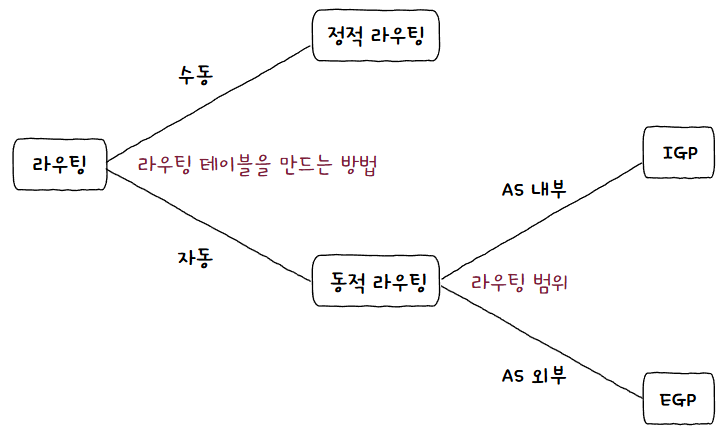  
라우팅 테이블 생성 방법과 프로토콜에 따라 위와 같이 나눠질 수 있음  
## 라우터
[네트워크 계층](네트워크%20계층.md)의 핵심 기능을 담당하는 장비  
**L3 스위치(L3 Switch)** 또한 핵심 장치이긴 하지만, 오늘날 **라우터와 기능상 상당 부분 유사**하므로 엄밀히 구분히지 않는 경우가 많음  

멀리 떨어져 있는 호스트 간 통신 과정에서 패킷은 **여러 라우터를 거쳐 다양한 경로로 이동**함  
이때 호스트와 라우터 간, 혹은 라우터와 라우터 간 이동하는 과정을 **홉(Hop)** 이라 부름  
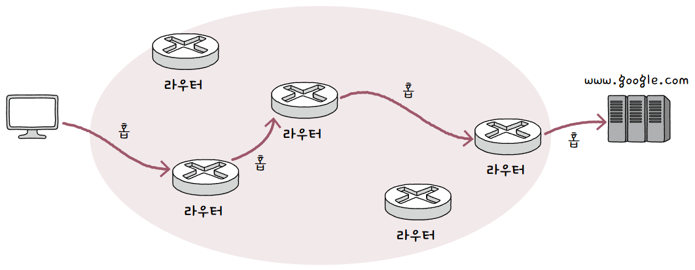  
즉, 패킷은 **여러 홉을 거쳐 라우팅**될 수 있는 것  

터미널에 `traceroute` 명령어를 실행해보면 원하는 호스트에 이르기까지 경로를 출력함  

## 라우팅 테이블
라우팅의 핵심은 라우터가 저장하고 관리하는 **라우팅 테이블(Routing Table)**  
**특정 수신지까지 도달하기 위한 정보를 명시한 표**와 같은 정보  
**라우팅 테이블을 참고해 수신지까지의 도달 경로를 판단**함  

테이블에 포함된 정보는 라우팅 방식이나 호스트 환경에 따라 다를 수 있음  
하지만 공통적이고 핵심적인 정보는 아래와 같이 있음  

1. **수신지 IP 주소와 서브넷 마스크**  
   **최종적으로 패킷을 전달**할 대상  
2. **다음 홉(Next Hop)**  
   최종 수신지까지 가기 위해 **다음으로 거쳐야 할 호스트의 IP 주소나 인터페이스**  
   **게이트웨이**라고 명시되기도 함  
3. **네트워크 인터페이스**  
   패킷을 **내보낼 통로**  
   [NIC](NIC.md) 이름이 직접적으로 명시되거나, 대응하는 IP 주소가 명시됨  
4. **메트릭(Metric)**  
   해당 경로로 **이동하는 데 드는 비용**  
   패킷을 내보낼 경로를 선택할 때 메트릭이 낮은 경로를 선호함  

간단한 라우팅 테이블을 예시로 보자  
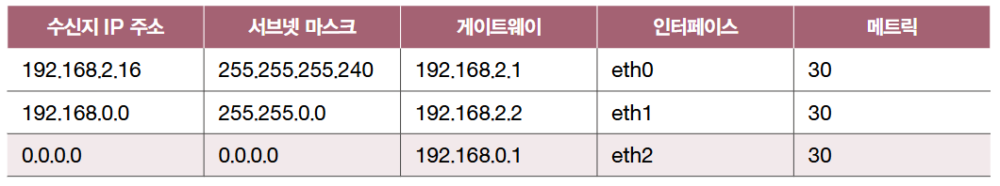  
이는 수신지가 `192.168.2.0/24`인 패킷을 `eth0(인터페이스)`를  통해 `192.168.2.1(게이트웨이)`로 전송하라는 의미  

이렇게 패킷 내 수신지 IP 주소가 라우팅 테이블에 있는 경우도 있지만, 그렇지 않을 수도 있음  
즉, **라우팅 테이블에 없는 경로로 패킷을 전송**해야 하는 일이 있음  
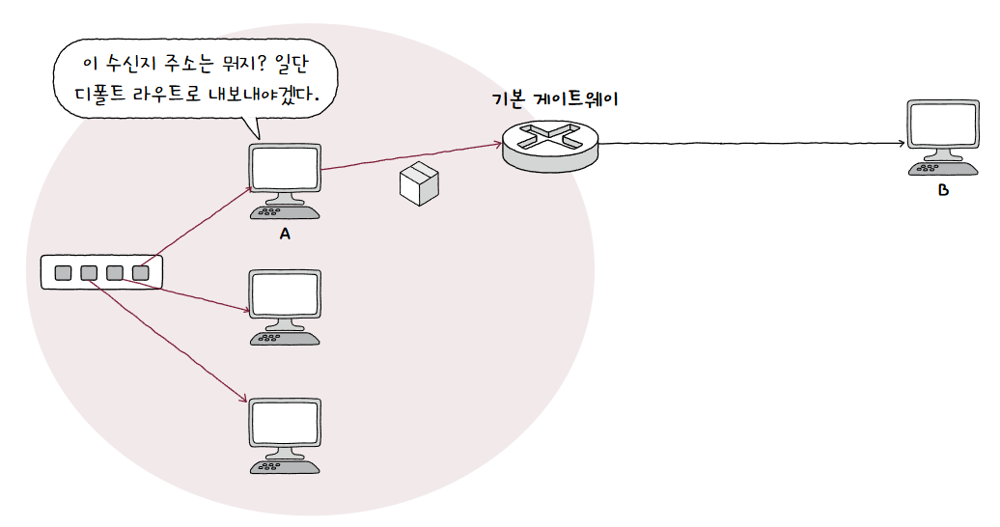  
이때 **기본적으로 패킷을 내보낼 경로**를 설정해 그 경로로 보낼 수 있음  
이 경로를 **디폴트 라우트(Default Route)** 라 부름  

기본 게이트웨이는 호스트가 속한 네트워크 외부로 나가기 위한 첫 번째 경로임  
여기서 기본 게이트웨이로 가기 위한 경로가 디폴트 라우트인 것  

간단한 예시로 네트워크 내부 호스트 A가 네트워크 외부 호스트 B에게 패킷을 전달한다고 하자  
A의 라우팅 테이블에 B로 이르는 경로가 따로 없는 경우, A는 패킷을 우선 라우터(기본 게이트웨이)에 전달함  
이를 위해 A는 라우터 주소인 기본 게이트웨이를 디폴트 라우트로 삼음  
그렇게 되면 A는 라우팅 테이블에 따로 경로가 등록되어 있지 않은 패킷을 기본적으로 라우터에게 전달하는 것  

> **💡 아니 그럼 라우터랑 게이트웨이의 차이가 뭔가요?**  
> 
> **게이트웨이가 더 포괄적임**  
> 게이트웨이는 **서로 다른 네트워크를 연결하는 하드웨어/소프트웨어적 수단**이고, 라우터는 그런 **게이트웨이 역할을 해주는 여러 장치 중 하나**인 것!  
> **IP 네트워크의 경우 라우터**가 게이트웨이 역할을 하고, **사설 네트워크를 사용하는 가정에서는 공유기**가 게이트웨이 역할을 하게 됨  
> 
> 게이트웨이는 **개념적인 의미**로 받아들이자!

맥 기준 터미널에 `netstat -rn`을 입력하면 라우팅 테이블을 확인할 수 있음  
보면 수신지 IP 주소, 서브넷 마스크, 게이트웨이, 네트워크 인터페이스(Netif)가 모두 포함된 모습  

## 정적/동적 라우팅
라우팅 테이블을 만드는 방법에는 크게 두 가지가 있음  
### 정적 라우팅
사용자가 **수동으로 채워 넣은 라우팅 테이블을 토대로 라우팅**되는 방식인 **정적 라우팅(Static Routing)**  
맥 기준 `sudo route add -net 10.0.0.0/24 192.168.1.1`과 같이 명령어를 입력하면 등록할 수 있음  
### 동적 라우팅
네트워크 규모가 커지면 정적 라우팅으로 관리하기 힘듦  
또한, **라우팅 경로에 있는 라우터에 문제가 발생**할 시 대처할 수 없음  
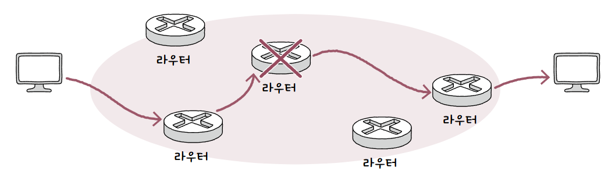  
이를 위해 나온 방식이 **동적 라우팅(Dynamic Routing)**  
**자동으로 라우팅 테이블 항목을 만들고 이를 이용**함  

그렇다면 어떻게 자동으로 라우팅 테이블을 만드는 것일까?  
모든 라우터는 **최적의 경로를 찾기 위해 라우터끼리 서로 자신의 정보를 교환**홤  
이 과정에서 사용되는 프로토콜이 **(동적) 라우팅 프로토콜**  
### 라우팅 프로토콜
라우터끼리 **정보를 교환하며 최적의 경로**를 찾기 위한 프로토콜인 **라우팅 프로토콜(Routing Protocol)**  
라우팅 프로토콜은 **AS 내부에서 수행되는 IGP(Interior Gateway Protocol)**, **AS 외부에서 수행되는 EGP(Exterior Gateway Protocol)** 이 존재함  

> **💡 AS가 뭔지는 알려줘야죠!**  
> 
> **AS(Autonomous System)** 은 **동일한 라우팅 정책으로 운영**되는 라우터들의 **집단 네트워크**  
> 대충 한 회사나 단체에서 관리하는 라우터 집단이라 생각해도 됨  
> 
> AS마다 고유한 AS 번호(ASN, Autonomous System Number)가 할당됨  
> 사설 IP 주소마냥 사설 AS 번호도 있지만, 일반적으로 고유한 번호를 일컫는 경우가 많음  
> 
> 한 AS 내에는 다수의 라우터가 있음  
> 라우터는 AS 내부에서만 통신할 수도 있고, 외부와 통신할 수도 있음  
> 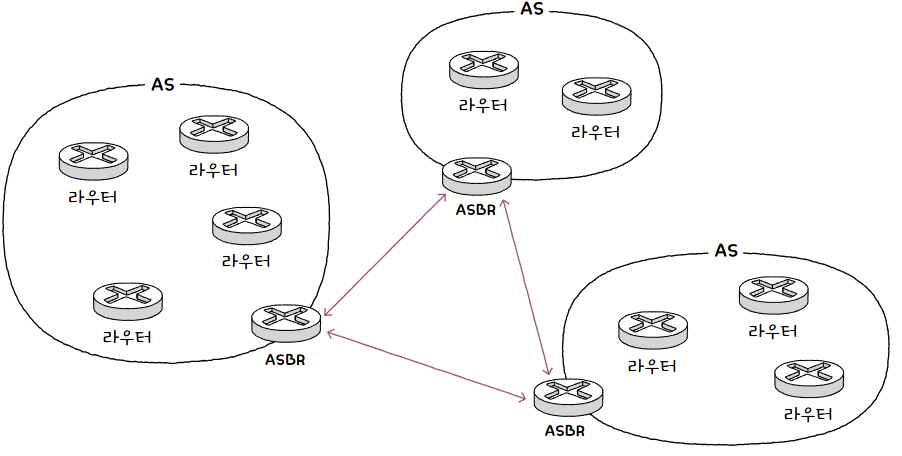  
> **AS 외부와 통신할 경우** AS 내외로 통신을 주고받을 수 있는 **AS 경계 라우터(ASBR, Autonomous System Boundary Router)** 라는 특별한 라우터를 이용함  

#### IGP
대표적인 IGP에는 **RIP(Routing Information Protocol)** 과 **OSPF(Open Shortest Path First)** 가 있음  
이는 **최적의 경로를 선정하는 과정**의 차이임  

- **RIP**  
  경로 선정 과정에서 **거리 벡터(Distance Vector)** 를 기반으로 찾음  
  여기서 **거리란 패킷이 경유한 라우터의 수, 즉 홉의 수**를 의미함  
  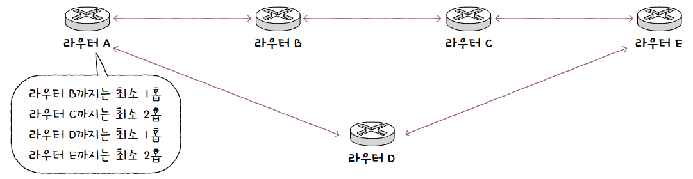  
  인접한 라우터끼리 경로 정보를 주기적으로 교환하여 수신지에 도달하기까지 홉의 수를 알 수 있음  
  이후 **특정 수신지까지 도달하기 위해 홉 수가 가장 적은 경로**를 최적의 경로로 판단함  
  즉, **홉 수가 적을수록 라우팅 테이블상 메트릭 값도 작아짐**  
- **OSPF**  
  경로 선정 과정에서 **링크 상태(Link State)** 를 기반으로 찾음  
  현재 네트워크 상태를 그래프 형태로 **링크 상태 데이터베이스(LSDB, Link State DataBase)** 에 저장함  
  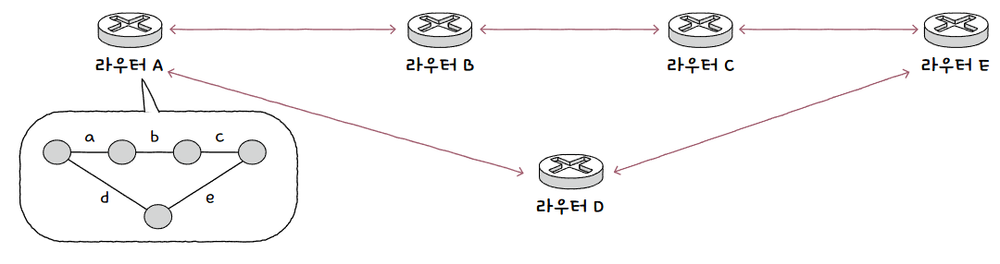  
  그 안에는 라우터 연결 관계, 연결 비용 등의 데이터가 저장됨  
  그 내용을 기반으로 네트워크 구성을 그린 후 최적의 경로를 선택함  
  
  **대역폭이 높은 링크일수록 메트릭이 낮은 경로**로 인식함  
  또한, 주기적으로 갱신하지 않고 **네트워크 구성이 변경된 경우 라우팅 테이블이 갱신**되는 형식  
  이러면 네트워크가 커졌을때 부담이 커지므로 AS를 **에이리어(Area)** 라는 단위로 나눔  
  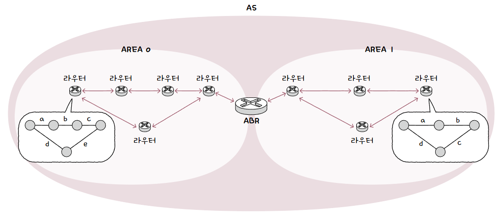  
  이 **에이리어 내에서만 링크 상태를 공유**하며, 에이리어 경계에 있는 **ABR(Area Border Router)** 라는 라우터가 에이리어 간 연결을 담당하는 방식  

#### EGP
대표적인 EGP에는 **BGP(Border Gateway Protocol)** 이 있음  

- **BGP**  
  **AS 간 통신이 가능**한 대표적인 프로토콜  
  AS 간 통신을 위한 BGP는 **eBGP(external BGP)**, AS 내의 통신을 위한 BGP는 **iBGP(internal BGP)** 라고도 함  
  
  AS 간 정보를 주고받기 위해서는 **AS 내에 BGP를 사용하는 라우터**가 있어야 하며, **다른 AS의 BGP 라우터와 연결**되어야 함  
  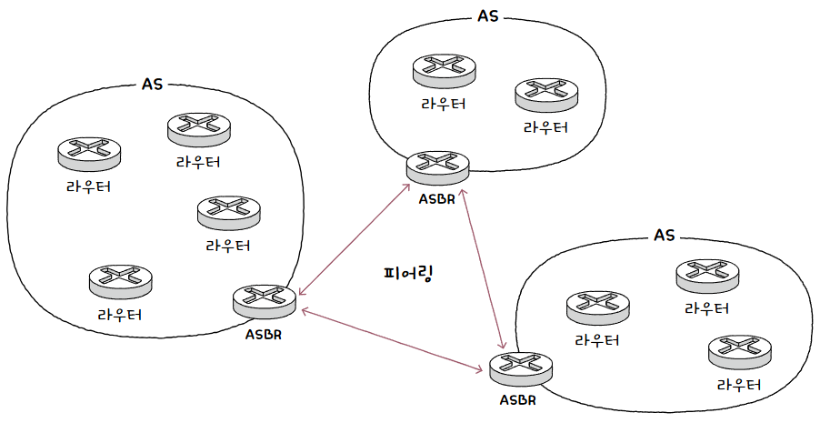  
  이 연결은 BGP 라우터 간 **BGP 메시지**를 주고 받으며 이루어 짐  
  BGP 메시지를 주고 받을 수 있도록 연결된 BGP 라우터를 **피어(Peer)** 라고 함  
  이렇게 피어 관계가 되도록 연결하는 과정을 **피어링(Peering)** 이라고 함  
  
  다양한 속성과 정책을 고려하기에 최적의 경로를 결정하는 과정이 **복잡하고 일정하지 않은 경우**가 많음  
  
  여기서 속성(Attribute) 에는 대표적으로 3가지가 있음  
  
  1. AS-PATH 속성  
     **메시지가 수신지에 이르는 과정에서 통과하는 AS 목록**  
     메시지가 AS를 거칠 때마다 속성에 거쳐간 AS가 추가됨  
     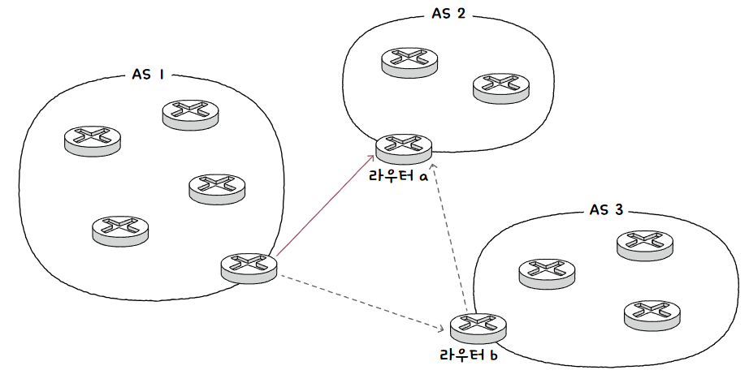  
     이 속성으로 볼 수 있는 BGP의 특성이 있음  
     
     우선, BGP는 AS 간 라우팅에서 거치게 될 라우터가 아닌 **AS 수를 고려**함  
     이로 인해 **라우터 홉 수는 더 많아질 수도** 있음  
     
     다음으로, RIP 처럼 단순한 거리가 아닌 어디를 거쳐 어디로 이동하는지 **경로를 고려**함  
     이로 인해 AS-PATH에 현재 AS가 포함된 경우 메시지를 버림으로써 **순환을 방지**할 수 있음  
  2. NEXT-HOP 속성  
     **다음으로 거칠 라우터의 IP 주소**  
  3. LOCAL-PREF 속성  
     지역 선호도(Local Preference) 의 약자로, AS 외부로 나가는 경로 선정에 있어서 **AS 내부에서 어떤 경로를 선호**할지에 대한 척도  
     AS-PATH나 NEXT-HOP 보다 우선시되며, LOCAL-PREF가 클수록 우선시 됨  
     AS 관리 주체가 설정하는 정책의 영향을 받음  