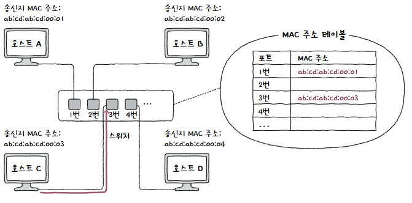
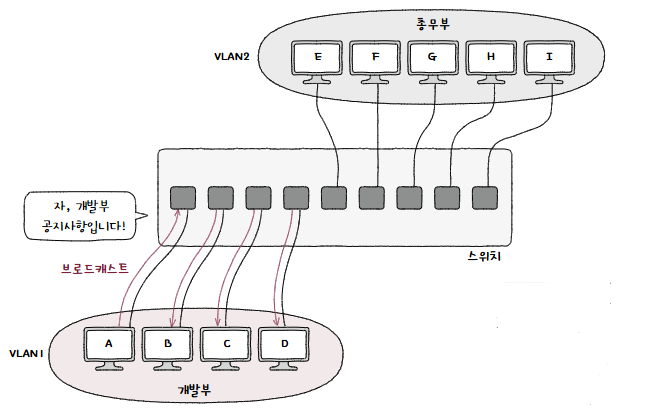

[허브](허브.md)는 주소 개념이 없는 물리 계층 장비이기 때문에 주소 특정이 불가능하고, 이로 인해 충돌이 발생할 수 있음  
이를 해결하기 위해 전달받은 신호를 수신지 포트에만 내보내고, 전이중 모드로 통신할 수 있도록 만든 것이 스위치  
## 스위치
**데이터 링크 계층**의 네트워크 장비로 2계층에서 사용한다 하여 **L2 스위치(L2 Swtich)** 라고도 불림  
허브와 같이 여러 포트에 호스트를 연결할 수 있음  

거기에 추가로 **특정 MAC 주소를 가진 호스트에만 프레임을 전달**할 수 있고, **전이중 통신을 지원**함  
당연히 `CSMA/CD` 프로토콜의 대기 시간도 없어지니 성능도 좋아질 것  
### 특징
**해당 포트에 연결된 호스트의 MAC 주소와의 관계를 기억**함  
이는 **MAC 주소 학습(MAC Address Learning)** 이라 하며, 이를 통해 **원하는 호스트에만 프레임을 전달**함  
  
이 MAC 주소 학습을 위해 포트와 연결된 **호스트의 MAC 주소 간 관계를 메모리에 표 형태로 기록**함  
이 정보를 **MAC 주소 테이블(MAC Address Table)** 이라 함  

### MAC 주소 학습
세 가지 주요 기능을 통해 이루어짐  
1. 플러딩
2. 포워딩과 필터링
3. 에이징

만약 호스트 A가 호스트 C에게 프레임을 전송한다고 가정하자  

처음에는 MAC 주소 테이블이 비어있음  
  
이후 호스트 A에서 프레임 수신 시 프레임 내 "송신지 MAC 주소" 기반으로 **MAC 주소 테이블에 저장**함  

하지만 아직 수신지 호스트가 어디 연결되어 있는지는 알지 못함  
아직 수신지 포트를 모르므로 송신지 포트를 제외한 **모든 포트에 프레임을 전송**함  
  
이를 **플러딩(Flooding)** 이라 함  

자신과 관련 없는 프레임을 받은 호스트들은 **프레임을 폐기**하고, 본인이 받을 프레임을 받은 호스트는 **스위치로 응답 프레임을 전송**함  
이 프레임에는 또 "송신지의 MAC 주소"가 적혀있으므로 이를 기반으로 호스트 C의 정보를 저장함  
  
이후 두 호스트 간 프레임 전송 시에는 **다른 포트로 프레임을 내보낼 필요가 없어짐**  

이렇게 **전달받은 프레임을 내보낼 곳**을 정하는 기능을 **필터링(Filtering)** 이라고 함  
또한 프레임이 **전송될 포트에 실제로 프레임을 내보내는 것**을 **포워딩(Forwarding)** dlfkrh gka
즉, 호스트 A가 호스트 C에게 프레임 전송 시 스위치는 호스트 B, D에게 보내지 않도록 필터링 하고, 호스트 C가 연결된 포트로 포워딩 함  

만약 MAC 주소 테이블에 등록된 이후 **일정 시간동안 프레임을 전송받지 못한다면 해당 항목은 삭제**됨  
이를 **에이징(Aging)** 이라 함  

### VLAN
스위치의 또 다른 기능으로 **VLAN(Virtual LAN)** 이 있음  
**한 대의 스위치로 가상의 LAN**을 만드는 것  

스위치에 연결된 호스트 중에서 서로 메시지를 주고 받을 일이 적거나 브로드 캐스트 메시지를 받을 필요가 없는 호스트가 있을 수 있음  
이를 위해 `VLAN`을 구성해 **한 대의 물리적 스위치로 마치 여러 대의 스위치가 있는 것처럼 구성**할 수 있음  
  
만약 VLAN1에 속한 호스트가 VLAN2에 속한 호스트와 통신하려 한다면 네트워크 계층 이상의 상위 계층 장비가 필요할 것  

또한 브로드캐스트 도메인도 달라짐  
  
서로 다른 네트워크로 간주하기 때문  

#### 포트 기반 VLAN
`VLAN`을 구성하는 가장 단순하고 대중적인 방식  
**포트 기반 VLAN(Port Based VLAN)** 은 **스위치의 포트가 `VLAN`을 결정**함  
  
사전 특정 포트에 `VLAN`을 할당하고, 해당 포트에 호스트를 연결하면 `VLAN`에 포함됨  

그런데 여기서 문제가 하나 발생함  
필요한 호스트보다 포트 수가 부족해진다면?  
  
위와 같이 **같은 `VLAN` 포트끼리 모두 연결**해 스위치 개수를 늘릴 수 있지만 너무 **포트 낭비가 심함**  

이를 해결하기 위해 **VLAN 트렁킹(VLAN Trunking)** 이 나옴  
두 대 이상 `VLAN` 스위치를 효율적으로 연결하는 방법  
스위치 간 통신을 위한 포트인 트렁크 포트(Trunk Port) 를 사용해 `VLAN` 스위치를 서로 연결함  
  
낭비되는 포트를 최소화하여 네트워크를 구성할 수 있음  

> **💡 엥? 그러면 트렁크포트를 타고 넘어온 프레임이 어떤 VLAN인지 어떻게 아나요??**  
> 
> **802.1Q**라는 **VLAN 식별 정보까지 포함**한 확장된 이더넷 프레임을 사용함!  
>   
> 이더넷 프레임 사이에 32비트 크기의 **VLAN 태그**를 추가하는 방식  
#### MAC 기반 VLAN
사전에 설정된 MAC 주소에 따라 `VLAN`이 결정되는 방식  
  
송수신하는 프레임 속 MAC 주소가 호스트가 속할 `VLAN`을 결정함  