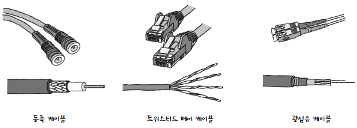
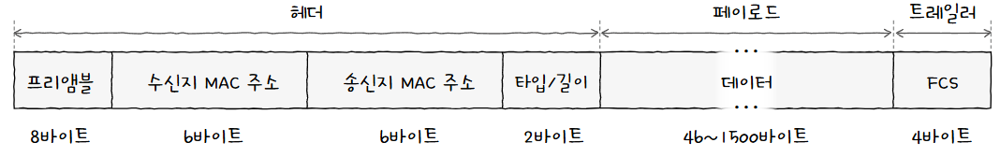

[물리 계층](네트워크%20참조%20모델.md#물리%20계층)과 [데이터 링크 계층](네트워크%20참조%20모델.md#데이터%20링크%20계층)은 두 계층 모두 이더넷이라는 공통된 기술을 사용하기 때문에 밀접하게 연관됨  
**이더넷(Ethernet)** 은 현대 LAN, 특히 유선 LAN 환경에서 가장 대중적으로 사용되는 기술  
  
컴퓨터끼리 정보를 주고받기 위해서는 **[케이블](케이블.md)** 같은 통신 매체가 필요함  
이후 통신 매체를 통해 정보를 송수신 하는 방법이 정해져야 함  
여기서 이더넷은 **다양한 통신 매체의 규격과 송수신되는 프레임의 형태 등이 정의**된 네트워크 기술  
## 표준
유선 LAN 환경은 대부분 이더넷을 기반으로 구성됨  
만약 유선 LAN 환경을 구축했다면 물리 계층에는 이더넷 규격 케이블을, 데이터 링크 계층에서 주고받는 프레임은 이더넷 프레임의 형식을 따를 것  

현재 이더넷은 국제적으로 **표준화**가 이루어짐  
**전기전자공학자협회(IEEE, Institute of Electrical and Electronics Engineers)** 라는 조직이 이더넷 관련 기술을 **IEEE 802.3**이라는 이름으로 표준화함  
여기에는 네트워크 장비들이 준수하는 이더넷 관련 다양한 표준들이 모여있음  

여기서 중요한 점은 **이더넷 표준에 따라** 지원되는 네트워크 장비, 통신 매체의 종류와 전송 속도등이 달라질 수 있다는 것!  
## 통신 매체
### 통신 매체 표기 형태
이더넷 표준 규격 IEEE 802.3i 을 따른다고 해서 케이블 이름을 "IEEE 802.3i 케이블" 이딴식으로 짓지 않음  
통신 매체의 속도와 특성을 파악하기 쉬운 형태로 지칭함  
아래와 같은 구조를 따름  
  
1. **전송 속도**  
   숫자만 적혀있으면 `Mbps`, 숫자 뒤에 `G`가 붙어 있으면 `Gbps`를 의미함  
   10 > 10Mbps
   1000 > 1000Mbps(1Gbps)
   5G > 5Gbps
2. **BASE**  
   **베이스밴드(Baseband)** 의 약자  
   **변조 타입(Modulation Type)** 을 의미함  
   여기서 변조 타입이란 **비트 신호로 변환된 데이터를 통신 매체로 전송하는 방법**  
   대부분 BASE를 사용함  
3. **추가 특성**  
   **통신 매체의 특성**을 명시함  
   명시되는 특성의 종류는 전송 가능한 최대 거리, 물리 계층 인코딩 방식, 비트를 전송할 전송로 수 등 다양함  
   
   하지만 이 중에서 중요한 특성은 **통신 매체의 종류!!**  

### 통신 매체 종류
대표적인 예시로 C, T, S, L이 있음  

| 추가 특성 표기(통신 매체 종류) | 케이블 종류       |
| ------------------ | ------------ |
| C                  | 동축 케이블       |
| T                  | 트위스티드 페어 케이블 |
| S                  | 단파장 광섬유 케이블  |
| L                  | 장파장 광섬유 케이블  |

  
표기 형식의 예시로 아래 케이블들이 있음  
10BASE-T 케이블: 10Mbps 속도를 지원하는 트위스티드 페어 케이블  
1000BASE-LX 케이블: 1000Mbps 속도를 지원하는 장파장 광섬유 케이블  

표준 이름보다 **전송 속도 BASE-추가특성** 형태를 보면 저 어떤 매체인지 짐작하기 쉬움!  
## 이더넷 프레임
유선 LAN 환경은 이더넷을 기반으로 구성되므로 데이터 링크에서 주고받는 **이더넷 프레임(Ethernet Frame) 형식도 정해져있음**  

이더넷 프레임은 상위 계층으로부터 받아들인 정보에 헤더와 트레일러를 추가하는 [캡슐화](캡슐화.md)를 통해 만들어짐  
수신지에서는 [역캡슐화](캡슐화.md#역캡슐화) 과정을 거쳐 상위 계층으로 올려보냄  

이더넷 프레임 헤더는 기본적으로 아래와 같은 구조를 가짐  
  
### 프리앰블
**이더넷 프레임의 시작**을 알리는 8바이트 크기의 정보  
즉, **프리앰블(Preamble)** 은 **송수신지 간의 동기화**를 위해 사용됨  
  
첫 7바이트는 10101010 값을 가지고, 마지막 바이트는 10101011 값을 가짐  
수신지는 이 프리앰블을 통해 **이더넷 프레임이 오고 있음**을 알아차림
### 수신지/송신지 MAC 주소
**네트워크 인터페이스마다 부여**되는 6바이트 길이의 주소  
MAC 주소는 물리적 주소라고도 불리며, **LAN 내의 수신지와 송신지를 특정**할 수 있음  

일반적으로 고유하고 변경되지 않으며, **[NIC(Network Interface Controller)](NIC.md)** 라는 장치가 네트워크 인터페이스 역할을 담당함  

> **💡 일반적으로 고유하고 변경되지 않다면 아닐수도 있나요?**  
> 
> MAC 주소 변경이 가능한 경우도 많고, 그에 따라 고유하지 않을 수도 있음!  
> 하지만 우연히 같게 만들 확률이 낮고 상황도 흔치 않으므로 일반적으로 그렇다고 하는 것  
### 타입/길이
말 그대로 **타입(Type)** 혹은 **길이(Length)** 가 올 수 있음  
크기가 **1500(16진수 05DC) 이하인 경우** 프레임의 크기를, **이상인 경우** 프레임의 타입을 나타냄  

여기서 타입이란 이더넷 프레임이 **어떤 정보를 캡슐화했는지** 나타내는 정보  
**이더타입(Ethertype)** 이라고도 부름  
타입을 어떤 식으로 표현하는지는 안외워도 됨!  
### 데이터
상위 계층에서 전달받거나, 전달해야 할 내용  
네트워크 계층의 데이터와 헤더를 합친 [PDU](네트워크%20참조%20모델.md#PDU)가 이곳에 포함됨  

**최대 크기는 1500바이트**이고, **최소한 46바이트** 크기를 가져야 함!  
그래서 부족하다면 크기를 맞추기 위해 **패딩(Padding)** 이라는 정보를 채움  
보통 46바이트가 될때까지 0을 채우는 방식  
### FCS
**FCS(Frame Check Sequence)** 는 수신한 이더넷 프레임에 **오류가 있는지 확인**하기 위한 필드  
**순환 중복 검사(CRC, Cyclic Redundancy Check)** 라는 오류 검출용 값을 넣고, **수신지에서 CRC 값을 계산해 이와 비교**함  
  
비교 값이 일치하지 않으면 오류가 있다고 판단하여 프레임을 폐기함  