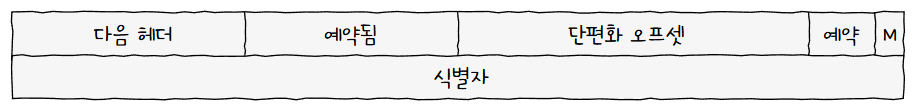

[네트워크 계층](네트워크%20계층.md)의 가장 핵심적인 **인터넷 프로토콜(IP, Internet Protocol)**  
**IPv4, IPv6** 두가지 버전이 존재함  
일반적으로 [IP 주소](IP%20주소.md)라 하면 IPv4를 의미함  
## IPv4
### 형태
IP 주소는 4바이트(32비트)로 표현할 수 있고, 숫자당 8비트를 사용하기 때문에 0~255 범위의 10진수 4개로 표현됨  
  
각 10진수는 점(.)으로 구별하고, 점으로 구별된 10진수를 **옥텟(Octet)** 이라 함  
### 기능
IP는 대표적으로 2가지 기능을 제공함

1. **IP 주소 지정(IP Addressing)**  
   IP 주소를 바탕으로 **송수신 대상을 지정**하는 것  
2. **IP 단편화(IP Fragmentation)**  
   전송하고자 하는 패킷의 크기가 MTU 보다 클 경우, **MTU 크기 이하의 복수 패킷**으로 나누는 것  

> **💡 엥 MTU가 뭔데요?**  
> 
> **MTU(Maximum Transmission Unit)** 은 한 번에 전송 가능한 IP 패킷의 최대 크기  
>   
> IP 패킷의 헤더 또한 이 크기에 포함되며, 일반적으로 1500바이트임  

> **💡 그럼 단편화는 많이 수행할수록 좋은가요?**  
> 
> 당연히 아님! 여러 패킷으로 쪼개지는 과정에서 전송해야 하는 헤드가 많아지면서 **불필요한 트래픽 증가 및 대역폭 낭비**로 이어질 수 있음  
> 또한 쪼개진 패킷을 **하나로 합치는 과정에서도 부하가 발생**함  
> 
> 그렇다면 어떻게 단편화를 피할까?  
> 호스트에서 처리할 수 있는 MTU가 아무리 커도 라우터가 지원하지 않으면 결국 단편화를 해야함  
> 결국, IP **단편화 없이 주고받을 수 있는 최대 크기**만큼 전송해야 하는 것  
> 이 크기를 **경로 MTU(Path MTU)** 라 부름  
> 
> 경로 MTU를 구하여 단편화를 회피하는 기술을 **경로 MTU 발견(Path MTU Discovery)** 라 부름  
> 오늘날 대부분 이를 지원하고, MTU 크기도 대부분 균일하기에 단편화가 자주 수행되지는 않음  
> 즉, 아래 언급될 DF 플래그가 활성화 된 상태가 대부분임  

그렇다면 IP 패킷에는 어떤 정보가 있어서 가능한걸까?
### IPv4
프레임의 데이터 필드에는 상위 계층에서 전달받거나 전달해야 할 내용이 명시됨  
  
즉, 데이터 링크 계층의 [PDU](네트워크%20참조%20모델.md#PDU)인 프레임의 페이로드가 IPv4 패킷임  

IPv4 패킷은 자세히 보면 아래와 같은 구조로 이루어짐  
  
헤더에서 중요한 부분은 크게 7가지  

1. **식별자(Identifier)**  
   **패킷에 할당된 번호**  
     
   메시지 전송 과정에서 패킷이 쪼개진 경우 이를 재조합 해야 함  
   이때, 식별자를 사용해 어떤 메시지에서 쪼개졌는지 인식함  
2. **플래그(Flag)**  
   **단편화에 관한 정보**를 담은 총 3개의 비트로 구성된 필드  
     
   첫 번째 비트는 항상 0으로 예약하며, 현재 사용하지 않음  
   
   두 번째 비트는 **DF(Don't Fragment)** 라는 비트  
   **0이라면 IP 단편화가 가능**하며, 1이라면 단편화를 수행하지 않음  
   만약 MTU를 넘어 **단편화 없이 처리 불가능한 경우 DF 플래그가 설정**되어 있다면, **"단편화 없이 처리할 수 없습니다"라는 오류 메시지를 전달**함  
   이후 패킷을 보낸 호스트는 점차 데이터 크기를 줄이게 됨  
   
   세 번째 비트는 **MF(More Fragment)** 라는 비트  
   **0이라면 이 패킷이 마지막 패킷**임을 의미하고, 1이면 쪼개진 패킷이 더 있다는 의미  
3. **단편화 오프셋(Fragment Offset)**  
   단편화되기 전 **초기 데이터에서 몇 번째로 떨어진 패킷**인지를 나타냄  
     
   단편화된 패킷이 **순서대로 도착하지 않을 수 있으므로** 재조합하기 위해 순서를 정하는 역할  
4. **TTL(Time To Live)**  
   **패킷의 수명**  
   패킷이 호스트 또는 라우터에 전달되는 것을 **홉(Hop)** 이라고 함  
   TTL 필드 값은 **홉마다 1씩 감소**하며, TTL이 0인 패킷은 폐기함  
     
   무의미한 패킷이 지속적으로 남아있는 것을 방지하기 위함  
5. **프로토콜**  
   **상위 계층의 프로토콜**을 나타냄  
   대표적으로 **TCP는 6번, UDP는 17번**임  
6. **송신지 IP 주소(Source IP Address)**  
   이름 그대로 송신지의 IP 주소
7. **수신지 IP 주소(Destination IP Address)**  
   이름 그대로 수신지의 IP 주소
## IPv6
IPv4에서 이론적으로 할당 가능한 IP 주소는 2^32 개  
대략 43억개로 IP 주소를 가질 수 있는 장치를 모두 담기에는 부족함  
이를 위해 등장한 것이 **IPv6**  

16바이트(128비트)로 주소를 표현하며, 콜론(:)으로 구분된 8개의 그룹이 16진수로 표현됨  
  
즉, 이론적으로 2^128개를 할당할 수 있으므로 매우 넉넉함  

패킷의 기본 헤더는 아래와 같은 구조로 이루어짐  
  
IPv4에 비해 단순한 구조를 가짐  
또한, IPv4는 **헤더의 크기가 가변적**인것에 반해, IPv6의 경우 **40바이트로 고정적인 크기**를 가지고 있음  

헤더에서 중요한 부분은 크게 4가지  

1. **다음 헤더(Next Header)**  
   상위 계층의 프로토콜이나 확장 헤더를 가리킴  
   
   > **💡 아니 확장 헤더는 또 뭐에요?**  
   > 
   > 위 사진에서 나오는 헤더는 **기본 헤더**  
   > IPv6의 경우 헤더 정보가 추가로 필요할때 기본 헤더에 더해 확장 헤더를 추가함  
   > 
   > 확장 헤더는 기본 헤더와 페이로드 사이에 위치함  
   >   
   > 이어서, 꼬리를 물며 또 다른 확장 헤더를 가질 수도 있음!  
   
   확장 헤더는 종류가 다양해 **상황에 맞는 다양한 정보**를 운반할 수 있음  
   대표적으로 수신지 까지의 모든 네트워크 장비가 패킷을 검사하도록 하는 **홉 간 옵션(Hop-by-Hop Option)**, 수신지에서만 패킷을 검사하는 **수신지 옵션(Destination Option)**, 라우팅 관련 정보를 운반하는 **라우팅(Routing)**, 단편화를 위한 **단편(Fragment)**, 암호화와 인증을 위한 **ESP(Encapsulating Security Payload)** 와 **AH(Authentication Header)** 가 존재함  
   
   > **💡 그렇다면 IPv4와 다르게 기본 헤더에는 단편화 필드가 없는거네요?**  
   > 
   > 맞음! **단편화 확장 헤더를 사용**해 단편화가 이루어짐  
   >   
   > 다음 헤더 필드가 존재하며, 이 외에는 IPv4의 단편화 관련 헤더와 비슷함  
   > **단편화 오프셋(Fragment Offset)** 은 IPv4와 같이 전체 메시지에서 현재 단편화 패킷의 위치  
   > **M 플래그(M Flag)** 는 IPv4의 MF 플래그와 같이 단편화 패킷 추가 존재 여부  
   > **식별자(Identification)** 은 IPv4와 같이 동일한 메시지에서 쪼개진 것인지 확인하기 위함  
   
2. **홉 제한(Hop Limit)**  
   패킷의 수명을 나타냄  
   IPv4의 TTL 생각하면 될듯!  
3. **송신지 IP 주소**  
   이름 그대로 송신지의 IP 주소  
4. **수신지 IP 주소**  
   이름 그대로 수신지의 IP 주소  

## ARP
**ARP(Address Resolution Protocol)** 은 **동일 네트워크에 있는 호스트의 IP 주소를 통해 MAC 주소**를 알아내는 프로토콜임  
통신 과정에서 **상대 호스트의 IP 주소는 알지만, MAC 주소는 알지 못하는 상황**을 위함  

ARP는 크게 3가지 동작으로 작동함  

1. **ARP 요청**  
   네트워크 내 **모든 호스트에게 [브로드캐스트](네트워크.md#주소와%20송수신지%20유형%20기준) 메시지**를 보냄  
   이 메시지를 **ARP 요청(ARP Request) 패킷**이라 부름  
     
   IP 주소 내 호스트들에게 수신지 IP 주소를 알려주며 MAC 주소를 요청하는 것  
2. **ARP 응답**  
   네트워크 내 모든 호스트가 ARP 요청 메시지를 수신하지만, IP 주소가 일치하지 않는 호스트의 경우 패킷을 버림  
   IP 주소가 일치하는 호스트는 해당 메시지를 받고, **본인의 MAC 주소가 담긴 메시지를 유니캐스트 메시지로 재전송**함  
     
   이 메시지를 **ARP 응답(ARP Reply) 패킷**이라 부름  
3. **ARP 테이블 갱신**  
   ARP를 활용할 수 있는 모든 호스트는 **ARP 테이블(ARP Table)** 정보를 가지고 있음  
   ARP 응답 패킷을 통해 상대 호스트의 MAC 주소를 알게되면, **해당 IP 주소와 MAC 주소의 연관 관계**를 테이블에 추가함  
     
   이후 **일정시간이 지나 삭제되거나, 임의로 삭제**하지 않는 경우 ARP 요청을 보낼 필요가 없어짐  

> **💡 위에서 사용하는 ARP 패킷은 어떻게 생겼나요?**  
> 
> ARP 패킷은 프레임의 페이로드에 포함되어 전송됨  
>   
> 
> 1. **오퍼레이션 코드(Operation Code)**  
>    ARP 패킷의 유형을 나타냄  
>    ARP 요청인 경우 1, ARP 응답인 경우 2  
> 2. **송/수신지 하드웨어 주소(Sender/Target Hardware Address)**  
>    **각각의 MAC 주소가 명시**됨  
>    ARP 요청에서 **이더넷 프레임의 수신지 MAC 주소**는 **브로드캐스트 메시지**임을 나타내는 `ff:ff:ff:ff:ff:ff` 가 명시됨  
>    **ARP 패킷 내의 수신지 하드웨어 주소**에는 `00:00:00:00:00:00` 가 명시됨  
> 3. **송/수신지 프로토콜 주소(Sender/Target Protocol Address)**  
>    각각의 IP 주소가 명시됨  

지금까지 위의 과정은 **동일 네트워크** 내에 있는 호스트의 IP 주소를 알고 있는 경우였음  
그렇다면 **서로 다른 네트워크**에 속해 있다면 어떻게 될까?  

송신 호스트에서 수신 호스트까지 가기 위해서는 여러 라우터를 거쳐야 함  
이 과정에서 **ARP 요청 - ARP 응답이 계속해서 반복**됨  
  
송신 호스트에서 첫 라우터로 갈때 ARP 한번 - 첫 라우터에서 두번째 라우터로 갈때 ARP 한번 - ... - 마지막 라우터에서 수신 호스트로 갈때 ARP 한번  
  
단, **실제로 라우터 간 통신을 주고받을 때는 ARP만 사용하지 않음**  

### ARP 스푸핑
이런 식으로 ARP를 사용한다면 악용할 수 있지 않나? 해서 검색했더니 바로 나와서 추가  

중간자 공격(MITM, Man In The Middle) 기법 중 하나  
**특정 IP 주소의 MAC 주소가 본인이라고 허위 패킷**을 보내 이후 보내는 패킷을 본인이 가로채는 공격  
  
ARP 응답을 받았을때 송/수신 호스트에게 모두 본인의 MAC 주소를 보냄으로써 ARP 테이블에 등록시키고, 두 호스트는 마치 정상적으로 통신하는 것으로 느끼게 할 수 있음  
**가로챈 패킷 내용을 변조**한 후 원래 목적지 MAC 주소로 보낼 수도 있음  
주로 **게이트웨이**를 노리며 해당 게이트웨이를 통과하는 모든 패킷을 탈취할 수 있게 됨  
특별히 이상 증세가 나타내지 않기에 공격을 알아채기 힘듦  

> **💡 아까 위에서는 본인 IP 주소로 온 패킷이 아니라면 버린다면서요!**  
> 
> 어디까지나 그 기능은 [NIC](NIC.md)가 제공하는 기능일 뿐임  
> 데이터 링크 계층에서는 MAC 주소, 네트워크 계층에서는 IP 주소가 맞지 않다면 패킷을 처분하는 것  
>   
> 하지만 강제로 해당 기능을 사용하지 않는 **Promiscous Mode**가 존재함  
>   
> 이것을 이용해 모든 패킷을 받은 후 Wireshark를 이용해 패킷을 뜯어볼 수 있음  

