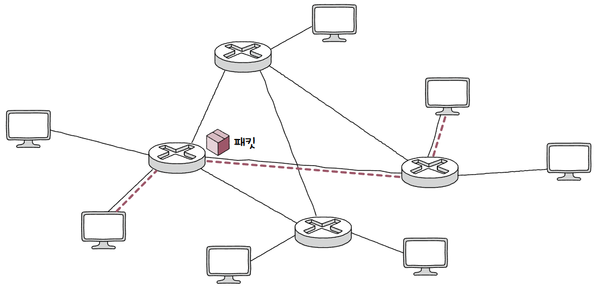
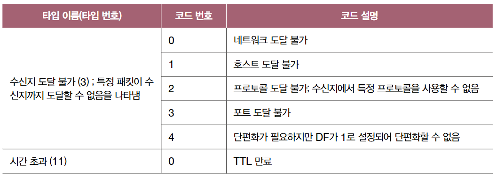
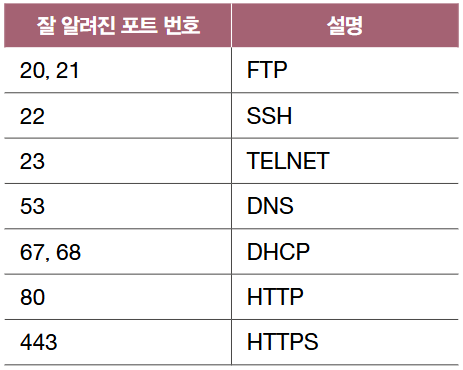
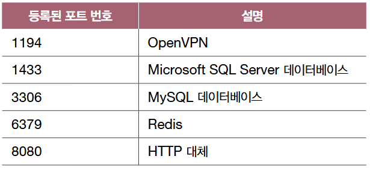
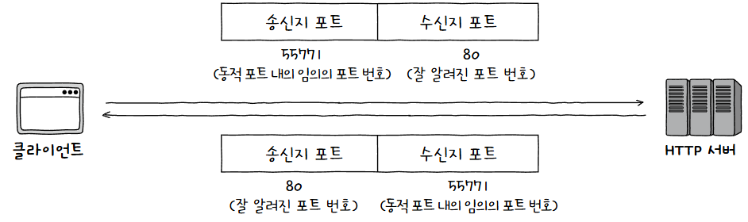
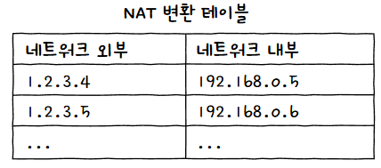
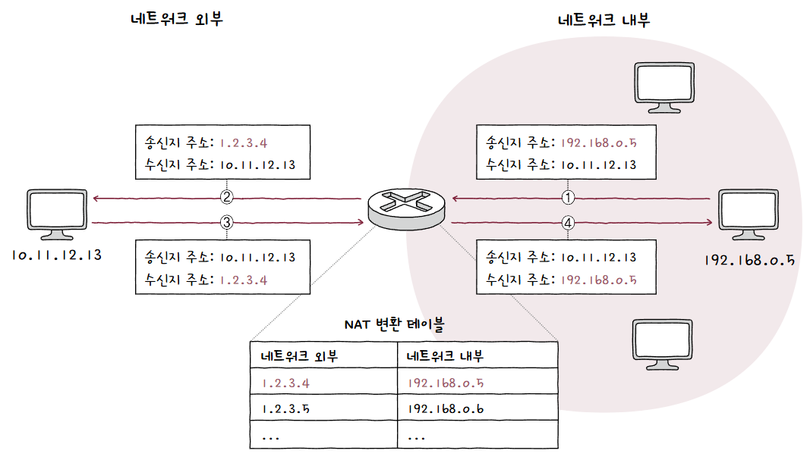
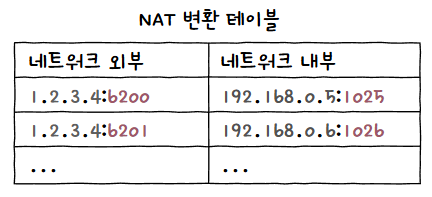
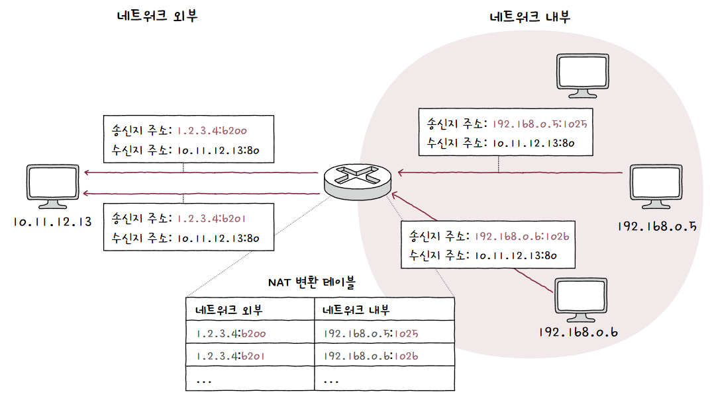
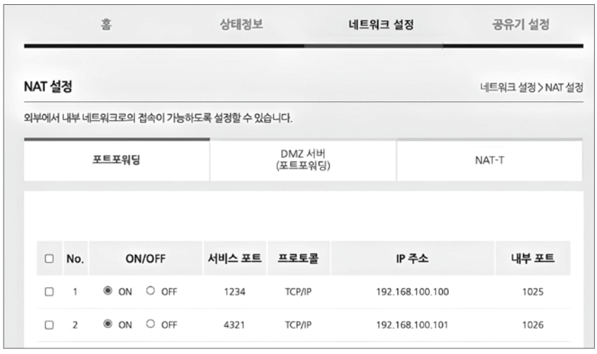

[네트워크 계층](네트워크%20계층.md)의 [IP](인터넷%20프로토콜.md)만으로는 분명한 한계가 있음  
## IP의 한계
IP의 핵심 기능인 IP 주소 지정, IP 단편화 외에도 두 가지 중요한 특징이 있음  

1. **신뢰할 수 없는 통신(Unreliable Protocol)**  
   패킷이 **수신지까지 제대로 전송되었다는 보장**을 하지 않음  
   패킷이 손상되거나 중복 패킷이 전송되어도 확인하지 않고, 재전송하지 않고, 순서도 보장하지 않음  
     
   이런 특성을 **최선형 전달(Best Effort Delivery)** 이라고도 부름  
   말 그대로 최선은 다할게~ 근데 보장은 안함 ㅎ  
2. **비연결형 프로토콜(Connectionless Protocol)**  
   송수신 호스트 간 연결 수립 작업을 거치지 않음  
   즉, 그저 수신지를 향해 보내기만 할 뿐  

> **💡 IP는 왜 일을 이딴식으로 하나요?**  
> 
> **결국 성능때문!**  
> 이런 단점들을 보완하는 과정에서 결국 **더 많은 시간과 부하가 요구**되는데, 이는 곧 성능상 악영향으로 이어짐  
> 위 단점들이 치명적으로 다가오는 연결들도 있지만, 그렇지 않은 연결들도 존재함  
> 예를 들어 동영상 스트리밍 같은 경우 패킷이 좀 손실되더라도 속도가 가장 중요함!  

## 한계 보완
**전송 계층**은 **신뢰할 수 있는 통신과 연결형 통신**을 가능하게 해 한계를 극복하고, **포트 번호를 통해 응용 계층의 프로세스를 식별**하는 역할을 수행함  

1. **연결형 통신**  
   연결형 통신을 지원하는 **대표적인 전송 프로토콜 [TCP](TCP.md)** 가 존재함  
     
   두 호스트가 정보를 주고받기 전 **가상의 회선을 설정하듯이 연결을 수립**함  
2. **신뢰성 있는 통신**  
   이 또한 TCP를 통해 가능함  
   TCP는 패킷이 수신지까지 **정확하고 확실히 전달되는 것을 보장하기 위해 다양한 기능을 제공**함  
   ex) 재전송을 통한 오류 제어, 흐름 제어, 혼잡 제어 등  

물론 위 단점들을 보완하면 성능상 악영향이 있음  
이 경우를 위한 **[UDP](UDP.md)** 라는 프로토콜도 존재함  

> **💡 네트워크 계층은 문제 해결 시도도 안하고 무책임하게 전송 계층으로 던지나요?**  
> 
> IP의 신뢰할 수 없는 통신과 비연결형 프로토콜 보완하기 위해 **ICMP(Internet Control Message Protocol)** 이라는 프로토콜이 있음  
> ICMP는 패킷 전송 과정에 대한 **피드백 메시지**를 얻기 위해 사용함  
> 메시지 종류로는 크게 **전송 과정에서 발생한 문제 상황 보고, 네트워크 진단 정보**가 있음  
> 
> 문제 상황 보고를 위한 ICMP 메시지 타입에는 대표적으로 수신지 도달 불가와 시간 초과가 있음  
>   
> 만약 라우터에게 전달된 패킷의 TTL이 0이 되면 송신지 호스트에게 **"시간 초과 타입 - TTL 만료 코드"** 를 보내는 것  
> 
> 네트워크 진단 정보를 위한 ICMP 메시지 타입은 대표적으로 아래와 같음  
>   
> 간단한 문제 진단 및 테스트를 위해 사용되기도 함  
> `traceroute`나 `ping` 또한 ICMP 메시지를 기반으로 동작함  
> 
> 단, ICMP는 IP의 신뢰성 문제를 보완하기 위한 역할일 뿐 여전히 **신뢰성을 보장하지 못함!!!**  

## 포트
전송 계층은 응용 계층과의 연결 다리 역할도 함  
이를 이해하기 위해서는 포트를 알아야 함  

### 정의
네트워크 외부에서 사진을 구성하는 패킷을 받아왔다고 하자  
받은 사진 패킷은 특정 애플리케이션 프로세스까지 전달되어야 함  
즉, **패킷의 최종 수신 대상은 특정 애플리케이션 [프로세스](프로세스.md)** 인 것  

수신할 애플리케이션에 대한 정보가 담겨있지 않으면 어디로 전달해야 할지 알 수 없음  
패킷에는 **특정 애플리케이션을 식별**할 수 있는 정보가 담겨있어야 하며, 이 정보를 **포트(Port)** 라 함  

### 분류
전송 계층에서는 **포트 번호**를 통해 애플리케이션을 식별함  
정확히는 **패킷 내 수신지 포트와 송신지 포트**를 통해 **송수신지 호스트의 애플리케이션을 식별**함  
TCP와 UDP 모두 포트 번호 필드인 **송신지 포트 번호와 수신지 포트 번호를 포함**함  
포트 번호는 **16비트로 표현해 0부터 65535번까지, 총 2^16개 할당 가능**함  

포트번호는 범위에 따라 크게 세 종류로 나뉨 
  

1. **잘 알려진(Well Known) 포트**  
   이름 그대로 **범용적으로 사용되는 애플리케이션 프로토콜이 일반적으로 사용하는 포트 번호**  
     
   영문 그대로 웰 노운 포트라고 부르는 경우가 많고, 시스템 포트라고도 부름  
2. **등록된(Registered) 포트**  
   위 포트 보다는 덜 범용적이지만, **흔히 사용되는 애플리케이션 프로토콜에 할당하는 포트 번호**  
     
   mysql이랑 redis 생각하면 편할듯!  
3. **동적(Dynamic)/사설(Private)/임시(Ephemeral) 포트**  
   인터넷 할당 번호 관리 기관에 의해 할당된 애플리케이션 프로토콜이 없음  
   그냥 **자유롭게 사용할 수 있는 포트**  

**서버**로서 동작하는 프로그램은 일반적으로 **잘 알려진 포트와 등록된 포트를 사용**하는 경우가 많음  
하지만, **클라이언트**로서 등작하는 프로그램은 그냥 **임의의 동적 포트 번호가 할당**되는 경우가 많음  
  
대표적으로 웹 브라우저가 특정 웹 사이트에 접속하면 동적 포트 내 임의의 포트를 할당받아 통신함  

IP 주소는 호스트를 식별할 수 있고, 포트 번호는 애플리케이션을 식별할 수 있음  
즉, IP 주소와 포트가 함께 주어지면 **특정 호스트에서 실행 중인 특정 애플리케이션 프로세스**를 식별할 수 있음  
  
그래서 포트 번호는 일반적으로 **"IP 주소:포트 번호"** 형식으로 함께 표기되는 경우가 많음  

## 포트 기반 NAT
**NAT**은 네트워크 내부에서 사용되는 **사설 IP 주소**와 네트워크 외부에서 사용되는 **공인 IP 주소를 변환**하는 기술  
이 변환을 위해 **NAT 변환 테이블**을 사용함  
### NAT 변환 테이블
NAT 변환 테이블(NAT 테이블)에는 변환의 대상이 되는 IP 주소 쌍이 명시됨  
  
위 테이블 기준 `192.168.0.5`라는 사설 IP 주소를 가진 호스트가 수신지 주소가 `10.11.12.13`인 네트워크 외부 호스트에게 패킷을 전송한다고 하자  
그렇다면 패킷이 NAT 기능을 거친 라우터를 거치면서 패킷의 송신지 주소가 공인 IP 주소인 `1.2.3.4`로 바뀜  
  
그런데 이 방식대로면 결국 **사용하는 사설 IP 주소만큼 공인 IP 주소가 필요**함  
하지만 분명 [사설 IP 주소](IP%20주소.md#사설%20IP%20주소)에서는 **"사설 IP 주소를 사용하는 여러 호스트가 적은 수의 공인 IP 주소를 공유할 수 있음"** 라고 적혀있음  
이것을 **가능하게 하는 것이 바로 포트!**  
### NAPT
포트 기반의 NAT를 **NAPT(Network Address Port Translation)** 이라 함  
**APT(Address Port Translation)** 라고도 부름  
하나의 공인 IP를 여러 사설 IP가 사용할 수 있도록 하는 NAT의 일종  
  
같은 `1.2.3.4`라는 공인 IP 주소로 변환되더라도 **포트 번호에 따라 내부 IP 주소를 구분**지을 수 있는 것  
이를 사용해 네트워크 내부 IP 주소와 외부 IP 주소를 N:1로 관리할 수 있음  
  

### 포트 포워딩
네트워크 내 호스트에 **IP 주소와 포트 번호를 할당**하고, 해당 **IP 주소:포트 번호로써 해당 호스트에게 패킷을 전달**하는 **포트 포워딩(Port Forwarding)**  
하나의 공인 IP 주소를 공유하므로 네트워크 외부에서 내부로 통신을 시작하는 상황에 어떤 IP 주소 및 포트를 수신지 주소로 삼을지 결정하기 어려움  
이때, **특정 IP 주소와 포트 번호 쌍을 특정 호스트에게 할당**한 후, 외부에서 통신을 시작할 호스트에게 알려주면 **그 정보로 통신을 시작**할 수 있음  
  
예시를 보면 이해가 쉬움  
위 상황은 **`공인 IP 주소:1234` 로 전송한 패킷은 `192.168.100.100:1025`로 전달되는 것**  
