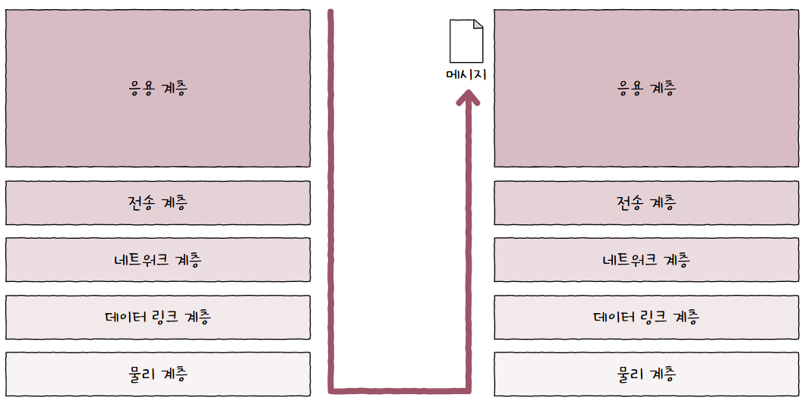
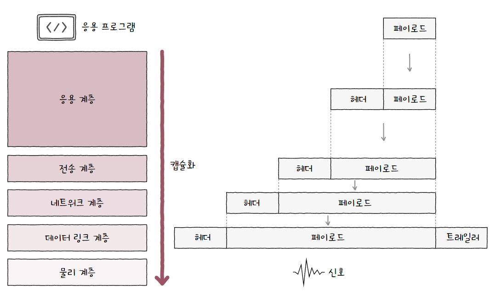

패킷은 송신 과정에서 캡슐화가 이루어지고, 수신 과정에서 역캡슐화가 이루어짐  
  
## 캡슐화
패킷 교환 네트워크에서 메시지는 패킷 단위로 송수신됨  
어떤 정보를 송신할 때 각 계층은 **상위 계층에게 받은 패킷을 페이로드**로 삼아, 프로토콜에 맞는 **헤더를 붙여 하위 계층으로 전달**함  
  
이렇게 송신 과정에서 헤더 및 트레일러를 추가하는 과정을 **캡슐화(Encapsulation)** 이라 부름  
## 역캡슐화
캡슐화와 반대로 수신자의 입장을 생각하면 됨  
캡슐화 과정에서 붙은 **헤더의 정보를 확인하고 제거**하는 과정  