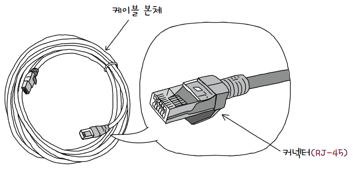
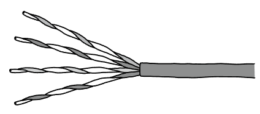
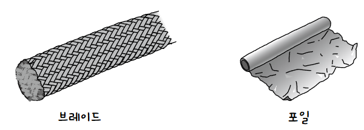
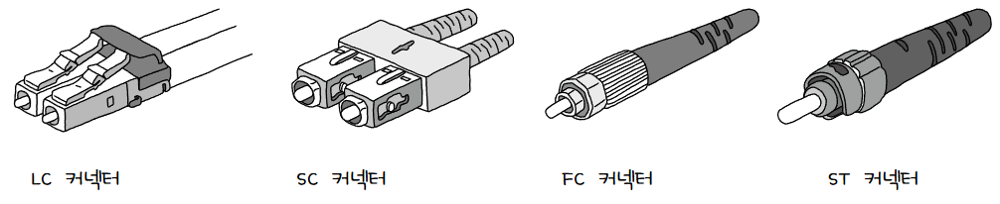
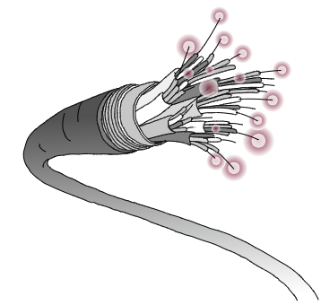
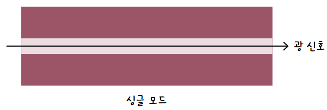
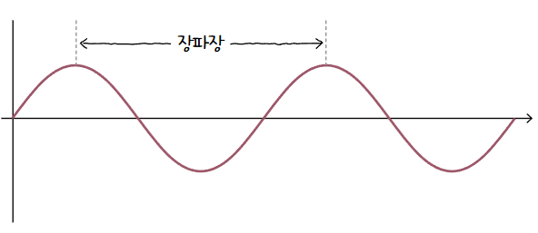
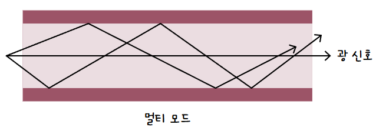

[NIC](NIC.md)에 연결되는 유선 통신 매체  
호스트가 아무리 데이터를 빠르게 처리해도 통신 매체가 그 속도를 잡지 못하면 효용이 없음  
## 트위스티드 페어 케이블
**트위스티드 페어 케이블(Twisted Pair Cable)** 은 **구리 선**으로 **전기 신호**를 주고 받는 통신 매체  

### 생김새
**케이블 본체**와 연결부인 **커넥터(Connector)** 로 이루어짐  
- **커넥터**  
  랜선 연결할때 본 적 있는듯한 생김새  
    
  이 모양의 커넥터를 **RJ-45**라 부름  
- **케이블 본체**  
  구리 선이 두 가닥씩 꼬아져 있는 형태  
    
  이렇게 구리선으로 전기 신호를 주고받으면 **전자적 간섭**이 생길 수 있음  
  이 간섭을 **노이즈(Noise)** 라 부름  
  구리선은 노이즈에 민감하기때문에 그물 모양의 철사 또는 포일로 감싸 보호하는 경우가 많음  
  이런 방식을 **차폐(Shielding)** 이라 하고, 그물 모양의 포일을 각각 브**레이브 실드(Brave Shield)** 또는 **포일 실드(Foil Shield)** 라 부름
    
### 실드에 따른 분류
일반적으로 크게 3가지로 나뉨  
1. 브레이브 실드를 감싼 경우 STP(Shielded Twisted Pair) 케이블  
2. 포일 실드를 감싼 경우 FTP(Foil Twisted Pair) 케이블  
3. 아무것도 감싸지 않은 경우 UTP(Unshielded Twisted Pair) 케이블  

하지만 실드는 여러 개일수도 있기 때문에 더 세분화 됨  
  
크게 이런 구조를 가짐  
U는 쉴드 없음, S는 브레이브 실드, F는 포일 실드  
XX에는 외부를 감싸는 실드 종류가 명시되고, Y에는 꼬인 구리 선 쌍을 감싸는 실드 종류가 명시됨  

ex)  
S/FTP 케이블: 외부는 브레이브 실드, 꼬인 각 구리 선 쌍은 포일 실드로 감싼 케이블  
SF/FTP 케이블: 외부는 브레이브 실드와 포일 실드, 꼬인 각 구리선 쌍은 포일 실드로 감싼 케이블  
U/UTP 케이블: 아무것도 감싸지 않은 케이블  

> **💡 이걸 언제 다 외우나요;;**  
> 
> 케이블 본체에 직접 명시된 경우가 많으니 어떤 규칙으로 표기하는지만 알아두자
### 카테코리에 따른 분류
줄여서 Cat 이라고도 부르는 **카테고리(Category)** 는 **케이블 성능의 등급**을 구분함  
각 카테고리마다 지원 대역폭, 주요 대응 규격, 전송 속도 등 성능이 다름  
카테고리3은 Cat3, 카테고리5는 Cat5와 같이 표시하는데 숫자가 높을수록 성능이 좋음  

## 광섬유 케이블
**광섬유 케이블(Fiber Optic Cable)** 은 빛을 이용해 정보를 주고받는 케이블  
빛응 사용하기에 속도도 빠르고 먼 거리까지 전송이 가능하며 간섭도 적음  
### 생김새
똑같이 **케이블 본체**와 **커넥터**로 이루어짐  
- **커넥터**  
  대표적으로 LC 커넥터, SC 커넥터, FC 커넥터, ST 커넥터가 있음  
    
- **케이블 본체**  
  본체 내부는 머리카락과 같은 형태로 광섬유로 구성됨  
    
  그 중심에는 실질적으로 빛이 흐르는 **코어(Core)** 가 있음  
  그리고 빛을 가두기 위해 코어를 둘러싸는 **클래딩(Cladding)** 이 있음  
  이 코어의 지름에 따라 싱글 모드 광섬유 케이블과 멀티 모드 광섬유 케이블로 나뉨  
### 종류
- **싱글 모드 광섬유(SMF, Single Mode Fiber) 케이블**  
  코어의 지름이 8~10µm 정도  
    
  코어의 지름이 작으니 **빛의 이동 경로가 하나**이고, 그래서 싱글 모드임  
  **신호 손실이 적어** 장거리 전송에 적합하나, **멀티 모드에 비해 비쌈**  
  
  또한, 파장이 긴 장파장의 빛을 발사함  
    
  대표적인 케이블 규격으로 1000BASE-LX가 있는데 여기서 L이 장(Long)파장  
- **멀티 모드 광섬유(MMF, Multi Mode Fiber) 케이블**  
  코어의 지름이 50~62.5µm 정도  
    
  코어의 지름이 크니 **빛의 이동 경로가 여러개**이고, 그래서 멀티 모드임  
  신호 손실이 커 장거리 전송에 부적합함  
  또한, 싱글 모드에 비해 단파장의 빛을 발사함  
  대표적인 케이블 규격으로 1000BASE-SX가 있는데 여기서 S가 단(Short)파장  

> **💡 그러면 사람이 이걸 어떻게 구별하나요?**  
> 
> 싱글 모드 광섬유 케이블은 대부분 노란색과 파란색  
> 멀티 모드 광섬유 케이블은 대부분 오렌지색과 아쿠아색  