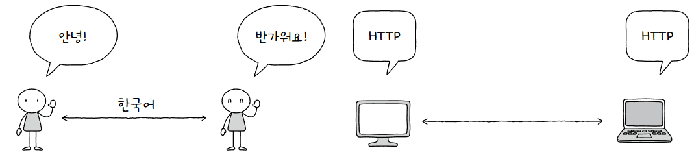

현대 인터넷은 대부분 [패킷 교환 방식](네트워크.md#패킷%20교환(Packet%20Switching)%20방식)을 사용함  
이때, 올바르게 정보를 주고받기 위해 언어와 같은 의사소통 방식을 만들었음  
그것이 **프로토콜(Protocol)**  
  
프로토콜은 노드 간 정보를 올바르게 주고받기 위해 합의된 규칙이나 방법을 의미함  

대표적인 예로 아래와 같이 있음  
1. **[IP](인터넷%20프로토콜.md)**  
   패킷을 수신지까지 전달하기 위해 사용하는 프로토콜  
2. **ARP**  
   IP 주소를 MAC 주소로 대응하기 위해 사용하는 프로토콜  
3. **HTTPS, HTTP**  
   정보를 안전하게 주고받기 위해 사용하는 프로토콜  
4. **TCP, UDP**  
   정보를 주고받는 방식을 정하기 위해 사용하는 프로토콜  
   
**모든 프로토콜에는 목적과 특징**이 있다는 것이 중요  

