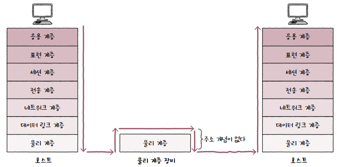
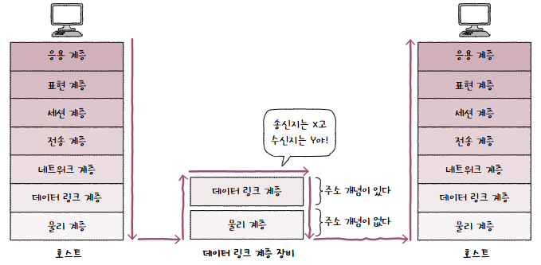
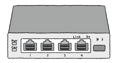
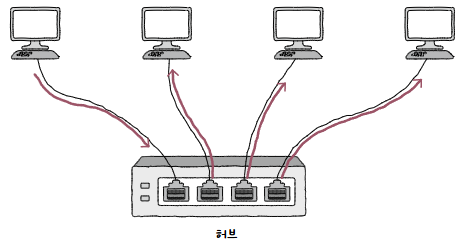
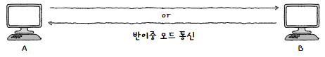
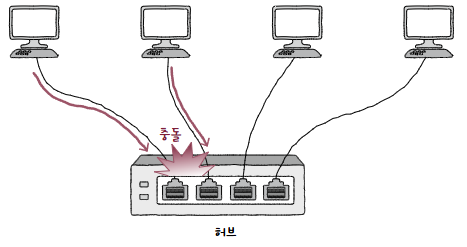
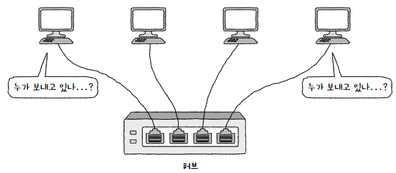
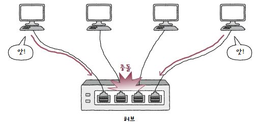
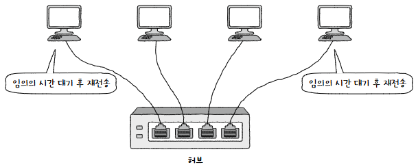

## 주소 개념이 없는 물리 계층
물리 계층에는 **주소 개념이 없음**!!  
  
단지 호스트와 통신 매체 간 연결과 통신 매체 상 송수신이 이루어질 뿐임  
그러므로 물리 계층의 네트워크 장비는 **어떠한 조작이나 판단**을 하지 않음  

하지만 데이터 링크 계층에는 **주소 개념이 있음**  
  
MAC 주소도 여기 포함됨  
따라서 **송수신지를 특정하거나, 주소를 바탕으로 정보 조작 및 판단이 가능**함  

중요한 차이니까 기억하자  
## 허브
**허브(Hub)** 는 **여러 대의 호스트를 연결**하는 장치  
**리피터 허브(Repeater Hub)** 라 부르기도 하고, 이더넷 네트워크에서는 **이더넷 허브(Ethernet Hub)** 라 부르기도 함  

허브는 아래와 같이 생김  
  
커넥터를 연결할 수 있는 **포트(Port)** 가 있음  
이 포트에 호스트와 연결된 통신 매체를 연결할 수 있음  
### 특징
크게 두 가지 특징이 있음  
1. **전달 받은 신호를 다른 모드 포트로 그대로 다시 내보냄**  
   물리 계층에는 주소 개념이 없기에 **수신지를 특정할 수 없음**  
     
   그래서 그냥 **송신지를 제외한 모든 포트**에 내보냄  
2. **반이중 모드로 통신함**  
   **반이중(Half Duplex)** 모드는 1차선 도로처럼 **송수신을 번갈아 가면서 하는 통신** 방식  
     
   호스트A가 B에게 메시지를 송신할 때 호스트B가 A에게 송신할 수 없는 것  
   그 반대인 **전이중(Full Duplex)** 모드도 있음  

### 콜리전 도메인
반이중 통신 과정에서 **동시에 신호를 송신하면 충돌(Collision)이 발생**할 수 있음  
  
충돌이 발생할 수 있는 영역을 **콜리전 도메인(Collision Domain)** 이라 함  
임계 영역 느낌인듯..?  

당연히 콜리전 도메인은 **작을수록 좋음**  
만약 콜리전 도메인이 너무 넓으면 **CSMA/CD 프로토콜을 사용하거나 스위치를 사용**해야 함  
## CSMA/CD
충돌이 발생하는 근본적인 이유인 **반이중 모드를 해결**하기 위해 나옴  
반이중 이더넷 네트워크에서 충돌을 방지하는 대표적인 프로토콜  

CSMA/CD는 Carrier Sense Multiple Access with Collision Detection의 약자  
뜻을 풀어서 보면 이해할 수 있음  
### 의미
1. CS, Carrier Sense는 **캐리어 감지**  
   메시지를 보내기 전 현재 네트워크상 전송 중인 것이 있는지 먼저 확인함  
     
   이렇게 현재 통신 매체의 사용 가능 여부를 검사하는 것을 **캐리어 감지(Carrier Sense)** 라고 함  
2. MA, Multiple Access는 **다중 접근**  
   복수의 호스트가 네트워크에 접근하려는 상황을 의미함  
     
3. CD, Collision Detection은 **충돌 검출**  
   충돌 발생 시 전송이 중단되고 다른 이들에게 충돌이 발생했음을 **잼 심호(Jam Signal)** 로 알림  
     
   이후 임의의 시간동안 대기 후 재전송  