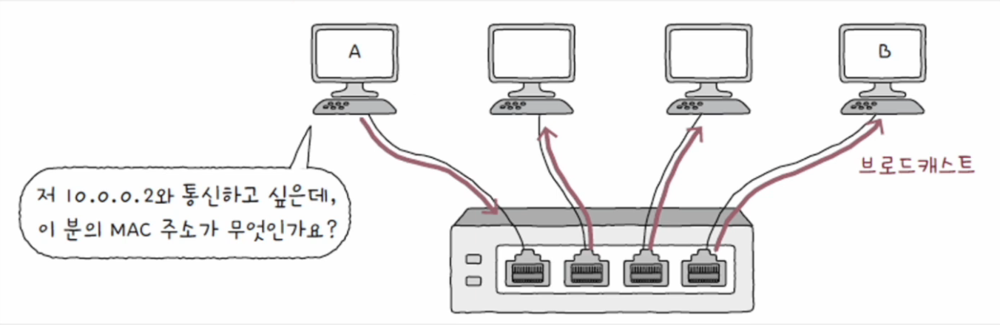
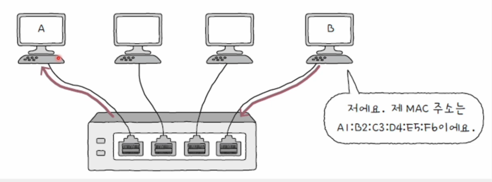
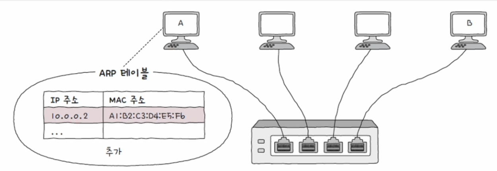
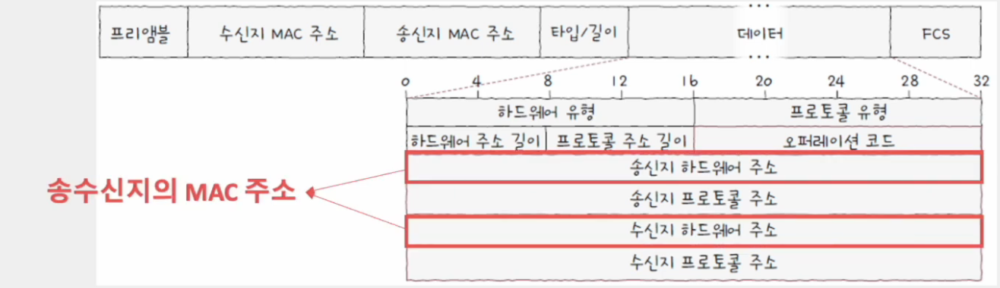
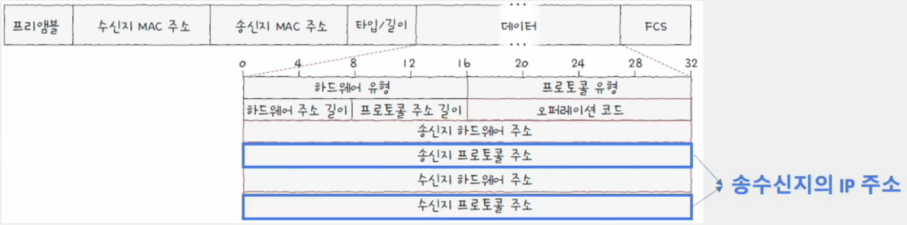
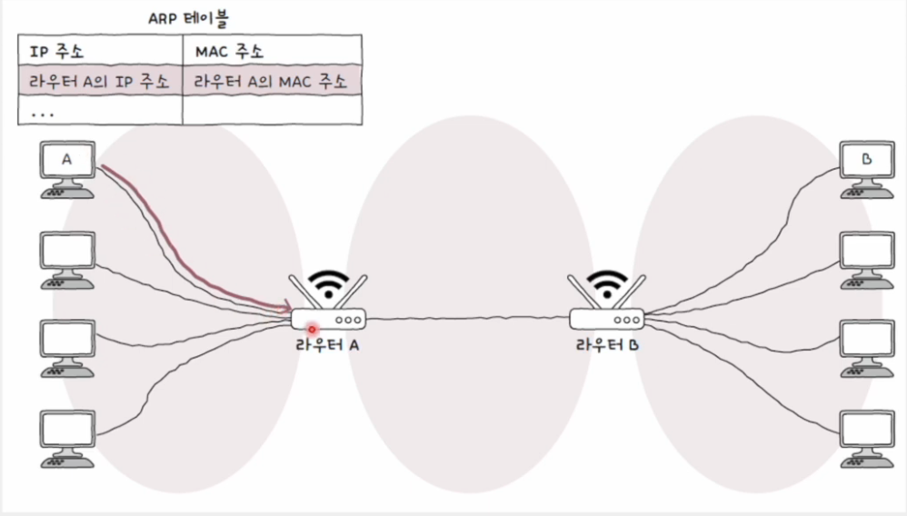

# ARP(Address Resolution Protocol)

- IP 주소를 통해 MAC 주소를 알아내는 프로토콜
- 동일 네트워크 내에 있는 송수신 대상의 IP 주소를 통해 MAC 주소를 알아낼 수 있다.

<br>

## ARP 동작 과정 - 같은 네트워트에 속한 두 호스트

#### 상황

    - 동일 네트워크에 속한 호스트 A, B
    - 호스트 A는 호스트 B의 IP 주소는 알지만 MAC 주소는 모른다.
    - 이 상황에서 호스트 B의 MAC 주소를 알아내는 과정

### 1. ARP 요청

- 호스트 A가 **브로트캐스트 메시지** 전송
- 브로트캐스트 메시지 = **ARP 요청**이라는 ARP 패킷



### 2. ARP 응답

- 호스트 B는 자신의 MAC 주소를 담은 **유니캐스트 메시지**를 A에게 전송
- 유니캐스트 메시지 = **ARP 응답**이라는 ARP 패킷
- 이 메시지를 수신한 A는 B의 MAC 주소를 알게 된다.
- 호스트 B 외에 나머지 호스트는 자신의 IP 주소가 아니므로 무시



### 3. ARP 테이블 갱신

- ARP 요청과 응답을 통해 알게 된 IP 주소와 MAC 주소의 연관 관계
- ARP 테이블 항목은 일정 시간이 지나면 삭제. 임의 삭제도 가능
- ARP 테이블에 등로고딘 호스트에 대해서는 ARP 요청을 보낼 필요가 없음



#### ARP 테이블 확인 명령어

```shell
$ arp -a
```

<br>

## ARP 패킷

- ARP 요청, ARP 응답 과정에서 송수신되는 패킷




#### 오퍼레이션 코드(Opcode)

    ARP 요청의 경우 1, ARP 응답의 경우 2

<br>

## ARP 동작 과정 - 서로 다른 네트워트에 속한 두 호스트

### ARP 요청

- ARP 응답 과정을 통해 라우터 A의 MAC 주소를 알아낸 뒤, 이를 향해 패킷 전송


