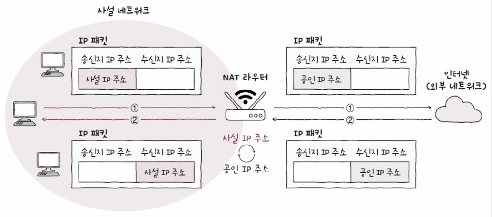
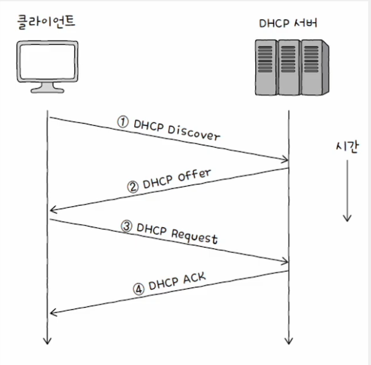
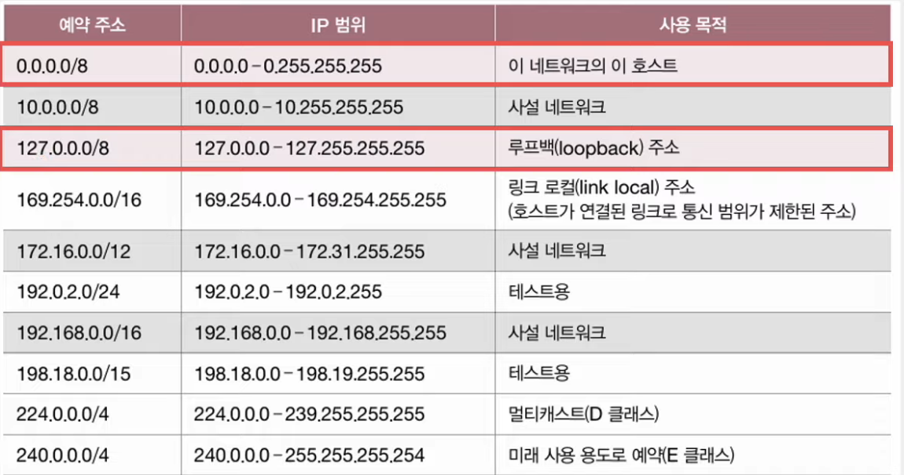

# IP 주소의 분류

## 공인 IP 주소 & 사설 IP 주소

### 💡 공인 IP 주소(Public IP Address)

- 전 세계에서 고유한 IP 주소
- 네트워크 간의 통신, 이를테면 인터넷을 이용할 때 사용하는 IP 주소
- 공인 IP 주소는 ISP나 공인 IP 주소 할당 기관을 통해 할당

### 💡 사설 IP 주소(Private IP Address)

- 사설 네트워크에서 사용하기 위한 IP 주소
- 사설 IP 주소로 사용하도록 특별히 예약된 IP 주소 공간
  - `10.0.0.0/8 (10.0.0.0 ~ 10.255.255.255)`
  - `172.16.0.0/12 (172.16.0.0 ~ 172.31.255.255)`
  - `192.168.0.0/16 (192.168.0.0 ~ 192.168.255.255)`
- 사설 IP 주소의 할당 주체는 일반적으로 라우터(공유기)
- 사설 IP 주소는 호스트가 속한 사설 네트워크에서만 유효한 주소
- 다른 네트워크상의 사설 IP 주소와 중복 가능
- 일반적으로 네트워크 간의 통신은 사설 IP 주소가 아닌 공인 IP 주소를 통해 이루어짐

### 💡 확인 방법

```shell
# window
$ ipconfig

# mac
$ ifconfig
```

<br>

## NAT(Network Address Translation)

- IP 주소 변환 기술
- 주로 **사설 IP 주소**(네트워크 내부)와 **공인 IP 주소**(네트워크 외부)를 변환
- 네트워크 내부에 있는 호스트가 네트워크 외부와 통신할 때 사용
- 대부분의 라우터와 (가정용) 공유기는 NAT 기능 내장
  - 사설 네트워크의 패킷 속 **사설 IP 주소**는 공유기를 거쳐 **공인 IP 주소**로 변경
  - 외부 네트워크 패킷 속 **공인 IP 주소**는 공유기를 거쳐 **사설 IP 주소**로 변경
- NAT를 통해 사설 IP 주소를 사용하는 여러 호스트는 적은 수의 공인 IP 주소를 공유 가능



<br>

## 정적 IP 주소 & 동적 IP 주소

### 💡 정적 할당

- 호스트에 직접(수동으로) IP 주소를 부여하는 방식
- 이렇게 할당된 IP 주소 = **정적 IP 주소**(**Static IP Address**)
- 주소 부여 시 일반적으로 입력하는 정보
  - IP 주소
  - 서브넷 마스크
  - 게이트웨이(라우터) 주소
  - DNS 주소
- 모든 IP 주소를 정적으로 할당 가능? => NO
  - 호스트의 수가 많아질 경우 관리 곤란
  - 의도치 않게 잘못된 IP 주소를 입력할 수 있음
  - 중복된 IP 주소를 입력할 수 있음

#### 기본 게이트웨이(Default Gateway)

- 일반적인 의미: 서로 다른 네트워크를 연결하는 HW/SW적 수단
- 호스트가 속한 **네트워크 외부로 나가기 위한 기본적인 첫 경로** (첫 번째 홉)
- 네트워크 외부와 연결된 라우터(공유기)의 주소를 의미하는 경우가 많음
- IP 할당의 맥락엥서 사용된 '게이트웨이'는 **기본 게이트웨이**(**라우터 및 공유기의 주소**)를 의미

### 💡 동적 할당

- 호스트에 IP 주소를 프로토콜을 활용해 자동으로 할당하는 방식
- 이렇게 할당된 IP 주소 = **동적 IP 주소**(**Dynamic IP Address**)

<br>

## DHCP(Dynamic Host Configuration Protocol)

    IP 동적 할당에 사용되는 대표적인 프로토콜

### 💡 DHCP를 통한 IP 주소 할당

- **클라이언트**와 **DHCP 서버** 간 메시지 송수신을 통해 할당이 이루어진다.
- DHCP로 할당받은 동적 IP 주소는 사용할 기간(임대 기간)이 정해진다.
  - 일반적으로 수 시간에서 수 일
- 임대 기간이 끝난 IP 주소는 다시 DHCP 서버로 반납된다.

#### 클라이언트

- IP 주소를 할당받고자 하는 호스트

#### DHCP 서버

- 호스트에게 IP 주소를 제공하는 호스트
- DHCP 서버의 역할은 일반적으로 라우터(공유기)가 수행
- 특정 호스트에 DHCP 서버 기능을 추가할 수 있다.
- DHCP 서버는 클라이언트에게 할당 가능한 IP 주소 목록을 관리하다가, 클라이언트 요청시 IP 주소를 할당한다.

<br>

## IP 주소 할당 과정에서 주고받는 메시지



### 1. DHCP Discover

- DHCP 서버를 찾는 메시지
- 브로드캐스트로 전송
- 클라이언트는 아직 IP 주소를 할당받지 못함
- 송신지 IP 주소를 `0.0.0.0`으로 설정

### 2. DHCP Offer

- 클라이언트에게 할당 가능한 IP 주소 정보를 제안하는 메시지
- 할당 가능한 IP 주소, 서브넷 마스크, 임대 기간 등의 정보 포함

### 3. DHCP Request

- DHCP Offer 메시지에 대한 응답
- 브로드캐스트로 전송

### 4. DHCP ACK(Acknowledgment)

- 최종 승인과 같은 메시지
- 클라이언트는 할당받은 IP 주소를 자신의 IP 주소로 설정한 후 **임대 기간 동안 IP 주소 사용**
- 사용 기간이 모두 끝나면 IP 주소를 DHCP 서버에 반납
  - 원칙적으로는 다시 1번(DHCP Discover)부터 진행하여 IP 주소 재할당

#### 임대 갱신(Lease Renewal)

- IP 주소 임대 기간이 끝나기 전에 임대 기간을 연장하는 것
- 임대 기간이 끝나기 전에 기본적으로 두 차례 자동으로 수행
- 자동 임대 갱신이 모두 실패하면 그때 IP 주소 반납

<br>

## 예약 주소



### 💡 127.0.0.1

- = 루프백 주소(loopback address) = 로컬 호스트(localhost)
- 자기 자신을 가리키는 특별한 주소
- 루프백 주소로 전송된 패킷은 자기 자신에게 되돌아온다.
- 부메랑 역할을 수행하는 주소
- 테스트나 디버깅 용도로 사용

### 💡 0.0.0.0/8

- 호스트가 IP 주소를 할당받기 전에 임시로 할당되는 IP 주소
  - 예) DHCP Discover 메시지를 전송하는 시점의 클라이언트 IP 주소
- 호스트 입장에서 자신을 특별히 지칭할 IP 주소가 없을 때 사용되는 IP 주소

### 💡 0.0.0.0/0

- 모든 임의의 IP 주소
- `0.0.0.0/8`과 유사하지만 다른 의미를 지니는 주소
- 주로 라우팅에서 **디폴드 라우트**를 나타내기 위해 사용

#### Default Route

    패킷을 어떤 IP 주소로 전달할지 결정하기 어려울 경우 기본적으로 패킷을 전달할 경로
