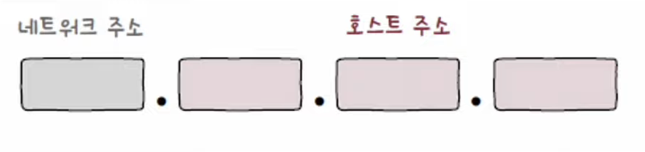
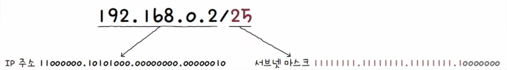

# IP 주소 구조

- 크게 **네트워크 주소**와 **호스트 주소**로 구성

#### 네트워크 주소

    호스트가 속한 특정 네트워크를 식별하는 부분

#### 호스트 주소

    특정 호스트를 식별하는 부분

 

## IP 주소 공간의 할당

### 💡 네트워크 주소가 하나의 옥텟으로 이루어질 경우

- 한 네트워크당 호스트 주소 할당에 24비트 사용 가능
- 상대적으로 많은 호스트에 IP 주소를 할당

#### 무조건 호스트 주소 공간을 크게 할당하면?

=> 호스트가 할당되지 않은 다수의 IP 주소가 낭비

### 💡 네트워크 주소가 세 개의 옥텟으로 이루어진 경우

- 한 네트워크당 호스트 주소 할당에 8비트 사용 가능
- 상대적으로 적은 호스트에 IP 주소를 할당

#### 무조건 호스트 주소 공간을 작게 할당하면?

=> 호스트가 사용할 IP 주소 부족

 

## 클래스(Class)

- 네트워크 크기에 따라 IP 주소를 분류하는 기준
- 필요한 호스트 IP 개수에 따라 클래스를 달리 선택
- 네트워크 크기 조정 가능

#### 클래스풀 주소 체계 (Classful Addressing)

    클래스를 기반으로 IP 주소를 관리하는 주소 체계

### 💡 A 클래스

- B와 C 클래스에 비해 할당 가능한 호스트 주소의 수가 많다.
- 네트워크 주소는 비트 `0`으로 시작하는 1옥텟, 호스트 주소는 3옥텟으로 구성
- 이론상 2^7개의 A 클래스 네트워크 존재 가능
- 각 네트워크에 2^24개의 호스트 주소 할당 가능
- 가장 처음 옥텟의 주소가 **0~127**일 경우, A 클래스 주소임을 짐작 가능

### 💡 B 클래스

- 네트워크 주소는 비트 `10`으로 시작하는 2옥텟, 호스트 주소도 2옥텟으로 구성
- 이론상 2^14개의 B 클래스 네트워크 존재 가능
- 각 네트워크에 2^16개의 호스트 주소 할당 가능
- 가장 처음 옥텟의 주소가 **128~191**일 경우, B 클래스 주소임을 짐작 가능

### 💡 C 클래스

- 네트워크 주소는 비트 `110`으로 시작하는 3옥텟, 호스트 주소는 1옥텟으로 구성
- 이론상 2^21개의 C 클래스 네트워크 존재 가능
- 각 네트워크에 2^8개 호스트 주소 할당 가능
- 가장 처음 옥텟의 주소가 **192~223**일 경우, C 클래스 주소임을 짐작 가능

 

## 클래스별 할당 가능한 주소의 개수

### 💡 할당 가능한 호스트 수에서 2씩 빠진 이유

- 호스트의 주소 공간을 모두 사용할 수 있는 것은 아니다.
- 호스트 주소가 전부 0인 IP 주소
  - 해당 네트워크 자체를 의미하는 **네트워크 주소**로 사용
- 호스트 주소가 전부 1인 IP 주소
  - **브로드캐스트 주소**로 사용

 

## 클래스리스 주소 체계 (Classless Addressing)

- 클래스 개념 없이 **클래스에 구애받지 않고** 네트워크의 영역을 나누고 호스트에게 IP 주소 공간을 할당하는 방식
- 클래스풀 주소 체계보다 더 유동적이고 정교한 네트워크 구획 가능
- 오늘날 주로 활용되는 방식

### 💡 클래스풀 주소 체계의 한계

- 클래스별 네트워크 크기가 고정되어 있어 여전히 낭비되는 IP 주소가 많을 수 있다.
- 클래스별 네트워크 크기가 고정되어 있어 사전에 정해진 크기 외의 다른 크기 네트워크 구성 불가능

 

## 서브네팅(Subnetting)

- 서브넷 마스크를 이용해 클래스를 원하는 크기로 더 잘게 쪼개어 사용하는 것
- 서브넷 마스크로 네트워크 주소와 호스트 주소를 구분짓는 방법
- IP 주소와 서브넷 마스크를 비트 **AND 연산**한 결과를 네트워크 주소로 지정
- 호스트 주소 모두 0
  - 네트워크 주소 `192.168.219.0`
- 호스트 주소 모두 1
  - 네트워크 주소 `192.168.219.255`
- 호스트 주소 할당 가능 범위
  - `192.168.219.1 ~ 192.168.219.254`

#### 비트 AND 연산

    피연산자가 모두 1인 경우에는 1, 아닌 경우에는 0이 되는 연산

### 💡 서브넷 마스크(Subnet Mask)

- 클래스 없이 IP 주소의 네트워크 주소, 호스트 주소를 구분하는 수단
- IP 주소상에서 네트워크 주소는 1, 호스트 주소는 0으로 표기한 비트열
- 네트워크 내의 **부분적인 네트워크**를 **구분 짓는** 비트열
- A, B, C 클래스의 기본 서브넷 마스크
  - A 클래스: `255.0.0.0`
  - B 클래스: `255.255.0.0`
  - C 클래스: `255.255.255.0`

### 💡 CIDR(Classless Inter-Domain Routing notation) 표기법

- 서브넷 마스크 표기법
- `IP 주소/서브넷 마스크상의 1의 개수` 형식으로 표기

 

## 예제) 192.168.0.2/25는 어떤 네트워크에 속한 어떤 호스트를 가리킬까?

### 1. 네트워크 주소와 호스트 주소 계산

### 2. 서브넷 마스크를 IP 주소와 비트 AND 연산

### 3. 할당 가능한 호스트 IP 주소의 범위

- 네트워크 주소: `192.168.0.0`
- 브로드캐스트 주소: `192.168.0.127`
- 할당 가능한 호스트 IP 주소: `192.168.0.1 ~ 192.168.0.126`

### 4. 결론

- 총 126개의 호스트를 할당할 수 있는 `192.128.0.0`이라는 네트워크에 속한 `192.168.0.2`를 의미
