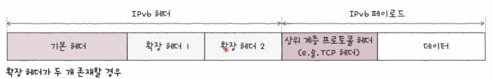

# 네트워크 계층

- LAN을 넘어 다른 네트워크와의 통신을 위한 계층
- 기능
  - IP 주소를 통한 송수신지 대상을 지정
  - 라우팅을 통한 다른 네트워크와 통신

 

## 물리 계층과 데이터 링크 계층의 한계

(물리 계층과 데이터 링크 계층만으로 LAN을 넘어서 통신하기 어려운 2가지 이유)

### 1. 다른 네트워크까지의 도달 경로를 파악하기 어려움

#### 라우팅(Routing)

    패킷이 이동할 최적의 경로를 결정하는 것

#### 라우터(Router)

    라우팅을 수행하는 대표적인 장비

### 2. MAC 주소만으로는 모든 네트워크에 속한 모든 호스트의 위치를 특정하기 어려움

- MAC 주소와 IP 주소는 함께 사용되고, 기본적으로 IP 주소를 우선 활용

#### IP 주소

- 택배의 **수신지** 역할
- 논리 주소
- 자동으로 할당받거나 사용자가 직접 할당(유동적)

#### MAC 주소

- 택배의 **수신인** 역할
- 물리 주소
- NIC마다 할당되는 고정된 주소

 

## IP(Internet Protocol)

- 네트워크 계층의 핵심
- 물리 계층과 데이터 링크 계층의 한계를 극복하는 프로토콜
- IPv4와 IPv6

#### RFC(Request for Comments)

- 네트워크/인터넷 관련 신기술 제안, 의견 등을 남긴 문서
- 일부 RFC는 오늘날까지 사용되는 인터넷 표준이 된다.
- RFC 문서에는 번호가 부여된다. (RFC 791)
- "세상에서 가장 정확한 네트워크 이론 지식"
- 폐지되거나 수정되지 않는다.

### 기능1. 주소 지정(IP Addressing)

- IPv4 주소를 바탕으로 송수신 대상을 지정하는 것을 의미
- 4바이트(32비트)로 하나의 주소를 표현
- 숫자당 8비트로 표현
  - 0~255 범위 안에 있는 4개의 10진수로 표기
- 각 숫자는 점(.)으로 구분

#### 옥텟(Octet)

    점으로 구분된 8비트(0~255 범위의 10진수)

### 기능2. 단편화(IP Fragmentation)

- 전송하고자 하는 패킷의 크기를 MTU 이하의 복수의 패킷으로 나누는 것

#### MTU(Maximum Transmission Unit)

- 한 번에 전송 가능한 IP 패킷의 최대 크기
- IP 패킷의 헤더도 MTU 크기에 포함
- 일반적인 MTU 크기는 _1500바이트_
  - 프레임 페이로드 크기
- MTU 크기 이하로 나누어진 패킷은 수신지에 도착하면 다시 재조합

 

## IPv4 패킷의 핵심 필드

### 1. 식별자(Identifier)

- 패킷에 할당된 번호
- 쪼개져서 도착한 IPv4 패킷들이 어떤 메시지에서 쪼개졌는지를 알기 위해 사용

### 2. 플래그(Flag)

- 3개의 비트로 구성
  - 첫 번째 비트는 항상 0으로, 현재 사용되지 않음

#### DF(Don't Fragment) Bit

    IP 단편화를 수행하지 말라는 표시

#### MF(More Fragment) Bit

    단편화된 패킷이 더 있는지를 여부를 표시

### 3. 단편화 오프셋(Fragment Offset)

- 초기 데이터에서 몇 번째로 떨어진 패킷인지를 나타낸다.
- 단편화되어 전송되는 패킷들은 수신지에 순서대로 도착하지 않을 수 있다.
- -> 수신지가 패킷들을 순서대로 재조합하려면 단편화된 패킷이 **초기 데이터에서 몇 번째에 해당하는 패킷인지** 알아야 한다.

### 4. TTL(Time To Live)

- 패킷의 수명
- 무의미한 패킷이 네트워크상에 지속적으로 남아있는 것을 방지하기 위해 존재
- 패킷이 하나의 라우터를 거칠 때마다 TTL이 1씩 감소
- TTL 값이 0으로 떨어진 패킷은 폐기

#### 홉(Hop)

    패킷이 호스트 또는 라우터에 한 번 전달되는 것으로, TTL 필드의 값은 홉마다 1씩 감소

### 5. 프로토콜

- 상위 계층의 프로토콜이 무엇인지를 나타내는 필드
- 예) 6번(TCP), 17번(UDP)

### 6. 송신지 IP 주소 & 수신지 IP 주소

- IPv4 주소를 통한 송수신지 지정

 

## IPv6

- 이론적으로 할당 가능한 IPv4 주소의 개수는?
  - 2^32 = 약 43억 개
  - => 부족
- 16바이트(128비트)로 주소를 표현
- 콜론(:)으로 구분된 8개 그룹의 16진수로 표기
- 이론적으로 할당 가능한 IPv6 주소 = 2^128개

 

## IPv6 패킷의 핵심 필드

### 1. 다음 헤더(Next Header)

- 상위 계층의 프로토콜 또는 확장 헤더를 가리키는 필드

#### 확장 헤더(Extension Header)

- IPv6는 기본 헤더와 더불어 확장 헤더라는 추가 헤더를 가질 수 있다.
- 확장 헤더는 기본 헤더와 페이로드 데이터 사이에 위치한다.
- 꼬리에 꼬리를 물듯 또 다른 확장 헤더를 가질 수 있다.
- 대표적인 확장 헤더
  - 홉 간 옵션(Hop-by-Hop Options)
  - 수신지 옵션(Destination Options)
  - 라우팅(Routing)
  - **단편(Fragment)**
  - ESP(Encapsulating Security Payload)
  - AH(Authentication Header)

### 2. 홉 제한

- IPv4 패킷의 TTL 필드와 비슷
- 패킷의 수명을 나타내는 필드

### 3. 송신지 IP 주소 & 수신지 IP 주소

- IPv6 주소를 통한 송수신지 지정

 

## IPv6의 단편화

- IPv6는 단편화 확장 헤더를 통해 단편화가 이루어진다.
- 단편화 확장 헤더에도 **다음 헤더** 필드가 있다.

#### 예약됨(reserved) & 예약(res)

    0으로 설정되어 사용되지 않음

#### 단편화 오프셋

    전체 메시지에서 현재 단편화된 패킷의 위치 (IPv4의 단편화 오프셋 필드)

#### M flag

    1일 경우 더 많은 단편화 패킷이 존재함을, 0일 경우 마지막 패킷임을 의미 (IPv4의 MF 플래그 필드)

#### 식별자

    동일한 메시지에서부터 단편화된 패킷임을 식별 (IPv4의 식별자 필드)

 

## IP 단편화 피하기

- IP 단편화는 되도록 하지 않는 것이 좋다.
  - 불필요한 트래픽 증가와 대역폭 낭비
  - 쪼개진 IP 패킷들을 하나로 합치는 과정에서 발생하는 부하도 성능 저하 요소
- => IP 패킷을 주고받는 모든 노드가 **IP 단편화 없이 주고 받을 수 있는 최대 크기** 만큼만 전송해야 한다.
- 단편화를 피하는 방법은 **Path MTU** 만큼의 데이터를 전송하는 것
- 실제로도 단편화는 자주 일어나지 않는다.
  - 대부분 DF 비트가 세팅되어 있다.

#### Path MTU

    IP 단편화 없이 주고 받을 수 있는 최대 크기

#### Path MTU Discovery

    경로 MTU를 구하고 해당 크기만큼만 송수신하여 IP 단편화를 회피
