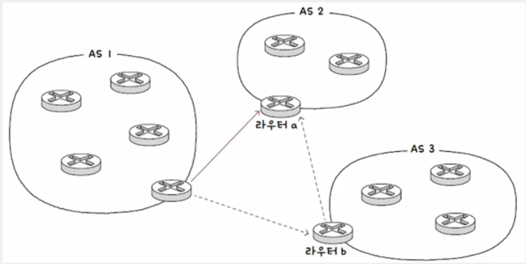

# 라우팅(Routing)

    패킷이 이동할 최적의 경로를 결정하는 것

## 라우터(Router)

- 라우팅을 수행하는 대표적인 장비
- 네트워크 간 통신을 가능케 하는 네트워크 계층의 장비
- 네트워크 간 통신 과정에서 패킷은 여러 라우터를 거쳐서 다양한 경로로 이동 가능

#### 홉(Hop)

    라우팅 도중 패킷이 호스트와 라우터 간에, 혹은 라우터와 라우터 간에 이동하는 한 과정

### 💡 라우팅 과정(홉 수) 확인 방법

```shell
# window
$ tracert www.google.com

# linux / macOS
$ traceroute www.google.com
```

<br>

## 라우팅 테이블(Routing Table)

- 특정 수신지까지 도달하기 위한 정보를 명시한 표와 같은 정보
- 라우터는 라우팅 테이블을 참고하여 수신지까지의 도달 경로를 판단

### 💡 라우팅 테이블에 포함된 정보

(라우팅 방식에 따라, 호스트 수행에 따라 달라짐)

#### 수신지 IP 주소와 서브넷 마스크

    최종적으로 패킷을 전달할 대상

#### 다음 홉(Next Hop)

    최종 수신지까지 가기 위해 다음으로 거쳐ㅕ야 할 호스트의 IP 주소나 인터페이스로,
    게이트웨이라고 명시되기도 함

#### 네트워크 인터페이스

    패킷을 내보낼 통로로, NIC 이름이 직접 명시되거나 인터페이스에 대응하는 IP 주소 명시

#### 메트릭(Metric)

    해당 경로로 이동하는 데에 드는 비용으로, 라우팅 테이블의 여러 경로 중 메트릭이 낮은 경로를 선호


- 수신지가 `192.168.2.0/24`인 패킷은
- `eth0`(인터페이스)를 통해
- `192.168.2.1`(게이트웨이)로 전송하라

### 💡 디폴드 라우트(Default Route)

- 라우팅 테이블에 경로가 없을 때, 기본적으로 패킷을 내보낼 경로
- 모든 IP 주소를 의미하는 `0.0.0.0/0`로 명시
- 일반적으로 _기본 게이트웨이 주소_ = 디폴드 라우트
  - = 네트워크 외부로 나아가기 위한 첫 경로로, 일반적으로 라우터/공유기 주소
- 라우팅 테이블에 따로 경로가 등록되어 있지 않은 패킷들을 기본적으로 기본 게이트웨이(라우터)에게 전달


### 💡 라우팅 테이블 확인

```shell
# window
$ route print

# linux / macOS
$ netstat -rn

# 실제 router의 routing table
$ show ip route
```

<br>

## 라우팅의 분류


### 💡 정적 라우팅(Static Routing)

- 수동으로 구성된 라우팅 테이블 항목을 통해 수행되는 라우팅
- 사용자가 수동으로 직접 채워 넣은 라우팅 테이블의 항목을 토대로 라우팅
- 문제점
  - 네트워크의 규모가 커지고 관리해야 할 라우터가 늘어나면 정적 라우팅만으로 관리가 힘듦
  - 입력 실수가 발생할 수 있음
  - 라우팅 경로상에 예상치 못한 문제가 발생할 경우, 경로 우회가 어려움

### 💡 동적 라우팅

- 자동으로 라우팅 테이블 항목을 만들고, 이를 이용하여 라우팅
- 라우팅 프로토콜 이용
- 동적 라우팅을 하면 라우팅 테이블 항목이 수시로 변할 수 있다.
- 라우팅 테이블의 항목을 수동으로 입력할 필요가 없다.
- 네트워크 경로상에 문제가 발생했을 때 이를 우회할 수 있게 경로가 자동으로 갱신

#### 라우팅 프로토콜(Routing Protocol)

    라우터끼리 자신들의 정보를 교환하며 패킷이 이동할 최적의 경로를 찾기 위한 프로토콜
    라우팅 프로토콜의 종류는 크게 IGP와 EGP

#### IGP(Interior Gateway Protocol)

    AS 내부에서 수행

#### EGP(Enterior Gateway Protocol)

    AS 외부에서 수행

### 💡 RIP(Routing Information Protocol)

- 거리 벡터 기반 라우팅 프로토콜
- 최적의 경로를 선정하는 과정에서 **거리 벡터**를 사용
- **거리**는 패킷이 경유한 라우터의 수, 즉 홉의 수를 의미
- 특정 수신지까지 도달하기 위해 **홉 수가 가장 적은 경로**를 최적의 경로라고 판단
- 홉 수가 적을수록 라우팅 테이블상의 메트릭 값도 작아진다.
- 주기적으로 인접 라우터끼리 경로 정보 교환, 라우팅 테이블 갱신, 특정 수신지까지의 홉 수 계산


### 💡 OSPF(Open Shortest Path First)

- 링크 상태 기반 라우팅 프로토콜
- 최적의 경로를 선정하는 과정에서 **링크 상태**를 사용
- 현재 네트워크 구성을 마치 지도처럼 그린 뒤, 최적의 경로를 선택
- 현재 네트워크의 상태(링크 정보)를 그래프의 형태로 **LSDB**(링크 상태 데이터베이스)에 저장
- 라우터들의 연결 관계, 연결 비용 등 현재 네트워크의 상태를 그래프로 표현하기 위한 데이터 저장
- 대역폭을 기반으로 메트릭을 계산하여 최적의 경로를 결정
- 대역폭이 높은 링크일수록 메트릭이 낮은 경로로 인식


#### RIP VS OSPF

- RIP는 라우팅 테이블 갱신을 위해 주기적으로 라우터 간 통신이 수행된다.
- OSPF는 네트워크 구성 변경 시 라우팅 테이블이 갱신된다.

### 💡 BGP(Border Gateway Protocol)

- AS 간의 통신에서 사용되는 대표적인 프로토콜
- 엄밀하게는 AS 간의 통신이 가능한 프로토콜
- BGP로 AS 내 라우터 간 통신도 가능
- RIP와 OSPF에 비해 최적의 경로를 결정하는 과정이 복잡하고, 일정하지 않은 경우가 많다.
  - 경로 결정 과정에서 수신지 주소와 더불어 다양한 *속성*과 *정책*이 고려되기 때문

#### 피어링(Peering)

    다른 AS와의 BGP 연결을 유지하기 위해서 BGP 라우터끼리 피어가 되도록 연결하는 과정

#### 정책(Policy)

    AS 관리 주체에 따라 각기 다른 상이한 정책 사용 가능
    (특정 AS 우대 정책, 특정 AS 차단 정책, 보안/안정성 우선 정책, 성능 우선 정책 등등)

<br>

## AS (Autonomous System)

- 라우터들의 집단 네트워크
- 동적 라우팅과 라우팅 프로토콜을 이해하기 위한 배경 지식
- 한 회사나 단체에서 관리하는 라우터 집단
- AS마다 인터넷상에서 고유한 **ASN**(AS 번호)가 할당
- ASN는 사설 IP 주소처럼 사설 ASN도 있지만, 일반적으로 고유한 ASN를 지칭한다.

### 💡 한 AS 내에는 다수의 라우터가 존재

- 라우터들은 AS 내부에서만 통신할 수 있고, AS 외부와 통신할 수도 있다.
- AS 외부와 통신할 경우 AS 경계에서 AS 내외로 통신을 주고받을 수 있는 **ASBR**(AS 경계 라우터)를 이용

<br>

## BGP의 속성

### 💡 AS-PATH 속성

- 메시지가 수신지에 이르는 과정에서 통과하는 AS들의 목록
- 메시지가 AS를 거칠 때마다 AS-PATH에는 거쳐간 AS가 추가
- RIP처럼 단순 *거리*가 아닌, 어디를 거쳐 어디로 이동하는지를 나타내는 *경로*를 고려
- 이런 점에서 **경로 벡터** 라우팅 프로토콜의 일종이라 부르기도 한다.

### 💡 NEXT-HOP 속성

- 홉, 다음으로 거칠 라우터의 IP 주소

### 💡 LOCAL-PREF 속성

- 지역 선호도
- AS 외부 경로 선택에 있어 AS 내부에서 어떤 경로를 선호할지에 대한 척도
- 일반적으로 AS-PATH나 NEXT-HOP 속성보다 우선시
- LOCAL-PREF 값은 AS 관리 주체가 설정하는 *정책*의 영향을 받는다.

### 💡 예시) AS1과 AS2와의 통신



#### AS-PATH

- AS1에서 곧장 AS2로 가는 경로: `AS1 -> AS2`
- AS1에서 AS3를 거쳐 AS2에 도달하는 경로: `AS1 -> AS3 -> AS2`

#### NEXT-HOP

- `AS1 -> AS2` 경로의 NEXT-HOP: 라우터 a의 IP 주소
- `AS1 -> AS3 -> AS2` 경로의 NEXT-HOP: 라우터 b의 IP 주소
