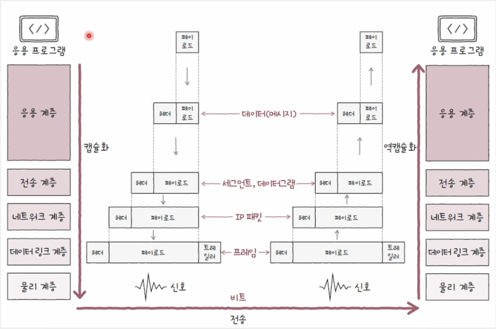

# 네트워크 참조 모델

- 통신이 이루어지는 각 과정을 계층으로 나눈 구조
- 통신 과정을 계층적으로 나눈 이유
  - 네트워크 구성과 설계가 용이
  - 네트워크 문제 진단과 해결이 용이

## OSI 모델 (OSI 7 계층)

#### 1. 물리 계층 (Physical Layer)

    OSI 모델의 최하단, 1과 0으로 표현되는 비트 신호를 주고받는 계층

#### 2. 데이터 링크 계층 (Data Link Layer)

    네트워크 내 주변 장치 간의 정보를 올바르게 주고받기 위한 계층

#### 3. 네트워크 계층 (Network Layer)

    메시지를 다른 네트워크에 속한 수신지까지 전달하는 계층

#### 4. 전송 계층 (Transport Layer)

    신뢰성 있고 안정성 있는 전송을 해야 할 때 필요한 계층

#### 5. 세션 계층 (Session Layer)

    세션(통신을 주고받는 호스트의 응용 프로그램 간 연결 상태)를 관리하는 계층

#### 6. 표현 계층 (Presentation Layer)

    문자를 컴퓨터가 이해할 수 있는 코드로 변환하거나 압축, 암호화하는 계층

#### 7. 응용 계층 (Application Layer)

    사용자 및 사용자가 이용하는 응용 프로그램에 다양한 네트워크 서비스를 제공하는 계층

 

## TCP/IP 모델 (TCP/IP 4계층)

#### 1. 네트워크 엑세스 계층 (Network Access Layer)

    노드와 노드 간의 신뢰성 있는 데이터 전송을 담당하는 계층으로,
    (링크 계층, 네트워크 인터페이스 계층) OSI 모델의 데이터 링크 계층과 유사

#### 2. 인터넷 계층 (Internet Layer)

    IP를 담당하는 계층으로, OSI 모델의 네트워크 계층과 유사

#### 3. 전송 계층 (Transport Layer)

    TCP/UDP를 담당하는 계층으로, OSI 모델의 전송 계층과 유사

#### 4. 응용 계층 (Application Layer)

    HTTP/FTP를 담당하는 계층으로, OSI 모델의 세션 + 표현 + 응용 계층과 유사

## 캡슐화와 역캡슐화

### 캡슐화

- 송신 과정에서 캡슐화
- 계층 별 프로토콜의 목적과 특징에 부합하는 헤더 및 트레일러 추가
- 상위 계층으로부터 내려받은 패킷을 페이로드 삼아, 프로토콜에 걸맞은 헤더 및 트레일러로 덧붙인 후 하위 계층으로 전달
- 상위 계층의 패킷은 하위 계층에서의 페이로드로 간주

### 역캡슐화

- 수신 과정에서 역캡슐화
- 계층 별 프로토콜의 목적과 특징에 부합하는 헤더 제거
- 캡슐화 과정에서 붙였던 헤더 및 트레일러를 각 계층에서 확인한 위 제거하는 과정

### PDU (Protocol Data Unit)

- 각 계층에서 송수신되는 메시지 단위
- 현재 계층의 PDU = 상위 계층 데이터 + 현재 계층 프로토콜 헤드 및 트레일러

