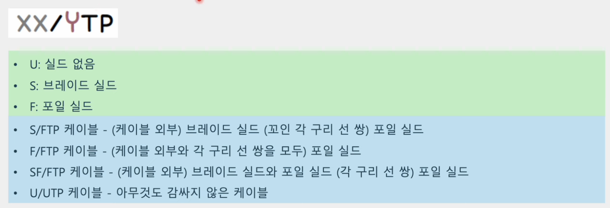
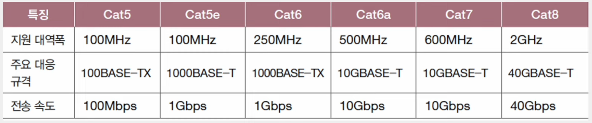

# NIC와 케이블

## NIC (Network Interface Controller)

- 호스트와 통신 매체를 연결하고, MAC 주소가 부여되는 네트워크 장비
- = 네트워크 인터페이스 카드, 네트워크 어댑터, LAN 카드, 네트워크 카드, 이더넷 카드 등
- 호스트를 네트워크(LAN)에 연결하는 장비
  - 호스트와 유무선 통신 매체를 연결
  - 통신 매체 신호와 컴퓨터가 이해하는 정보 상호 변환
  - 호스트가 네트워크를 통해 송수신하는 정보는 NIC를 거치게 됨
  - **네트워크 인터페이스** 역할을 수행
- MAC 주소를 인식
  - 자신과는 관련 없는 수신지 MAC 주소가 명시된 프레임 폐기
  - FCS 필드를 토대로 오류를 검출해 잘못된 프레임을 폐기
- NIC마다 지원되는 속도가 다르다
- **데이터 링크 계층**의 장비

## 케이블 (Cable)

- NIC에 연결되는 **물리 계층**의 유선 통신 매체

### 트위스티드 페어 케이블 (Twisted Pair Cable)

- 구리 선으로 전기 신호를 주고받는 통신 매체
- 커넥터 + 케이블 본체
  - 커넥터: 주로 활용되는 커넥터는 RJ-45
  - 케이블 본체: 구리 선이 두 가닥씩 꼬아진 형태
- 구리 선은 노이즈에 민감
  - 차폐(shielding)
    - 구리 선 주변을 감싸 노이즈를 감소시키는 방식
  - 브레이드 실드 (braided shield) / 포일 실드 (foil shield)
    - 차폐에 사용된 그물 모양의 철사와 포일

#### 실드에 따른 트위스티드 페어 케이블의 분류

- STP(Shielded Twisted Pair)
  - 브레이드 실드로 감싼 케이블
- FTP(Foil Twisted Pair)
  - 포일 실드로 노이즈를 감소시킨 케이블
- UTP(Unshielded Twisted Pair)
  - 아무것도 감싸지 않은 구리 선만 있는 케이블
- XX
  - 케이블 외부를 감싸는 실드의 종류
- Y
  - 꼬인 구리 선 쌍을 감싸는 실드의 종류

#### 카테고리에 따른 트위스티드 페이 케이블의 분류

- 카테고리가 높을수록
  - 지원 가능한 대역폭이 높아짐
  - 송수신할 수 있는 데이터의 양이 많아짐
  - 일반적으로 더 빠른 전송이 가능함

### 광섬유 케이블

- 빛(광신호)을 이용해 정보를 주고받는 케이블
- 전기 신호를 이용하는 케이블에 비해 속도가 빠르고, 먼 거리까지 전송 가능
- 노이즈로부터 간섭받는 영향도 적으므로 대륙 간 네트워크 연결에도 사용
- 커넥터 + 본체
  - 커넥터 종류가 다양함
- 본체 내부는 머리카락과 같은 형태의 광섬유로 구성
  - 광섬유는 빛을 운반하는 매체
  - 광섬유 중심의 코어(core)
    - 광섬유에서 실질적으로 빛이 흐르는 부분
  - 코어를 둘러싸는 클래딩(cladding)
    - 빛이 코어 안에서만 흐르도록 빛을 가두는 역할

#### 코어의 지름에 따른 광섬유 케이블의 종류

- 싱글 모드 광섬유 케이블
  - 코어의 지름이 작으면 빛의 이동 경로가 하나 이상을 갖기 어려움
  - 장점
    - 신호 손실이 적기에 장거리 전송에 적합
  - 단점
    - 멀티 모드에 비해 일반적으로 비용이 높음
  - 싱글 모드 케이블은 파장이 긴 장파장의 빛을 사용
  - 노란색, 파란색
- 멀티 모드 광섬유 케이블
  - 코어의 지름이 싱글 모드보다 큼
  - 빛이 여러 경로로 이동할 수 있음
  - 싱글 모드보다 전송 시 신호 손실이 클 수 있기에 장거리 전송에는 부적합
  - 싱글 모드에 비해 단파장의 빛을 사용
  - 오렌지 색, 아쿠아 색
