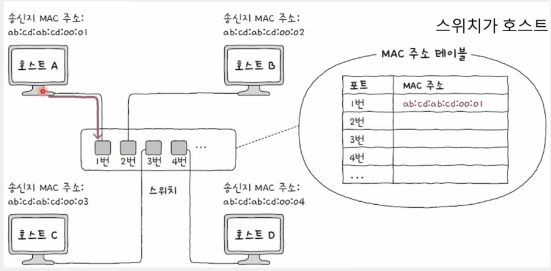
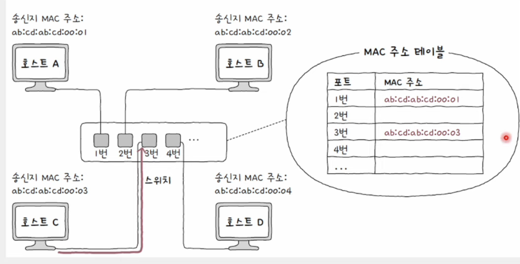

# 스위치

## 스위치 (Switch)

- 허브와 달리 특정 MAC 주소를 가진 호스트에만 프레임 전달 가능
- 전이중 모드 통신 지원
- CSMA/CD 프로토콜 불필요

 

## 기능1. MAC 주소 학습 기능

- 전달받은 신호를 원하는 포트로만 내보냄
- 특정 포트와 해당 포트에 연결된 호스트의 MAC 주소와의 관계를 기억
- 원하는 호스트에만 프레임을 전달
- 포트별로 콜리전 도메인이 나누어지기에 충돌 위험이 감소

### 과정 예시

- 가정) 호스트 A가 호스트 C로 프레임을 전송하는 상황

#### 1. MAC 주소 학습 전: 스위치는 호스트 A,B,C,D의 MAC 주소와 연결된 포트의 연관 관계를 모름

#### 2. MAC 주소 학습: 프레임 내 송신지 MAC 주소 필드를 바탕으로 이루어짐

#### 3. 호스트C에 연결된 포트를 찾기 위해 **flooding**

- 허브처럼 모든 포트로 프레임 전송
- 호스트 B,C,D 프레임 수신 -> 호스트 B와 D는 프레임 폐기

#### 4. 호스트 C는 스위치로 응답 프레임 전송

- 송신지 MAC 주소 필드로 호스트 C의 MAC 주소 학습
- MAC 주소 테이블에 기록

#### 5. 호스트 A가 호스트 C에게 프레임을 전송

- 스위치는 호스트 B,D가 연결된 포트로는 내보내지 않도 **filtering**
- 호스트 C가 연결된 포트로 프레임을 **forwarding**

#### MAC 주소 테이블

    스위치 포드와 연결된 호스트의 MAC 주소 간의 연관 관계를 나타내는 정보

#### 에이징(Aging)

    - 만약 MAC 주소 테이블에 등록된 포트에서 일정 시간 동안 프레임을 받지 못하면 해당 항목은 삭제
    - 일정 시간 동안 송신지 MAC 주소에 해당하는 프레임을 포트에서 못 받으면 해당 항목 삭제

 

## 기능2. VLAN 기능

- 논리적으로 LAN을 분리하는 가상의 LAN, VLAN 구성 가능
- 한 대의 스위치로 가상의 LAN을 만드는 방법
- 불필요한 트래픽(허브, 스위치의 플러딩)으로 인한 성능 저하 방지
- 한 대의 물리적 스위치를 여러 대의 스위치가 있는 것처럼 논리적인 단위로 LAN을 구획
- 서로 다른 네트워크로 간주
- 브로드캐스트 도메인이 달라짐

### 포트 기반 VLAN

- 스위치의 포트가 VLAN을 결정하는 방식
- 특정 포트에 VLAN을 할당한 뒤, 해당 포드에 호스트를 연결하여 VLAN에 참여

### MAC 기반 VLAN

- 사전에 설정된 MAC 주소에 따라 VLAN이 결정
- 송수신하는 프레임 속 MAC 주소가 호스트가 속할 VLAN을 결정하는 방식

 

## 브리지 (Bridge)

- 데이터 링크 계층의 스위치와 유사한 장비
- 네트워크 영역을 구획하여 콜리전 도메인을 나누거나 네트워크를 확장
- 스위치의 기능들도 제공
  - MAC 주소 학습, 포워딩, 필터링
- 일반적으로 스위치의 기능이 더 다양하고 성능도 우수
  => 단일 장비로서의 브리지는 스위치에 비해 사용 빈도가 줄어드는 추세
