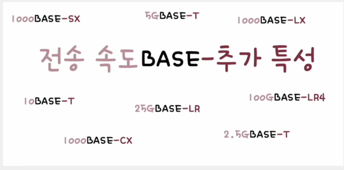
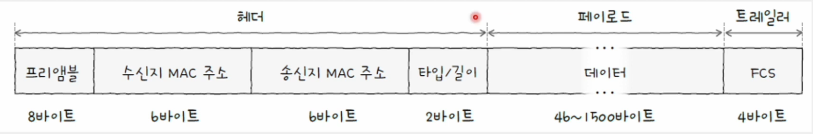

# 이더넷 (Ethernet)

- 현대 LAN, 특히 유선 LAN 환경에서 가장 대중적으로 사용되는 기술
- 다양한 통신 매체의 규격, 송수신되는 프레임의 형태, 프레임을 주고받는 방법 등이 정의도니 기술
- 물리 계층에서 사용되는 케이블은 이더넷 규격을 따른다.
- 데이터 링크 계층에서 주고받는 프레임은 이더넷 프레임 형식을 따른다.

## 물리 계층 관련 이더넷 기술 - 통신 매체

### 국제 표준으로써의 이더넷

- **IEEE 802.3**이라는 이름으로 국제 표준이 됨
  - 이더넷 관련 다양한 표준의 모음
- 오늘날에도 이더넷은 발전 중이며, 새로운 표준들이 생기는 중이다.
- 이더넷 관련 표준
  - 802.3 뒤 버전을 나타내는 알파벳으로 표현
- 이더넷 표준에 따라 지원되는 네트워크 장비, 통신 매체의 종류, 전송 속도 등이 달라진다.

### 통신 매체의 종류



#### 전송 속도

- 숫자만 표기되어 있으면 Mbps 속도
- 숫자 뒤에 G가 붙는 경우 Gbps 속도

#### BASE

- 베이스밴드(BASEband)의 약자
- 변조 타입을 의미
- 비트 신호로 변환된 데이터를 통신 매체로 전송하는 방법

#### 추가 특성

- 통신 매체의 특성을 명시
- 다양한 특성 명시 가능
  - 전송 가능한 최대 거리
  - 물리 계층 인코딩 방식
  - 비트 신호를 옮길 수 있는 전송로 수
- **통신 매체의 종류**를 명시할 수 있다.
  - C : 동축 케이블
  - T : 트위스티드 페어 케이블
  - S : 단파장 광섬유 케이블
  - L : 장파장 광섬유 케이블

### 이더넷의 분류

#### 고속 이더넷 (Fast Ethernet)

    100Mbps 가량의 속도를 지원하는 표준

#### 기가비트 이더넷 (Gigabit Ethernet)

    1Gbps 가량의 속도를 내는 이더넷 표준

#### 10기가비트 이더넷(10 Gigabit Ethernet)

    10Gbps 가량의 속도를 내는 이더넷 표준

<br>

## 데이터 링크 계층 관련 이더넷 기술 - 이더넷 프레임 형식

- 데이터링크 계층에서 이더넷 네트워크에서 주고받는 프레임
- 캡슐화를 거쳐 송신됨
  - 상위 계층 정보 + 헤더 + 트레일러
- 역캡슐화를 거쳐 수신됨



### 프리앰블 (Preamble)

- 이더넷 프레임의 시작을 알리는 8바이트 크기의 정보
- 첫 7바이트는 `10101010` 값을 가지고, 마지막 바이트는 `10101011` 값을 가짐
- 송수신지 간의 동기화를 이해 사용되는 정보

### 수신지 MAC 주소 & 송신지 MAC 주소

- 물리적 주소
- 일반적으로 고유하고, 일반적으로 변경되지 않는 주소

#### MAC 주소

- 네트워크 인터페이스마다 부여되는 6바이트 길이의 주소
- LAN 내의 송수신지 특정
- 일반적으로 NIC(Network Interface Controller) 장치가 네트워크 인터페이스 역햘을 담당
- 한 컴퓨터에 MAC 주소도 여러 개 있을 수 있다.
- MAC 주소 확인 방법

  ```c
  // window
  $ getmac /v
  $ ipconfig /all

  // macOS
  $ ifconfig
  ```

### 타입 / 길이

- 타입 혹은 길이 명시
- 필드에 명시된 크기가 1500(16진수 05DC) 이하일 경우, 이 필드는 프레임의 크기(길이)
- 필드에 명시된 크기가 1536(16진수 0600) 이상일 경우, 이 필드는 타입

#### 타입

- 이더타입(Ethertype)이라고도 함
- 어떤 정보를 캡슐화했는지를 나타내는 정보
- 대표적으로 상위 계층에서 사용된 프로토콜이 명시

### 데이터

- 페이로드
- 상위 계층에서 전달받거나 전달해야 할 내용
- 최대 크기 : 1500바이트
- 최소 크기 : 46바이트
  - 46바이트보다 작다면 크기 맞추기용 데이터인 padding이 채워진다. (보통 0)

### FCS (Frame Check Sequence)

- 오류 검출용 정보
- 수신한 이더넷 프레임에 오류가 있는지 확인하기 위한 필드
- **CRC**(Cyclic Redundancy Check)라는 오류 검출용 값이 명시됨

## 토큰 링 네트워크 (Token Ring Network)

- 이더넷 이외의 대표적인 기술
- 호스트들이 링(고리) 형태로 연결
- 호스트끼리 돌아가며 토큰이라는 특별한 정보를 교환
- 네트워크 내 다른 호스트엥게 메시지를 송신하려면 반드시 이 토큰을 가지고 있어야 함
