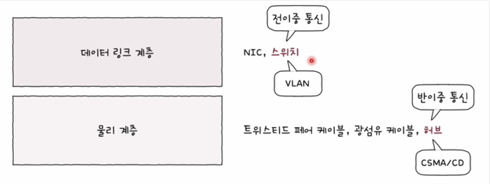

# 허브

## 물리 계층 장비와 데이터 링크 계층 장비의 차이점

#### 물리 계층에는 주소 개념이 없다.

- 단지 호스트와 통신 매체 간의 연결과 통신 매체상의 송수신이 이루어질 뿐
- 물리 계층 장비는 송수신되는 정보에 대한 어떠한 조작이나 판단을 하지 않는다.

#### 데이터 링크 계층에서는 주소 개념이 있다.

- MAC 주소
- 데이터 링크 계층 이상 장비들은 송수신지 특정 가능
- 송수신 정보에 대한 조작 가능

 

## 허브

- 물리 계층의 대표 장비
- 여러 대의 호스트를 연결하는 장치
- 리피터 허브(repeater hub) 혹은 이더넷 허브(ethernet hub)
- 포트(port)
  - 커넥터를 연결할 수 있는 연결 지점

### 특징1. 받은 정보는 모든 포트로 내보낸다.

- 정보에 대한 어떠한 조작도 판단하지 않는다.
- 전달받은 신호를 다른 모든 포트로 그대로 다시 내보낸다.
- 데이터 링크 계층에서 패킷의 MAC 주소를 확인하고 자신과 관련 없는 주소 폐기

### 특징2. 반이중 통신

- 반이중(half duplex)
  - 1차선 도로처럼 송수신을 번갈아 가면서 하는 통신 방식
- 전이중(full duplex)
  - 송수신을 동시에 양방향으로 할 수 있는 통신 방식

 

## 충돌 (Collision)

- 동시에 허브에 신호를 송신하면 충돌이 발생
- 허브에 호스트가 많이 연결되어 있을수록 충돌 발생 가능성이 높음
- collision domain
  - 충돌이 발생할 수 있는 영역
  - 허브에 연결된 모든 호스트는 같은 콜리전 도메인에 속함
  - 콜리전 도메인은 작아야 한다.

### CSMA/CD(Carrier Sense Multiple Access with Collision Detection)

- 반이중 이더넷 네트워크에서 충돌을 방지하는 대표적인 프로토콜
- 캐리어 감지 (`CS`)
  - 통신 매체의 현재 사용 가능 여부 검사
  - 메시지를 보내기 전 현재 전송 중인 것이 있는지를 먼저 확인
- 다중 접근 (`MA`)
  - 복수의 호스트가 부득이 동시에 네트워크에 접근할 때 충돌 발생
- 충돌 검출 (`CD`)
  - 전송 중단
  - 충돌 발생을 알리는 잼 신호 전송
  - 임의의 시간 동안 기다린 뒤에 재전송

 

## 리피터 (Repeater)

- 허브 이외에 물리 계층의 대표적인 장비
- 전기 신호가 감소하거나 왜곡되는 것을 방지하기 위해 전기 신호를 증폭시켜주는 장비
- 신호에 대한 어떠한 판단이나 조작을 하지 않고 그저 신호를 증폭시키기만 한다.
- 허브는 리피터의 기능을 포함하는 경우가 많다.
