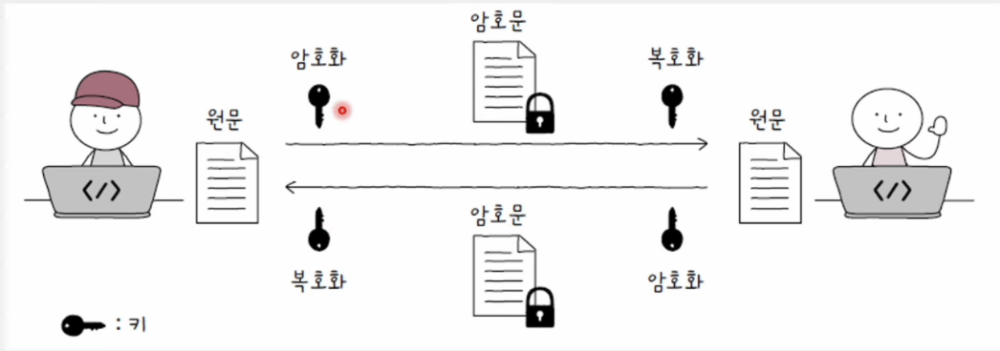
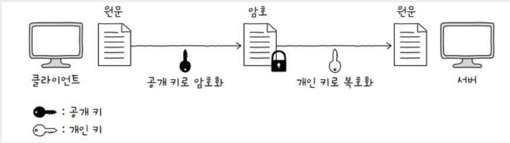
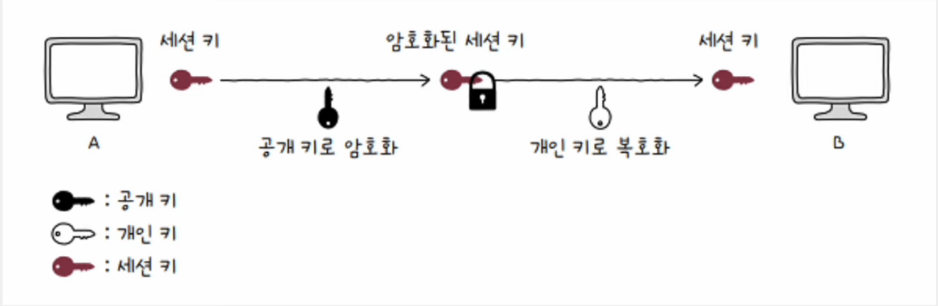
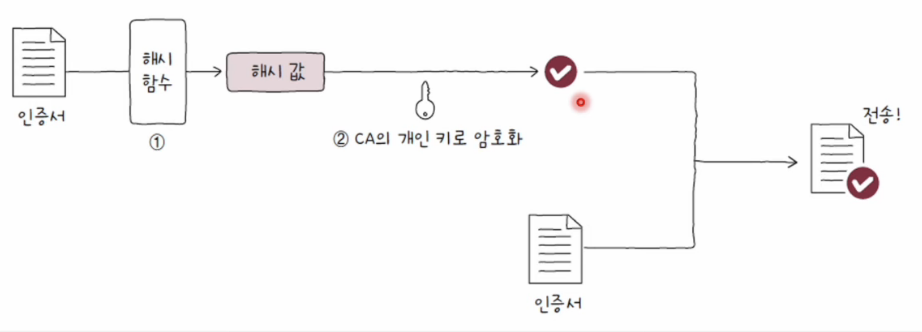
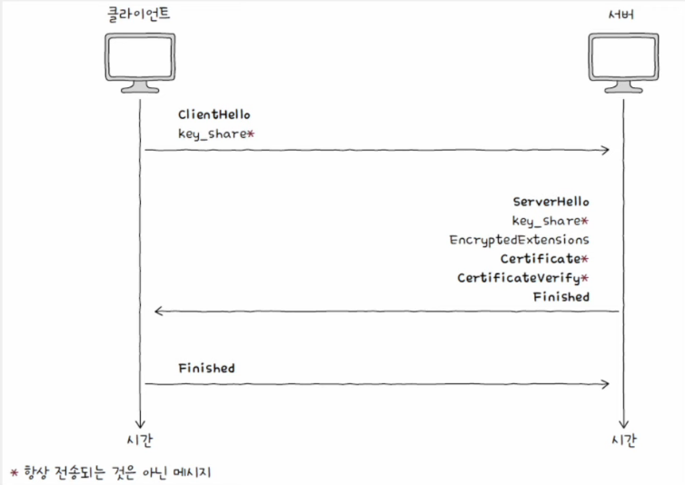

# 안전성을 위한 기술

### 💡 암호화(encrypt)와 복호화(drecrpyt)

- 핵심은 키(key)
- 키에 수학적 연산(= 암호화 알고리즘)을 거치면 암호문 생성

 

## 대칭 키 암호화(symmetric-key cryptography)

- 암호화와 복호화에 동일한 키를 사용하는 방식
- 동일한 키를 사용하므로 키가 유출되면 큰 문제 발생
- 따라서 당연하게도 키를 안전하게 상대방에게 전달해야 함

#### 장점

- 적은 부하
- 빠른 암호화 및 복호화 수행 가능

#### 단점

- 키를 안전하게 전송하기 어렵

 

## 공개 키 암호화(public-key cryptography)

- = 비대칭 키 암호화
- 암호화에 사용되는 키와 복호화에 사용되는 키가 다르다.
- 한 쌍의 키(공개 키, 개인 키)를 사용
- 한 키로 암호화를, 다른 키로 복호화
- 공개 키를 알아도 개인 키 유추 불가능. 역도 마찬가지

#### 장점

- 안전한 키 공유 가능

#### 단점

- 높은 부하
- 느린 암호화 및 복호화

### 💡 A -> B에게 "hi" 전송 과정

1. A가 B의 공개키 요청, B는 A에게 공개키 전달
2. A는 B의 공개키로 "hi" 암호화. 암호화된 데이터 전달
3. 암호문이기 때문에 제 3자가 이를 보아도 이해할 수 없다.
4. B는 개인키로 복호화

 

## 세션 키(session key)

- 대칭 키를 공개 키로 암호화하고 개인 키로 암호화된 대칭키를 복호화
- 안전한 대칭 키 공유 가능
- 빠른 대칭키 기반 암호화/복호화 가능

 

## 인증서(certificate)

- 무엇인가를 증명하기 위한 문서
- 네트워크(인터넷)에서의 인증서 = 공개 키 인증서

#### 공개 키 인증서(public key certificate)

    공개 키와 공개 키의 유효성을 입증하기 위한 전자 문서

#### 인증 기관(CA, Certification Authority)

    인증서의 발급, 검증, 저장과 같은 역할을 수행할 수 있는 공인 기관
    (IdenTrust, DigiCert, GlobalSign 등)

#### 서명 값(signature)

    인증 기관의 인증 정보
    클라이언트는 CA가 발급한 인증서의 서명 값을 바탕으로 인증서를 검증

 

### 💡 서명 값 생성의 원리

- 인증서 내용에 대한 해시 값을 CA의 개인 키로 암호화하는 방식으로 생성
- CA는 이렇게 얻어낸 정보를 서명값으로 삼아 클라이언트에게 인증서와 함께 전송

    

 

### 💡 해시 값

- 해시 함수를 적용시킨 결과값
- 데이터 변조 여부 검사에 사용

#### 해시 함수

- 임의의 길이의 데이터를 **고정된 길이의 데이터**로 변환하는 함수
- MD5, SHA-1, SHA-2(SHA-256, SHA-384, SHA-512) 등
- 입력값에 민감 -> 입력 데이터가 조금만 달라져도 완전히 다른 결과가 나온다.

#### 데이터 변조 여부 검사 과정

1. `보낼 데이터 + 데이터에 대한 해시값`을 함께 전송
2. 수신자가 전달받은 데이터에 대한 해시값을 직접 계산
3. 계산 결과를 전달받은 해시값과 비교
4. 같은 값이 도출된다면 데이터 전송 도중 변조되거나 소실되지 않았다고 판단

 

### 💡 인증서 검증 과정

1. 서명 값과 인증서 분리
2. 서명 값을 CA의 공개 키로 복호화하여 **인증서 내용에 대한 해시 값**을 얻는다.
3. 인증서 데이터에 대한 해시 값을 직접 계산
4. 이를 복호화한 값과 비교  
   => 값이 일치한다면 전달받은 인증서는 확실히 CA의 개인 키로 만들어졌다고 보장

#### 디지털 서명

    개인 키로 암호화된 메시지를 공개 키로 복호화함으로써 신원을 증명하는 절치

 

## HTTPS(HTTP over TLS)

- SSL/TLS를 사용하는 대표적인 프로토콜
- HTTP 메시지의 안전한 송수신을 위해 개발된 프로토콜

#### HTTPS 메시지 송수신 단계

1. TCP 쓰리 웨이 핸드셰이크
2. TLS 핸드셰이크
3. 암호화된 메시지 송수신

### 💡 SSL(Secure Sockets Layer)과 TLS(Transport Layer Security)

- 인증과 암호화를 수행하는 프로토콜
- TLS가 SSL을 계승한 프로토콜로, 작동 과정은 큰 들에서 보면 유사
- 초기 SSL 2.0과 SSL 3.0을 거쳐 TLS 1.0, TLS 1.1, TLS 1.2, **TLS 1.3**이 순차적으로 출시

 

## TLS 핸드셰이크

- 암호화 통신을 위한 키 교환
- 인증서 송수신과 검증이 이루어지는 단계

    

### 💡 키 교환

- ClientHello와 ServerHello를 주고받으면 암호화 통신ㅇ르 위해 사전 협의해야 할 정보들이 결정된다.
- 서버와 클라이언트는 암호화에 사용할 키를 생성

#### 클라이언트의 **ClientHello** 메시지

- 암호화된 통신을 위해 서로 맞춰 봐야 할 정보들을 제시하는 메시지
- 지원 TLS 버전, 사용 가능한 암호화 알고리즘과 해시 함수, 키 생성에 필요한 난수 등이 포함

#### 서버의 **ServerHello** 메시지

- 제시된 정보들을 선택하는 메시지
- 선택된 TLS 버전, 사용 가능한 암호화 알고리즘과 해시 함수, 키 생성에 필요한 난수 등이 포함

#### 암호 스위트(cipher suite)

    사용 가능한 암호화 방식과 해시 함수를 담은 정보

 

### 💡 인증서 및 인증서 검증

- 서버는 Certificate 메시지와 CertificateVerify 메시지 전송
- 각각 인증서와 검증을 위한 디지털 서명
- 클라이언트는 이 메시지를 토대로 서버의 공개 키 검증

 

### 💡 TLS 핸드셰이크 마무리, 암호화 통신 수행

- 서버와 클라이언트는 TLS 핸드셰이크의 마지막을 의미하는 Finished 메시지를 주고 받음
- 주고받은 키를 바탕으로 암호화 데이터(Application Data)를 주고 받음
