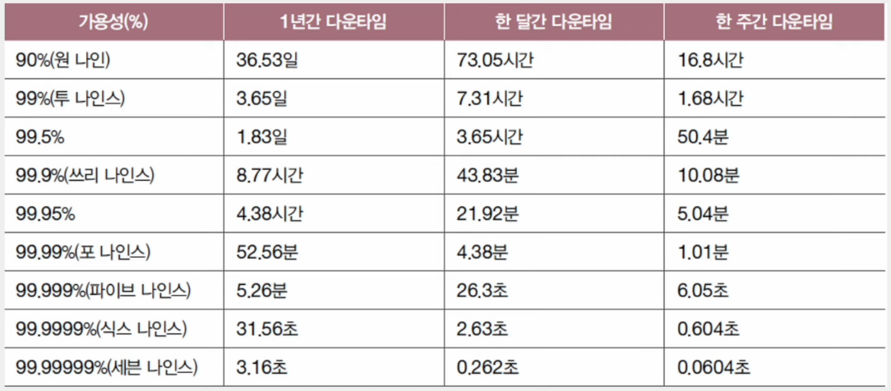
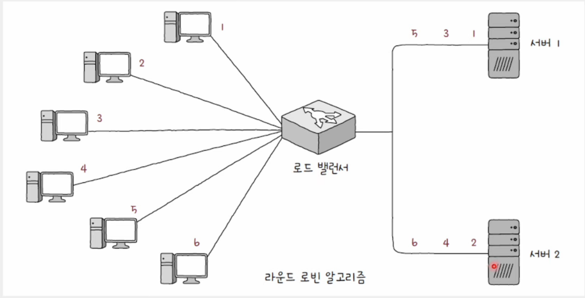
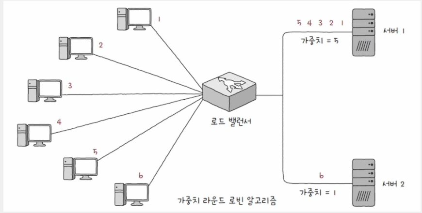

# 안정성을 위한 기술

## 가용성(Availability)

- 컴퓨터 시스템이 특정 기능을 실제로 수행할 수 있는 시간의 비율
- 전체 사용 시간 중에서 정상적인 사용 시간
- `가용성 = 업타임 / (업타임 + 다운타임)`
- 일반적으로 안정적인 시스템은 99.999% 이상을 목표로 한다.
- 가용성을 높이기 위해서는 다운타임을 낮춰야 한다.
- 하지만 다운타임의 발생 원인을 모두 찾아 원천적으로 차단할 수는 없다.
- 핵심은 문제가 발생하지 않도록 하는 것이 아니라, **문제가 발생해도 계속 기능하고독 설계하는 것**

    

#### 업타임

    정상적인 사용 시간

#### 다운 타임

    정상적인 사용이 불가능한 시간

#### 고가용성(HA, High Availability)

    가용성이 높다

#### 결함 감내(Fault Tolerance)

    문제가 발생하더라도 기능할 수 있는 능력
    결함을 감내할 수 있도록 서비스나 인프라를 설계하는 것이 중요

 

## 이중화

- 결함을 감내하여 가용성을 높이기 위한 가장 기본적이고 대표적인 방법
- 예비(백업)을 마련하는 방법
- 이중화의 대상 : SPoF 지점
  - 서버 컴퓨터, 네트워크 인터페이스, 스위치와 같은 물리적 장비
  - 데이터베이스, 웹 서버 프로그램 등

#### SPoF(Single Point of Failure)

    문제가 발생할 경우 시스템 전체가 중단될 수 있는 대상

#### 액티브/스탠바이(Active-Standby)

    한 시스템은 가동하고, 다른 시스템은 백업 용도로 대기 상태인 구성 방법

#### 액티브/액티브(Active-Active)

    두 시스템 모두를 가동 상태인 구성 방법

 

## 다중화

- 이중화의 확장

### 💡 티밍(teaming)과 본딩(bonding)

- 여러 네트워크 인터페이스(NIC)를 이중화/다중화하여 더 뛰어나고 안정적인 성능의 하나의 인터페이스처럼 보이게 하는 기술
- 티밍 - 윈도우
- 본딩 - 리눅스

 

## 로드 밸런싱(Load Balancing)

- 트래픽의 고른 분배를 위한 기술
- 로드 밸런서에 의해 수행
- 전용 네트워크 장비로 수행
  - L4 스위치는 IP 주소와 포트 번호와 같은 전송 계층까지의 정보를 바탕으로 로드 밸런싱
  - L7 스위치는 URI, HTTP 메시지 일부, 쿠키 등 응용 계층의 정보까지 활용하여 로드 밸런싱
- 로드 밸런싱 소프트웨어를 설치하면 일반 호스트도 로드 밸런서로 사용 가능
  - HAProxy, Envoy 등
  - Nginx에도 로드 밸런싱 기능이 내포

### 💡 로드 밸런서의 위치

- 일반저그올 이중화/다중화된 서버와 클라이언트 사이에 위치
- 클라이언트들은 로드 밸런서에 요청을 보내고, 로드 밸런서는 해당 요청을 각 서버에 균등하게 분배

 

### 💡 서버의 상태를 검사하는 방법

#### 핼스 체크(Health Check)

- 서버들의 건강 상태를 주기적으로 모니터링하고 체크
- 주로 로드 밸런서에 의해 이루어진다.
- HTTP, ICMP 등 다양한 프로토콜을 활용

#### 하트비트(Hearbeat)

- 서버 간 하트비트라는 메시지를 주기적으로 주고받는 방법

 

### 💡 로드 밸런싱 알고리즘

#### 라운드 로빈 알고리즘(Round Robin Algorithm)

    단순히 서버를 돌앙가며 부하를 전달

#### 최소 연결 알고리즘(Least Connection Algorithm)

    연결이 적은 서버부터 우선적으로 부하를 전달

#### 기타

- 단순히 무작위로 고르는 알고리즘
- 해시 자료 구조를 이용하는 알고리즘
- 응답 시간이 가장 짧은 서버를 선택하는 알고리즘

 

### 💡 가중치가 부여된 로드 밸런싱 알고리즘

- 가중치 라운드 로빈 알고리즘(Weighted Round Robin Algorithm)
- 가중치 최소 연결 알고리즘(Weighted Least Connection Algorithm)
- 서버 간 성능이 다른 경우 주로 가중치가 적용된 알고리즘이 유리

    
