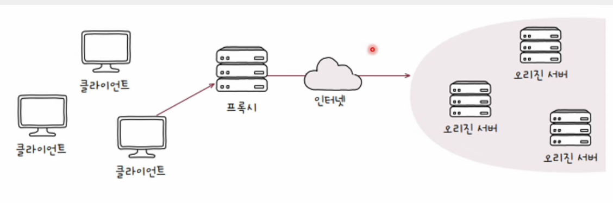
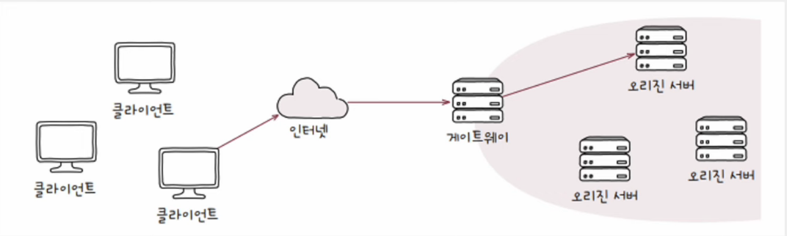

# 중간 서버

### 💡 중간 서버와 다중화된 오리진 서버

- 일반적으로 클라이언트와 단일 서버는 나란히 붙어 있지 않다.
- 실제로는 클라이언트와 서버 사이에는 수많은 서버가 존재할 수 있다.
- 실제로는 서버가 다중화된 경우가 많다.

#### 오리진 서버(Origin Server)

    클라이언트가 최종적으로 메시지를 주고받는 대상
    자원을 생성하고 클라이언트에게 권한있는 응답을 보낼 수 있는 HTTP 서버

#### 인바운드(inbound) 메시지

    오리진 서버를 향하는 메시지

#### 아웃바운드(outbound) 메시지

    클라이언트를 향하는 메시지

### 💡 대표적인 HTTP 중간 서버

- 프록시(proxy) - 포워드 프록시
- 게이트웨어(gateway) - 리버스 프록시

 

## 프록시(proxy)

- **클라이언트가 선택한** 메시지 전달 대리자
- 프록시를 언제 어떻게 사용할지는 클라이언트가 선택
- 오리진 서버보다 클라이언트와 더 가까이 위치
- 캐싱, 클라이언트 암호화, 접근 제한 등

    

 

## 게이트웨이(gateway)

- 네트워크 간의 통신을 가능케 하는 입구 역할을 하는 HW/SW
- **아웃바운드 연결에 대해 오리진 서버 역할을 수행**하는 중개자
- 수신된 요청 미시지를 다른 인바운드 서버들에 전달하는 중개자

    
