# DNS와 자원

### 💡 메시지를 주고받기 위해

- 메시지를 주고받는 송수신지 파악
  - IP 주소
  - 도메인 네임
- 송수신하고자 하는 정보 파악
  - 자원

### 💡 도메인 네임 사용 이유

- IP 주소만으로 송수신지 특정하는 것은 번거롭다.
- 통신하고자 하는 모든 호스트의 IP 주소를 기억하기 어렵다.
- IP 주소는 언제든 바뀔 수 있다.

 

## 도메인 네임

- 호스트의 IP 주소와 대응되는 문자열 형태의 호스트 특정 정보
- DNS 서버에서 관리
- IP 주소가 변경되어도 도메인 네임에 다시 대응하면 된다.

    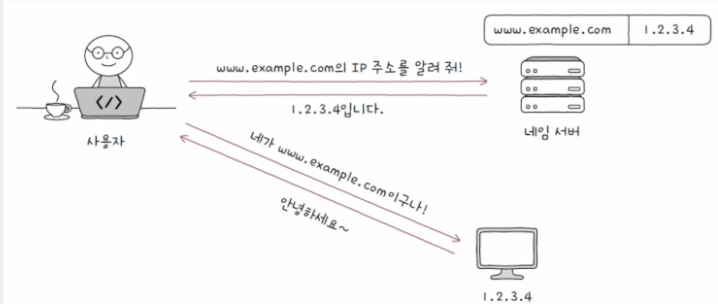

#### hosts 파일

    도메인 네임과 IP 주소의 대응 관계를 담은 파일

 

### 💡 도메인 네임의 구조

- 점(.)을 기준으로 계층적으로 분류

    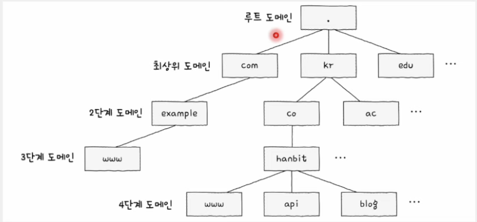

#### 전체 주소 도메인 네임 (FQDN; Fully-Qualified Domain Name)

- 전체 도메인 계층을 모두 포한하는 도메인 네임
- FQDN까지 알면 비로소 하나의 호스트를 식별할 수 있게 된다.

    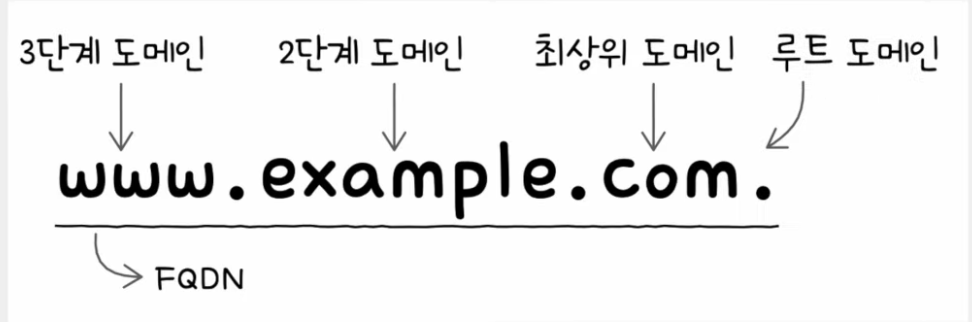

#### 서브 도메인 (subdomain)

- 다른 도메인이 포함된 도메인
- 예) `google.com`의 서브 도메인
  - `mail.google.com`
  - `www.google.com`
  - `scholar.google.com`
  - `drive.google.com`

 

### 💡 네임 서버 (DNS 서버)

- 계층적 도메인 네임을 관리하기 위한 네임 서버 또한 계층적으로 관리
- 전 세계 여러 군데 **분산**되어 위치

#### DNS(Domain Name System)

    계층적이고 분산된 도메인 네임에 대한 관리 체계

 

## 계층적 네임 서버

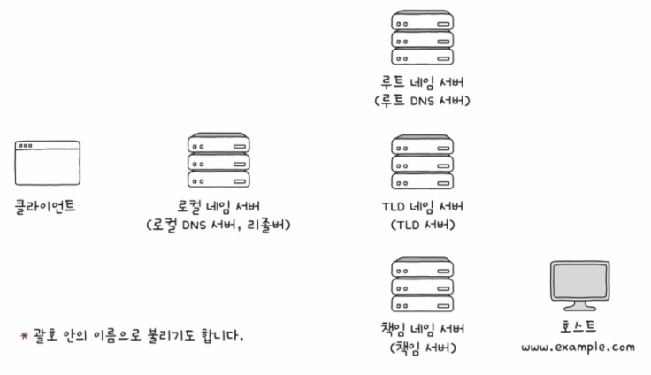
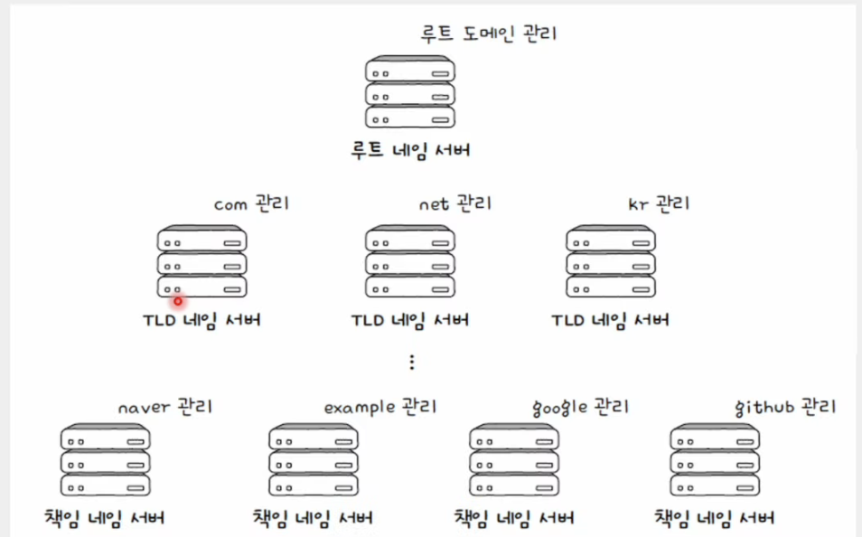

- 계층적이고 분산된 네임 서버들이 사용된다.
- 주요 네임 서버의 유형

  - 로컬 네임 서버, 루트 네임 서버, TLD 네임 서버, 책임 네임 서버

#### 도메인 네임 Resolving

    도메인 네임에 대응하는 IP 주소를 알아내는 과정

### 💡 로컬 네임 서버(Local Name Server)

- 클라이언트와 맞닿아 있는 네임 서버
- 클라이언트가 도메인 네임을 통해 IP 주소를 알아내고자 할 때 가장 먼저 찾게 되는 네임 서버
- 로컬 네임 서버의 주소는 일반적으로 ISP에서 할당
- 공개 DNS 서버인 public DNS Server를 이용할 수 있다.
  - 구글의 `8.8.8.8`, `8.8.4.4`, 클라우드플레어의 `1.1.1.1`

### 💡 루트 네임 서버(Root Name Server)

- 루트 도메인을 관장하는 네임 서버
- 로컬 네임 서버가 대응되는 IP 주소를 모를 경우,
- TLD 네임 서버의 IP 주소를 반환할 수 있다.

    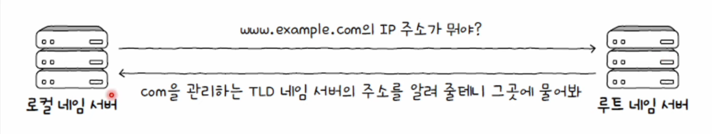

### 💡 TLD 네임 서버

- TLD를 관리하는 네임 서버
- DNS 질의에 대해 TLD의 하위 도메인 네임을 관리하는 네임 서버 주소 반환
- 하위 도메인 네임을 관리하는 네임 서버는 그보다 하위 도메인 네임을 관리하는 네임 서버 주소를 반환

    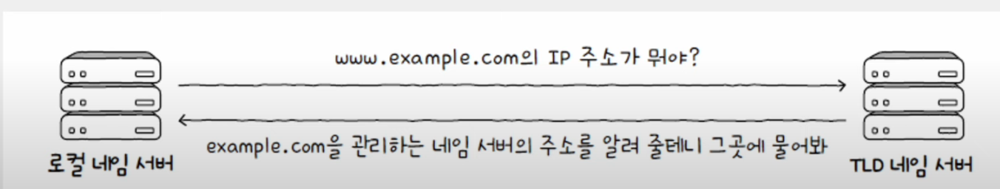

### 💡 책임 네임 서버(Authoritative Name Server)

- 특정 도메인 영역을 관리하는 네임 서버
- 다른 네임 서버에게 떠넘기지 않고 곧바로 답할 수 있는 네임 서버
- 즉, 책임 네임 서버는 로컬 네임 서버가 마지막으로 질의하는 네임 서버
- 일반적으로 로컬 네임 서버는 책임 네임 서버로부터 원하는 IP 주소를 얻어낸다.

 

## 네임 서버의 계층적 구조를 토대로 IP 주소를 알아내는 과정

### 💡 재귀적 질의(Recursive Query)

- 클라이언트 -> 로컬 네임 서버 -> 루트 네임 서버 -> TLD 네임 서버 -> 책인 네임 서버
- 최종 응답 결과를 역순으로 전달

    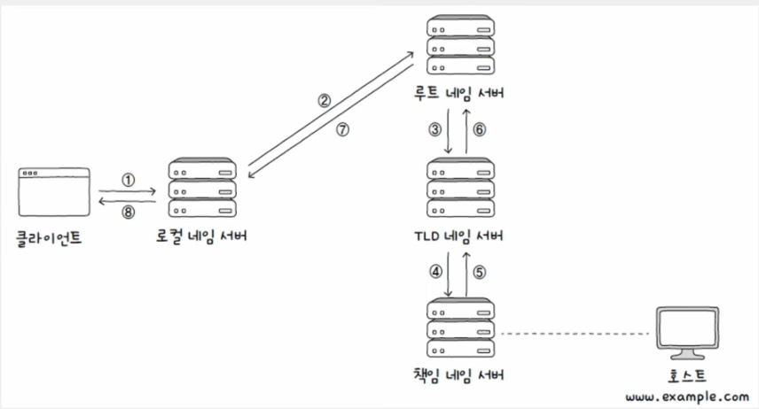

### 💡 반복적 질의(Iterative Query)

- 네임 서버에 일일이 질의-응답 반복
- 최종 응답 결과를 클라이언트에게 전달

    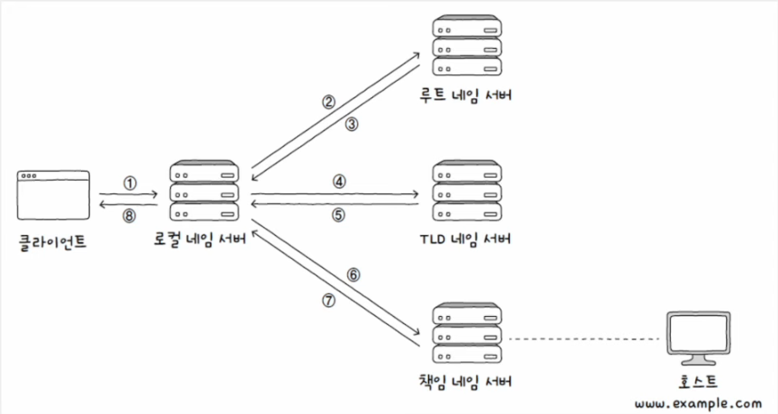

### 💡 문제점

- 여러 단계를 거치게 된다.
- 시간이 오래 걸리고 네트워크상의 메시지 수가 지나치게 늘어날 수 있다.
- 루트 네임 서버에 과부하 우려
- => **DNS Cache** 사용

 

## DNS 캐시

- 네임 서버들이 기존에 응답받은 결과를 임시로 저장했다가 추후 같은 질의에 이를 활용
- DNS 캐시를 저장하는 용도로만 사용되는 서버도 있다.
- DNS 캐시를 활용하면 더 짧은 시간 안에 원하는 IP 주소를 얻어낼 수 있다.
- DNS 캐시는 영원히 남아있는 것은 아니다.
- 임시 저장된 값은 TTL 값과 함께 저장

#### TTL(Time To Live)

    캐시될 수 있는 시간

 

## 자원(Resource)

- 네트워크상의 메시지를 통해 주고받는 대상
- 두 호스트가 네트워크를 통해 서로 정보를 주고받을 때, 송수신하는 대상
- 예시) HTML 파일, 이미지, 동영상, 텍스트 파일 등
- **HTTP 요청 메시지의 대상**이라 보기도 한다.

#### URI(Uniform Resource Identifier)

    자원을 식별할 수 있는 정보

#### URL(Uniform Resource Locator)

    위치를 이용해 자원 식별
    오늘날 인터넷 환경에서 자원 식별에 더 많이 사용되는 식별자

#### URN(Uniform Resource Name)

    이름을 이용해 자원 식별

 

## URL의 구조

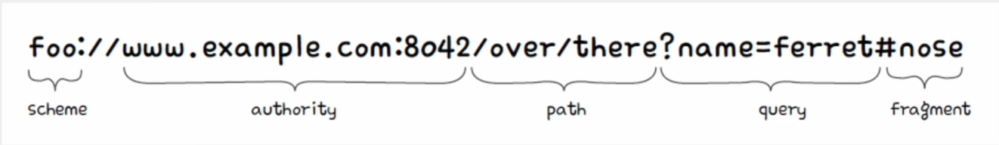

### 1) scheme

- 자원에 접근하는 방법
- 일반적으로 사용할 프로토콜이 명시
  - HTTP 사용하여 접근 => `http://` 사용
  - HTTPS 사용하여 접근 => `https://` 사용

### 2) authority

- 호스트를 특정할 수 있는 정보
- 이를테면 IP 주소 혹은 도메인 네임 명시
- 콜론(:) 뒤에 포트 번호를 덧붙일 수 있다.

### 3) path

- 자원이 위치한 경로
- 자원의 위치는 슬래시(/)를 기준으로 계층적으로 표현
- 최상위 경로 또한 슬래시로 표현

### 4) query

- = 쿼리 문자열, 쿼리 파라미터
- 물음표(?)로 시작되는 `<키,값>` 형태의 데이터
- 앰퍼샌드(&)로 여러 쿼리 문자열을 덧붙일 수 있다.

### 5) fragment

- 자원의 한 조각을 가리키기 위한 정보
- HTML 파일과 같은 자원에서 특정 부분을 가리키기 위해 사용

 

## URL VS URN

### 💡 URL의 단점

- 위치를 기반으로 자원을 식별하는데 자원의 위치는 언제든 변할 수 있다.
- 즉, 자원의 위치가 변경되면 기존 URL로는 자원을 식별할 수 없다.

### 💡 URN의 장점

- 자원에 고유한 이름을 붙이는 이름 기반 식별자이기에 자원의 위치와 무관하게 자원을 식별 가능하다.

 

## DNS 자원 레코드

- 이름(호스트 이름, record name)
- 값
- TTL
- 레코드 유형(타입)

### 💡 DNS 레코드 유형(타입, Record Type)

- 레코드 유형이 달라지면 레코드 이름과 값의 의미가 달라진다.

    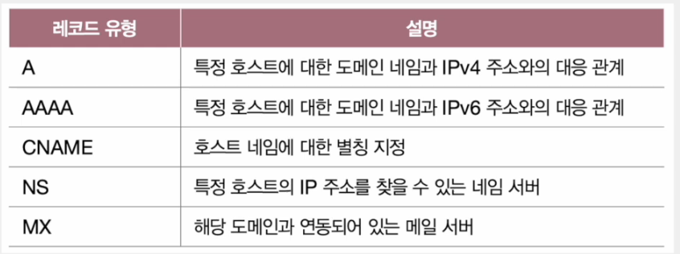
