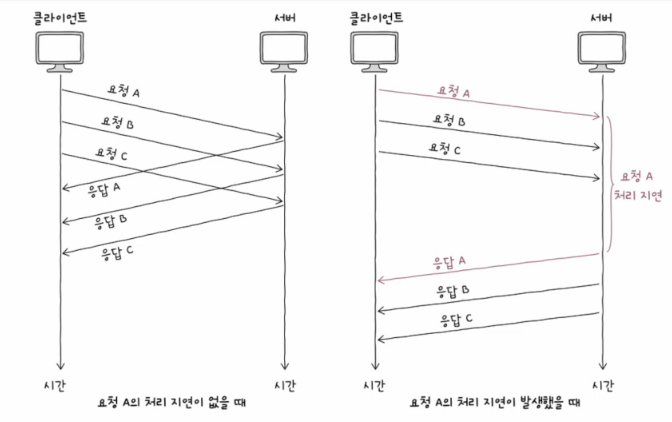

# HTTP 버전

## HTTP/0.9

- 현재 거의 사용되지 않는 초창기 HTTP 버전
- 사용 가능한 메서드: GET
- 헤더 지원 안함

 

## HTTP/1.0

- HEAD, POST 등 GET 이외에 메서드 도입
- 헤더 지원 시작
- 공식적으로는 지속 연결 미지원

 

## HTTP/1.1

- 오늘날까지 널리 사용되는 버전
- 지속 연결 공식적 지원
- 파이프라이닝, 콘텐츠 협상 기능 등 다양한 편의 기능 추가
- 메시지 본문 = 평문

### HOL 블로킹(Head-of-line blocking)

- 같은 큐에 대기하며 순차적으로 처리되는 여러 패킷이 있을 경우,
- 첫 번째 패킷의 처리 지연으로 인해 나머지 패킷 처리도 모두 지연되는 문제 상황

    

 

## HTTP/2.0

- 오늘날까지 널리 사용되는 버전
- HTTP/1.1의 효율과 성능을 높이기 위한 버전
- 메시지 본문 - 바이너리 데이터
- 헤더 압축 전송 기능
- 서버 푸시 기능
- HTTP 멀티플랙싱(multiplexing)

#### 서버 푸시(server push)

    클라이언트가 요청하지 않았더라도 미래에 필요할 것으로 예상되는 자원 미리 전송하는 기능

#### HTTP 멀티플랙싱

- 여러 스트림을 활용해 병렬적으로 메시지를 주고받는 기술
- 요청-응답 단위는 하나의 스트림에서 이루어짐
- 스트림별 독립적인 송수신 가능
- 별도의 스트림을 통해 여러 데이터를 병렬적으로 주고받으며 HOL 블로킹 완화

 

## HTTP/3.0

- 오늘날 점차 사용 확대되는 버전
- UDP 기반 프로토콜인 **QUIC**(Quick UDP Internet Connections) 기반으로 동작
  - 이전까지의 HTTP 버전 = TCP 기반 동작
- 빠른 송수신 가능
  - 연결형 프로토콜 기반 송수신 속도 < 비연결형 프로토콜 기반 송수신 속도
