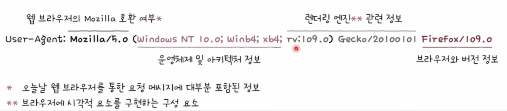
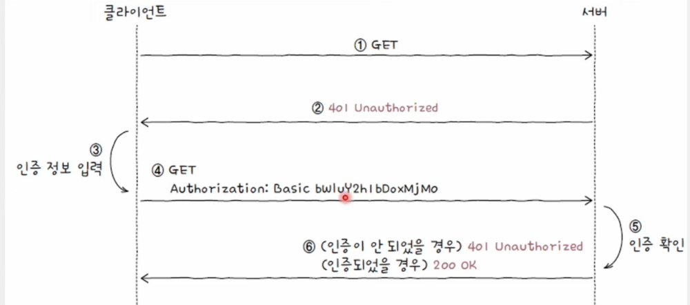

# HTTP 헤더

    필드 이름(헤더 이름)과 필드 값(헤더 값)이 콜론(:)을 기준으로 구분

## HTTP 요청 시 주로 사용되는 헤더

### 💡 Host

- 요청을 보낼 호스트를 나타내는 헤더
- 주로 도메인 네임 명시
- 포트 번호가 포함되어 있을 수 있다.

### 💡 User-Agent

- 요청 메시지 생성에 관여한 클라이언트 프로그램과 관련된 다양한 정보가 명시

    

#### 유저 에이전트

    HTTP 요청을 시작하는 클라이언트 측의 프로그램

### 💡 Referer

- 클라이언트가 요청을 보낼 때 머무르고 있던 URL이 명시
- 클라이언트의 유입 경로를 파악

### 💡 Authorization

- 클라이언트의 인증 정보를 담는 헤더
- 인증 타입과 인증을 위한 정보 명시
- 인증 타입에 따라 인증 정보에 명시될 값이 달라짐

#### Basic

- 가장 기본적인 HTTP 인증 타입
- `username:password`를 Base64 인코딩한 값을 인증 정보로 삼는 방식

 

## HTTP 응답 시 주로 사용되는 헤더

### 💡 Server

- 요청을 처리하는 서버 측의 소프트웨어와 관련된 정보를 명시

### 💡 Allow

- 클라이언트에게 허용된 HTTP 메서드 목록을 알려주기 위해 사용
- 상태 코드 405를 응답하는 메시지에서 함께 사용

### 💡 Retry-After

- 상태 코드 503과 함께 사용될 수 있는 헤더
- 자원을 사용할 수 있는 날짜 혹은 시각을 나타낸다.

### 💡 Location

- 클라이언트에게 자원의 위치를 알려 주기 위해 사용되는 헤더
- 주로 리다이렉션이 발생했을 때나 새로운 자원이 생성되었을 때 사용

### 💡 WWW-Authenticate

- 상태 코드 401과 함께 사용되는 헤더
- 자원에 접근하기 위한 인증 방식을 설명

#### Authorization과 WWW-Authenticate 헤더를 통해 HTTP 인증 과정

1.  인증되지 않은 클라이언트가 서버에 GET 요청 메시지를 전송
2.  서버는 401와 함께 WWW-Authenticate 헤더를 통해 인증 방식을 알린다.
3.  클라이언트는 사용자로부터 인증 정보를 전달받는다.
4.  클라이언트는 Base64 인코딩한 값을 Authorization 헤더를 통해 요청 메시지를 전송
5.  서버는 인증 정보를 확인
6.  인증이 유효하면 상태 코드 200으로 응답하고, 인증되지 않았으면 상태 코드 401로 응답

    

 

## HTTP 요청과 응답 모두에서 활용되는 헤더

### 💡 Date

- 메시지가 생성된 날짜와 시각에 관련된 정보를 담은 헤더

### 💡 Connection

- 클라이언트의 요청과 응답 간의 연결 방식을 설정하는 헤더
- 지속 연결이 Connection에 명시되는 대표적인 연결 방식
- 가장 대표적으로 사용되는 값은 keep-alive와 close

### 💡 Content-Length

- 본문의 바이트 단위 크기(길이)

### 💡 Content-Type, Content-Language, Content-Encoding

- 메시지 본문의 표현 방식을 설명하는 헤더
- **표현 헤더**의 일종

#### Content-Type 헤더

    메시지 본문에서 사용된 미디어 타입

#### Content-Language 헤더

    메시지 본문에 사용된 자연어 명시
    언어 태그로 명시: 하이픈(-)으로 구분된 구조
    언어 코드-국가 코드의 조합 (ko-KR, en-GB, en-US, ...)

#### Content-Encoding 헤더

    메시지 본문을 압축하거나 변환한 방식
    여러 인코딩이 사용되었을 경우, 적용된 순서대로 명시

 
