# HTTP

## HTTP의 특성

### 1) 요청-응답 기반 프로토콜

- 클라이언트-서버 구조 기반의 요청-응답 프토토콜
- HTTP 요청 메시지와 HTTP 응답 메시지는 메시지 형태가 다르다.

 

### 2) 미디어 독립적 프로토콜

- HTTP는 주고받을 자원의 특성과 무관하게 그저 자원을 주고받을 수단(인터페이스) 역할만 한다.
- HTTP를 통해 HTML, JPEG, PNG, JSON, XML, PDF 등 다양한 종류의 자원 송수신 가능
- HTTP는 주고받을 미디어 타입에 특별히 제한을 두지 않고 동작

#### Media Type (= MIME Type)

- HTTP에서 메시지로 주고받는 자원의 종류
- 슬래시를 기준으로 `type/subtype` 형식으로 구성
  - 타입: 데이터의 유형
  - 서브타입: 주어진 타입에 대한 세부 유형
- 부가적인 설명을 위해 선택적으로 매개변수 포함 가능

  - 형식 = `type/subtype;parameter=value`
  - 예시) `type/html;charset=UTF-8`

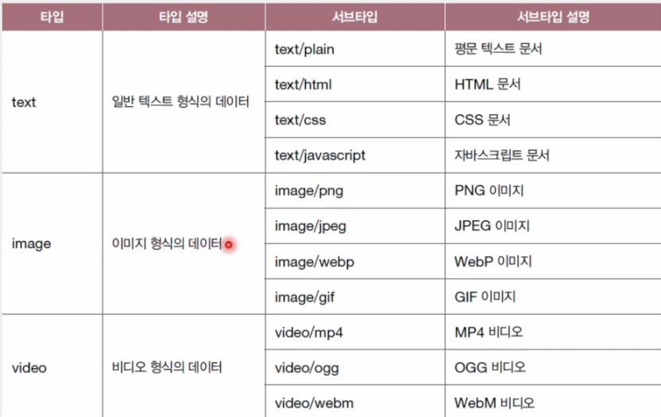
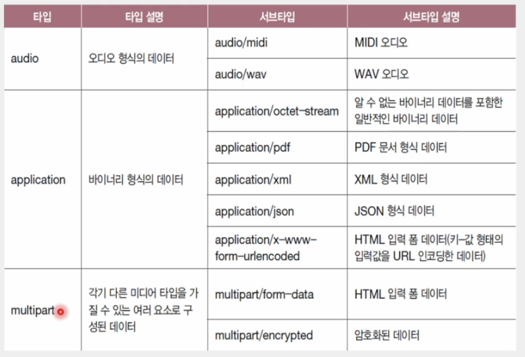

 

### 3) 상태를 유지하지 않는(Stateless) 프로토콜

- 서버가 HTTP 요청을 보낸 클라이언트와 관련된 상태를 기억하지 않는다는 의미
- 클라이언트의 모든 HTTP 요청은 기본적으로 독립적인 요청으로 간주
- 모든 클라이언트의 상태 정보를 유지하는 것에 대한 서버의 부담 제거
- 특정 클라이언트가 특정 서버에 종속되는 상황 방지

#### 확장성(Scalability)

    틀정 클라이언트가 특정 서버에 종속되지 않게 한다.

#### 견고성(Robustness)

    서버에 문제가 생겨도 다른 서버로 대체 용이

 

### 4) 지속 연결(Persistent Connection)을 지원하는 프로토콜

- = 킵 얼라이브(Keep-Alive)
- 최근 대중적으로 사용되는 HTTP 버전(HTTP 1.1 이상)
- 하나의 TCP 연결상에서 여러 개의 요청-응답을 주고받을 수 있는 기술
- 비지속 연결
  - 초기의 HTTP 버전(HTTP 1.0 이하)
  - TCP 연결 수립한 후, 요청에 대한 응답을 받으면 연결 종료
  - 추가적인 요청-응답을 하기 위해서는 다시 TCP 연결 수립부터 반복

 

## HTTP 메시지 구조

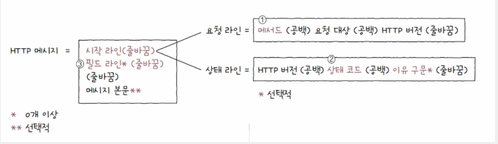

### 💡 시작 라인(start-line)

- HTTP 메시지가 HTTP 요청 메시지일 경우, `시작 라인 = 요청 라인`
- HTTP 메시지가 HTTP 응답 메시지일 경우, `시작 라인 = 상태 라인`

#### 요청 라인

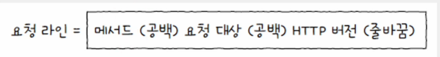

- 메서드(method)

  - 클라이언트가 서버의 자원(요청 대상)에 대해 수행할 작업의 종류
  - 대표적으로 GET, POST, PUT, DELETE 등

- 요청 대상(request-target)

  - HTTP 요청을 보낼 서버의 자원
  - 보통 (쿼리가 포함된) URI의 경로가 명시
  - 만약 하위 경로가 없더라도 요청 대상은 슬래시(/)로 표기

- HTTP 버전
  - 사용된 HTTP 버전
  - `HTTP/<버전>` 이라는 표기 방식을 따른다.

#### 상태 라인

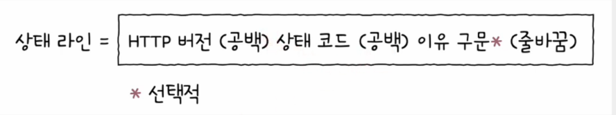

- 상태 코드(status code)
  - 요청에 대한 결과를 나타내는 세 자리 정수
  - 200, 404, ...
- 이유 구문(reason phrase)
  - 상태 코드에 대한 문자열 형태의 설명
  - OK, Not Found, ...

 

### 💡 필드 라인(= 헤더 라인)

- 0개 이상의 HTTP 헤더 명시
- HTTP 통신에 필요한 부가 정보
- 콜론을 기준으로 헤더 이름과 하나 이상의 헤더값으로 구성

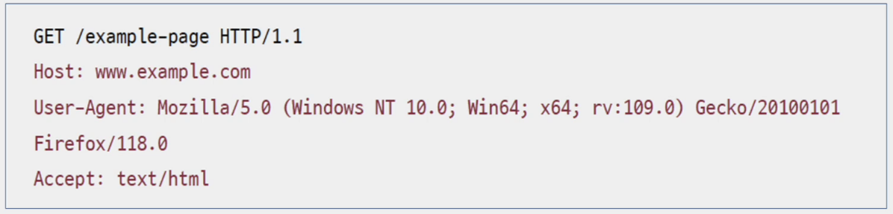

 

### 💡 메시지 본문(message-body)

- HTTP 요청 혹은 응답 메시지에서 본문이 필요할 경우 선택적으로 메시지 본문에 명시
- 다양한 콘텐츠 타입이 사용 가능

 

## HTTP 메서드

### 💡 GET

- 특정 자원을 조회할 때 사용되는 메서드
- 클라이언트가 서버에게 '자원을 가져다주세요'라고 요청 보내는 것과 같다.

#### 요청 메시지

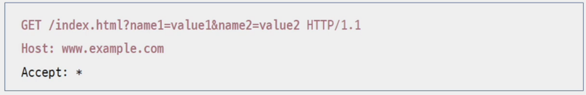

#### 응답 메시지

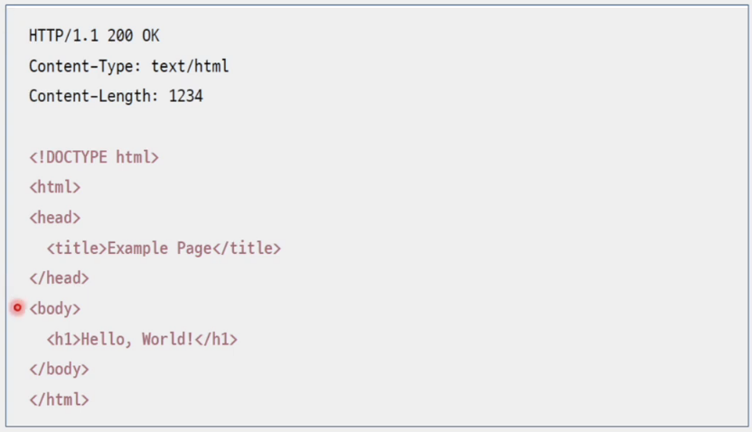

 

### 💡 HEAD

- HEAD 메서드를 사용하면 서버는 요청에 대한 응답으로 응답 메시지의 헤더만을 반환

#### 요청 메시지

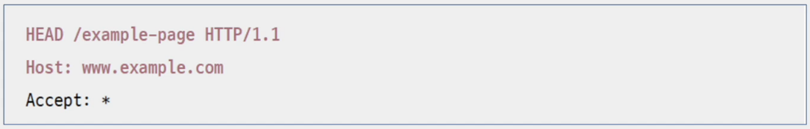

#### 응답 메시지

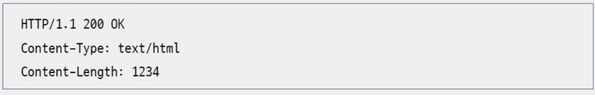

 

### 💡 POST

- 서버로 하여금 **특정 작업을 처리**하도록 요청하는 메서드
- 처리할 대상이 흔히 **메시지 본문**으로 명시
- 많은 경우 **클라이언트가 서버에 새로운 자원을 생성하고자 할 때** 사용
- 새로운 자원이 생성시 서버는 응답 메시지의 **Location** 헤더를 통해 새로 생성된 자원의 위치를 알려준다.

#### 요청 메시지

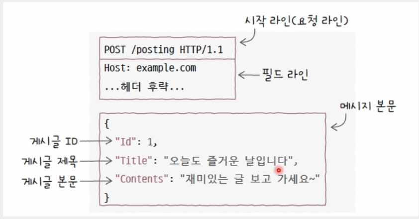

#### 응답 메시지

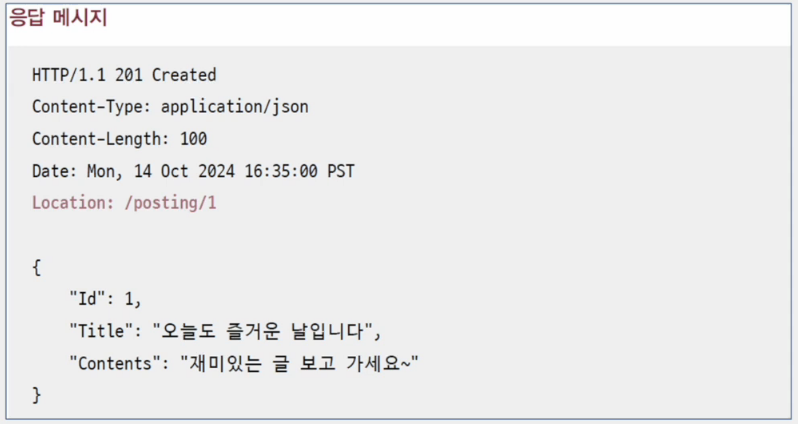

 

### 💡 PUT

- 요청 자원이 없다면 메시지 본문으로 자원을 새롭게 생성
- 요청 자원이 존재한다면 메시지 본문으로 자원을 완전히 대체

### 💡 PATCH

- 메시지 본문에 맞게 자원을 일부 부분적으로 수정

### 💡 DELETE

- 특정 자원을 삭제하고 싶을 때 사용

 

## HTTP 상태 코드

- 요청에 대한 결과를 나타내는 세 자리 정수
- **백의 자리 수**를 기준으로 유형을 구분

    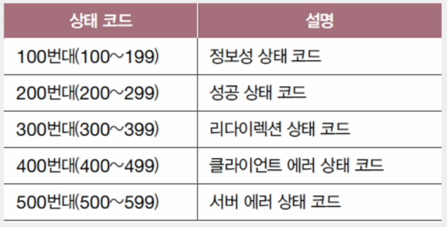

### 💡 200번대

- 요청 성공 상태 코드

    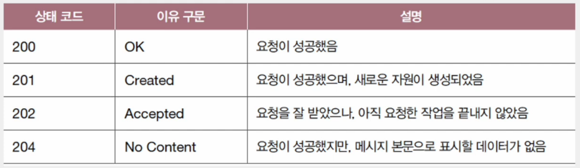

 

### 💡 300번대

- 리다이렉션 상태 코드
- **영구적인 리다이렉션**

  - 자원이 완전히 새로운 곳으로 이동하여 경로가 영구적으로 재지정
  - 이 경우 기존의 URL에 요청 메시지를 보내면 항상 새로운 URL로 리다이렉트
  - 기존의 자원 위치를 기억할 필요 없음

    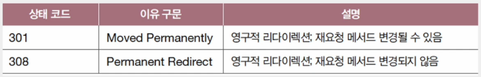

- **일시적인 리다이렉션**

  - 자원의 위치가 임시로 변경되었거나 임시로 사용할 URL이 필요한 경우에 주로 사용
  - 어떤 URL에 대해 일시적인 리다이렉션 관련 상태 코드를 응답받았다면 여전히 요청을 보낸 URL은 기억

    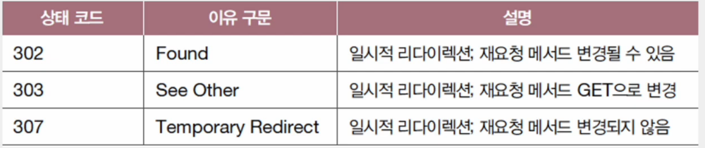

#### 리다이렉션(redirection)

- 요청을 완수하기 위해 추가적인 조치가 필요한 상태
- 클라이언트가 요청한 자원이 다른 곳에 있을 때, 클라이언트의 요청을 다른 곳으로 이동시키는 것

    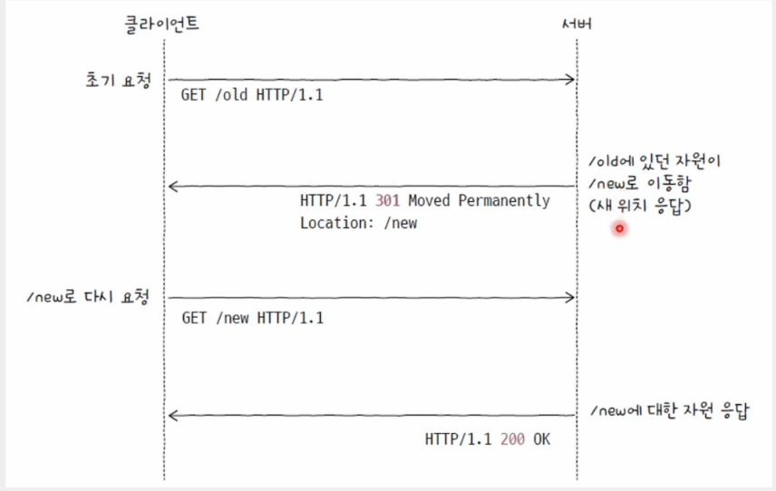

 

### 💡 400번대

- 클라이언트 에러 상태 코드

    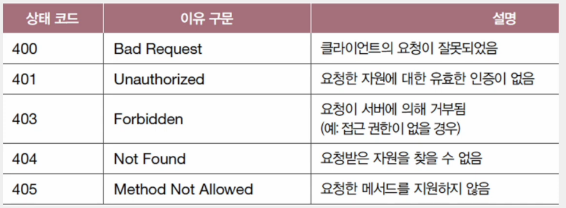

 

### 💡 500번대

- 서버 에러 상태 코드

    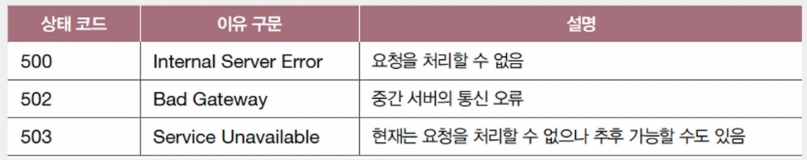
