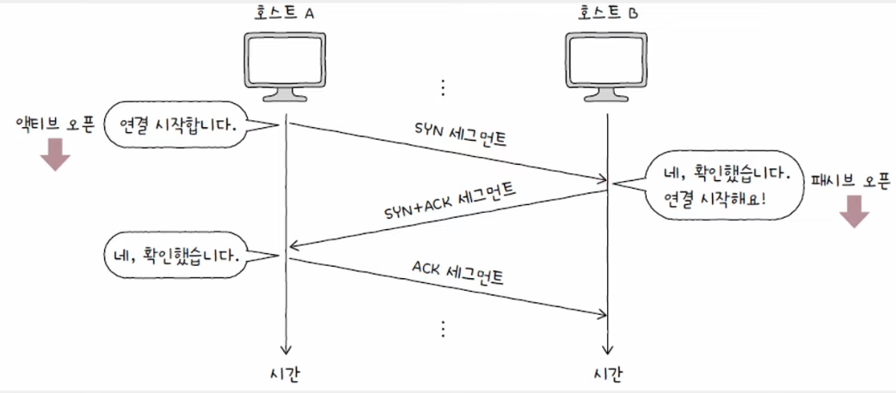

# TCP(Transmission Control Protocol)

    신뢰할 수 있는 통신을 위한 연결형 프로토콜


#### MSS(Maximum Segment Size)

- TCP로 전송할 수 있는 최대 페이로드 크기
- TCP 헤더 크기는 제외


<br>

## TCP 세그먼트 구조


### 💡 송신지 포트, 수신지 포드

- 송수신하는 포트 번호

### 💡 순서 번호(Sequence Number)

- 순서 번호가 명시되는 필드
- 송수신되는 세그먼트 데이터의 첫 바이트에 부여되는 번호
- 세그먼트의 올바른 송수신 순서를 보장하기 위한 번호


### 💡 확인 응답 번호(Acknowledgment Number)

- 상대 호스트가 보낸 세그먼트에 대한 응답
- 다음으로 수신하기를 기대하는 순서 번호가 명시
- 일반적으로 `수신한 순서 번호 + 1`
- 확인 응답 번호 값을 보내기 위해서는 제어 비트에서 승인을 나타내는 비트인 **ACK 플래그**를 1로 설정


### 💡 제어 비트(Control Bits)

- = 플래그 비트
- 현재 세그먼트에 대한 부가 정보
- 기본적으로 8비트로 구성

#### ACK

    세그먼트의 승인을 나타내기 위한 비트

#### SYN

    연결을 수립하기 위한 비트

#### FIN

    연결을 종료하기 위한 비트

### 💡 윈도우(Window)

- 수신 윈도우의 크기가 명시

#### 수신 윈도우

    한 번에 수신하고자 하는 데이터의 양

<br>

## TCP 연결 수립 : Three-way Handshake




#### 액티브 오픈(Active Open)

    연결 시작 호스트의 연결 수립 과정

#### 패시브 오픈(Passive Open)

    연결 수락 호스트의 연결 수립 과정

<br>

## TCP 연결 종료 : Four-way Handshake


#### 액티브 클로즈(Active Close)

    종료 시작 호스트의 종료 과정

#### 패시브 클로즈(Passive Close)

    종료 수락 호스트의 종료 과정

<br>

## TCP 상태의 유형

#### 상태(state)

    현재 어떤 통신 과정에 있는지를 나타내는 정보
    TCP는 Stateful Protocol

#### TCP 상태 확인

```shell
# linux / macOS
$ netstat
```


<br>

### 💡 연결이 수립되지 않은 상태

#### CLOSED

- 아무 연결이 없는 상태

#### LISTEN

- 일종의 연결 대기 상태
- `SYN` 세그먼트를 기다리는 상태
- 서버로서 동작하는 패시브 오픈 호스트는 일반적으로 _LISTEN_ 상태 유지
- _LISTEN_ 호스트에게 `SYN` 세그먼트를 보내면 Three-way Handshake 시작

<br>

### 💡 연결 수립 과정에서 주로 볼 수 있는 상태


#### SYN-SENT

- 연결 요청을 보낸 뒤 대기하는 상태
- 액티브 오픈 호스트가 `SYN` 세그먼트를 보낸 뒤 그에 대한 응답인 `SYN+ACK` 세그먼트를 기다리는 상태

#### SYN-RECEIVED

- 패시브 오픈 호스트가 `SYN+ACK` 세그먼트를 보낸 뒤 그에 대한 `ACK` 세그먼트를 기다리는 상태

### ESTABLISHED

- 연결이 확립되었음을 나타내는 상태

<br>

### 💡 연결 종료 과정에서 주로 볼 수 있는 상태


#### FIN-WAIT-1

- 일반적인 TCP 연결 종료 과정에 있어 연결 종료의 첫 단계

#### CLOSE-WAIT

- 종료 요청인 `FIN` 세그먼트를 받은 패시브 클로즈 호스트가 그에 대한 응답으로 `ACK` 세그먼트를 보낸 후 대기하는 상태

#### FIN-WAIT-2

- _FIN-WAIT-1_ 상태에서 `ACK` 세그먼트를 받고 상대 호스트의 `FIN` 세그먼트를 기다리는 상태

#### LAST-ACK

- _CLOSE-WAIT_ 상태에서 `FIN` 세그먼트를 전송한 뒤 이에 대한 `ACK` 세그먼트를 기다리는 상태

#### TIME-WAIT

- 액티브 클로즈 호스트가 FIN 세그먼트를 수신한 뒤, 이에 대한 `ACK` 세그먼트를 전송한 뒤 접어드는 상태
- 패시브 클로즈 호스트는 마지막 `ACK` 세그먼트를 수신하면 _CLOSED_ 상태로 전이
- _TIME-WAIT_ 상태의 액티브 클로즈 호스트는 **일정 시간을 기다린 뒤** _CLOSED_ 상태로 전이

<br>

## TCP의 기능

- 재전송을 기반으로 다양한 오류를 제어
- 흐름 제어를 통해 처리할 수 있을 만큼의 데이터 송수신
- 혼잡 제어를 통해 네트워크가 혼잡한 정도에 따라 전송량 조절
